# feat: Baseball Swing Coach app

## Summary

Build the swing coach as a new `(swing)` route-group app following the todos/workouts conventions: one core migration plus a derived-artifacts storage bucket, a fully client-side extraction pipeline (WebCodecs decode + MediaPipe pose in a web worker, metrics and annotated stills rendered in the browser, artifacts uploaded incrementally per clip), and a server-side assessment step that feeds deterministic metrics, a curated drill/cue library, and the player's prior assessments into the house Anthropic structured-output pattern. Pipeline state lives as WHOOP-style status columns on session/clip rows — no job queue, and every step after extraction is retryable from stored artifacts without re-uploading video.

---

## Problem Frame

Volunteer coaches can see a swing "looks off" but can't diagnose, prioritize, prescribe, or judge subsequent reps; existing tools output metrics, not coaching (full framing in the origin doc). This plan covers v1 post-hoc assessment with an architecture that carries into the v2 live tee-station mode.

---

## Assumptions

*This plan was authored without synchronous user confirmation. The items below are agent inferences that fill gaps in the origin doc — un-validated bets that should be reviewed before implementation proceeds. The four origin questions explicitly deferred to planning are resolved in Key Technical Decisions instead; these are product-behavior calls the origin doc did not make.*

- **Minimum usable-swing floor is 3.** R3 targets 5–10 and R4 forbids single-swing judgments, but no floor is stated. Below 3 usable clips the session is insufficient (a derived condition, not a stored status) and prompts the coach to add clips; 3–4 proceeds with an explicit low-sample caveat in the assessment.
- **Focus areas apply automatically when an assessment completes.** R8's keep/advance/replace recommendation takes effect without a separate coach-confirmation step; the coach's recourse is voiding the assessment or regenerating the coaching text. Keeps v1 to one actor decision (deliver or don't), avoids approval UI.
- **v1 requires one canonical camera angle: side-on (open side, facing the hitter's chest).** Metrics are angle-dependent; mixing angles breaks cross-swing comparison (R4). Clips detected as far off-angle are rejected per-clip with a teaching reason. Front-view support is deferred.
- **Voiding an assessment simply excludes it from the current-state derivation** — the previous complete assessment's focus areas become current again automatically (no revert writes; see Key Technical Decisions on derived current-ness). A session whose only assessments are voided is re-analyzable and can be reassigned to another player; covers the wrong-kid case even when it's discovered after analysis.
- **Players are archived, never hard-deleted, in normal use** — but a deliberate hard-purge path (player + all sessions + storage artifacts) must exist, even as a documented script rather than UI: the stored artifacts are pose data and stills of minors who are not family members, and another parent's removal request must be honorable. Archive explicitly does *not* remove artifacts. Abandoned `draft` sessions (including derived-insufficient ones) get a coach-initiated delete-session action (rows + storage prefix) so dead weight doesn't accumulate — manual delete only in v1, no time-based auto-cleanup heuristic.
- **Roster stores birth year rather than age** (age drifts; assessments want "9-year-old" language, derived at generation time).
- **Detected handedness vs. roster `bats` mismatch warns the coach but does not block** — footage wins for metric computation (mirroring), the warning catches wrong-kid/roster-typo cases.
- **One filming session = one day.** Clip creation timestamps spanning more than one day produce a warning with override, nothing stronger.
- **The app is visible to all signed-in family members** (standard family RLS); no owner-gating. Players are other people's kids, which is acceptable inside a single-family private app for v1.

---

## Requirements

Carried from origin (see origin doc for full text); plan-relevant phrasing:

- R1. Roster: players with name, birth year, bats L/R — nothing more.
- R2. Per-player assessment history + current focus areas; new assessments always run with history in context.
- R3. An assessment ingests a batch of swing clips (target 5–10) for one player from one session.
- R4. Patterns are found across the batch; no judgments from a single swing.
- R5. Coach-facing output; each focus area has diagnosis / how-to-coach (cue + 1–2 drills) / what-to-watch-for (naked-eye tell).
- R6. At most 1–2 active focus areas; surplus issues are parked, visibly.
- R7. Annotated visual evidence from the player's own video: skeleton/reference-line overlays showing each tell.
- R8. With prior focus areas, the new assessment evaluates progress and recommends keep/advance/replace, with evidence.
- R9. Pipeline is pose → metrics → LLM coaching language; raw video never goes to a multimodal LLM as the primary path.
- R10. New app inside mason-family-hq following existing app/auth/db/deploy conventions.
- R11. Capture is the iPhone built-in camera (240fps slo-mo); the app ingests uploads, never captures.
- R12. Heavy video processing never runs on production; pose extraction is client-side. Production persists derived artifacts only, never raw sessions.
- R13. The current-focus view is usable on a phone at the field.

**Origin actors:** A1 (Coach — Andrew), A2 (Player — kid 7–12, never uses the app in v1), A3 (Analysis pipeline)
**Origin flows:** F1 (Assess a player), F2 (Re-assess and check progress), F3 (Practice reference)
**Origin acceptance examples:** AE1 (covers R3–R6), AE2 (covers R8), AE3 (covers R6), AE4 (covers R12)

---

## Scope Boundaries

### Deferred for later

Carried from origin:

- v2 live tee-station mode (per-swing feedback in seconds, MacBook + camera). v1 must not preclude it — the decode/pose/metrics modules and the drill library are built as plain TS modules with no Next.js coupling so they can be re-hosted in a live loop.
- Throwing/pitching analysis.
- Kid- or parent-facing report views, sharing, simplified-language output.
- Other coaches/teams as users (multi-tenant, onboarding, distribution).
- Native iOS app.

### Outside this product's identity

Carried from origin:

- Outcome-metric measurement (exit velocity, bat speed, launch angle) — this product coaches, b4/Blast measure.
- Team management (schedules, lineups, communications).
- Replacing the human coach — the app equips the coach; the coach delivers.

### Deferred to Follow-Up Work

Plan-local sequencing decisions:

- **Short annotated overlay clips** (WebCodecs-encoded H.264 slow-motion snippets per tell): v1 ships annotated stills only; clips are a follow-up once storage cost and rendering time are observed in real use. The evidence renderer keeps a seam for this.
- **Front-view camera-angle support** and per-angle metric sets.
- **Multi-swing-per-clip splitting UX**: the detector reports multiple wrist-speed bursts and v1 uses the most prominent one per clip (flagging the rest); first-class "we found 3 swings in this clip" splitting is follow-up.
- **Firefox support**: Firefox has no WebCodecs HEVC path and no HEVC playback on macOS at all; v1 targets Chrome/Edge/Safari and shows an actionable unsupported-browser message in Firefox.
- **PWA offline caching for the field view (F3)**: standard responsive page over LTE for v1.

---

## Context & Research

### Relevant Code and Patterns

- App anatomy to mirror: `src/app/(todos)/` route group (layout with `appMetadata`, `[view]` server page with `force-dynamic`, `actions.ts` server actions, client shell reconciling via `router.refresh()`), with domain logic in `src/lib/todos/` and components in `src/components/todos/`. Workouts (`src/app/(workouts)/`, `src/lib/workouts/`) is the same shape.
- App registry: `src/lib/pwa/apps.ts` (`PWA_APPS`) + `src/components/layout/app-switcher.tsx` (parallel `APPS` list) + per-group icons + `scripts/generate-icons.mjs`.
- Auth: middleware-guarded by default (`src/lib/supabase/middleware.ts`); server identity via `src/lib/members/auth.ts` (`requireUserId()`); no per-app auth work needed.
- Migrations: sequential `supabase/migrations/NNNNN_snake_name.sql` (latest at research time: `00138`; **check the live max before numbering** — shared local DB across Conductor workspaces collides). New-app convention is one heavily-commented core migration (`00129_todos_core.sql` is the exemplar): uuid PKs, `created_at`/`updated_at` + trigger, soft deletes, text CHECK constraints instead of enums, RLS `"Family access" USING (auth.uid() IS NOT NULL)`.
- Storage: buckets created in migrations with size/MIME limits + four storage.objects policies (`00130_todo_images.sql`); upload via server-action `createSignedUploadUrl` → client `uploadToSignedUrl` → server action records the DB row (`src/lib/todos/attachment-upload.ts`, `createTaskAttachmentUploadUrls` in `src/app/(todos)/todos/actions.ts`); serving via batched `createSignedUrls(paths, 3600)` at read time (`src/lib/todos/queries.ts`).
- Pipeline state: WHOOP push pattern — status/hash/error columns on the domain row (`supabase/migrations/00128_workout_session_whoop_sync.sql`, `src/lib/whoop/push.ts`); no job queue exists and none is introduced.
- Anthropic: lazy singleton `src/lib/journal/anthropic.ts`; per-app model override (`src/lib/workouts/anthropic.ts` re-exports with `WORKOUTS_MODEL ?? JOURNAL_MODEL`); structured output via one forced tool call with full JSON-schema `input_schema` and defensive parsing (`src/lib/reading/quiz-generate.ts`, `src/lib/workouts/parse.ts`); regenerate-from-stored-inputs precedent at `src/app/(journal)/journal/api/regenerate/route.ts`.
- Browser media precedent: `src/lib/journal/photo-upload.ts` — MIME/extension sniffing incl. QuickTime, canvas downscaling, poster-frame extraction from video via `<video>` + canvas. Proves the toolkit; the swing pipeline goes much further (workers, WebCodecs).
- Verification convention: no test runner; standalone `scripts/verify-*.mts` scripts run with `npx tsx` (`scripts/verify-workout-math.mts` et al.). Lint via `npm run lint`; `npx tsc --noEmit` and `next build` are the type gates. Dev server: `npm run dev:agent` (never port 3000).

### Institutional Learnings

- `docs/solutions/` does not exist yet; relevant memory-level learnings: shared local Supabase across workspaces (migration collisions — re-apply via psql + PostgREST reload), PostgREST large-`.in()` URL overflow (keep fat blobs and long id lists out of the API surface), Next.js sibling-nav `loading.tsx` quirk (use `useLinkStatus` for param-only navs; verify SSR via prod build).

### External References

- MediaPipe Pose Landmarker (`@mediapipe/tasks-vision` **0.10.35**, pin it): 33 landmarks + visibility, `runningMode: "VIDEO"`, `detectForVideo()` is synchronous → run in a worker (official guidance); GPU (WebGL) delegate with CPU/XNNPACK fallback; model variants lite/full/heavy (5.8/9.4/30.7 MB `.task`); wasm assets self-hostable from `node_modules/@mediapipe/tasks-vision/wasm`. Legacy `@mediapipe/pose` is deprecated — Tasks API only. (ai.google.dev/edge/mediapipe pose landmarker web guide.)
- iPhone 1080p/240fps slo-mo is HEVC in QuickTime `.mov`; AirDrop/Files transfers carry a real 240fps track, but some share paths bake the slow-mo edit into ~30fps — **read actual track fps from container metadata, never assume 240**.
- WebCodecs has no demuxer: use **Mediabunny** (TS, zero-dep, reads `.mov`/HEVC, `canDecode()` capability checks, timestamp-driven sample sinks) — fallback option `web-demuxer` (ffmpeg-wasm based). HEVC-in-WebCodecs: Chrome 107+ with hardware decoder (universal on Apple Silicon), Safari 16.4+; Firefox: no. Fallback path: `<video>` seek-stepping + `requestVideoFrameCallback` (authoritative `mediaTime`), pairing `seeked` with rVFC on Safari.
- Phase detection from keypoint series is well-supported by swing-segmentation literature: smooth first (interpolate low-visibility gaps + Savitzky-Golay), then kinematic extrema — lead-ankle lift/plant, wrist-speed burst for launch, peak lead-wrist speed ≈ contact, deceleration for finish. Sanity-check phase ordering/durations (~150 ms launch-to-contact) and reject clips that don't fit.
- Honest 2D single-camera metric set (trunk landmarks are reliable; wrists/ankles noisy; child-pose accuracy is a research gap — spike first): head drift, stride length relative to height, posture/spine angle over time, front-knee extension at contact, back-elbow slot, phase tempo ratios, weight-transfer proxies, hip-vs-shoulder rotation *timing* proxy. Not claimable from 2D: true hip-shoulder separation degrees, rotational velocities, bat metrics (Driveline's 2D critique). Mustard's phase-named key-frame stills + drill prescriptions validate the product shape.
- Evidence artifacts: WebP stills at quality ~0.8 (≈80–250 KB each); MediaRecorder is realtime-bound and codec-fragmented — if/when clips come, WebCodecs `VideoEncoder` → H.264 MP4.
- Workers in Next 16.2 (repo is on 16.2.0): `new Worker(new URL(...), { type: "module" })` works under Turbopack, and 16.2 fixed worker origin bootstrapping (un-breaks wasm fetching in workers). Avoid `new URL("*.wasm", import.meta.url)` under Turbopack — serve MediaPipe wasm + `.task` from `public/` with absolute paths. `VideoFrame` is transferable; always `frame.close()` promptly; gate decode on queue depth for backpressure. OffscreenCanvas universal; Screen Wake Lock universal since 2024 (auto-releases on tab hide → re-acquire on `visibilitychange`).
- Supabase: keypoint series (~1–2 MB gzipped via `CompressionStream`) belong in Storage, not jsonb rows; summary metrics jsonb in rows is fine. Standard uploads fine at these sizes; signed-URL flow as per house pattern.
- Anthropic SDK `^0.96.0` (installed) supports structured outputs via its beta surface (`client.beta.messages.parse` / `output_format` verified present in node_modules); house forced-tool pattern also fine — exact param names to be confirmed at implementation (or bump to the current SDK for the GA surface). Current models: `claude-sonnet-4-6` (repo default), `claude-opus-4-8` for highest quality. Vercel Fluid compute default 300s — a 30–60s generation call needs no config.

---

## Key Technical Decisions

The four origin questions deferred to planning, resolved:

- **Pose extraction runs in-browser** (not a local Python/Mac process): MediaPipe Tasks `PoseLandmarker` (heavy model, GPU delegate with CPU fallback) inside a module web worker, fed by WebCodecs decode. Rationale: zero install, works from any of Andrew's machines, Next 16.2 removed the worker/wasm blocker, and the worker pipeline is exactly what v2 live mode re-hosts at lower fidelity. A local Python sidecar would duplicate the metrics/brain layer and add an ops surface for one user.
- **Swing segmentation: one swing per clip is the v1 filming contract** (stated in the filming guidelines), matching how slo-mo is actually filmed. The detector still scans the whole clip for wrist-speed bursts: zero bursts → clip rejected ("no swing detected"); multiple bursts → most prominent used, others flagged (full multi-swing splitting deferred).
- **Persisted artifacts: annotated stills, not overlay clips.** Per usable clip: gzipped keypoints JSON (~1–2 MB) + ~6 phase-keyframe WebP stills (stance, load, foot plant, launch, contact, finish; ≈1 MB total) + summary metrics jsonb on the clip row. A 10-clip session ≈ 25–30 MB — comfortably inside Supabase Storage economics, and AE4's "viewable later from any device" is satisfied. Keypoints persistence also means a better pose model later can re-derive everything without re-filming.
- **Drill/cue library is a curated data file in the repo** (`src/lib/swing/library/drills.ts`): typed entries (issue addressed, age band, cue wording, drill steps, the naked-eye tell template). Seeded once with LLM assistance, curated by Andrew in code review like any other change. The assessment prompt instructs the LLM to prescribe from the library, with an explicit escape hatch (`library_gap: true` + freeform suggestion) so gaps surface for curation instead of silently inventing drills. Rationale: R5 consistency and the eye-test quality gate need stable, reviewed prescriptions — not per-call LLM improvisation.

Other plan-time decisions:

- **Decode via Mediabunny + WebCodecs, with `<video>` seek-stepping fallback — behind a `FrameSource` seam.** The reusable pipeline core (pose → smoothing → phases → metrics → quality → annotate) consumes a timestamped frame stream, not a file: v1's frame sources are WebCodecs decode (worker-side) and the seek-stepping fallback (which is DOM-bound, so it runs on the main thread and transfers `VideoFrame`s into the worker); v2's live mode adds a camera source without touching the core. Capability-check at upload time (`canDecode()` / `isConfigSupported`); actionable error for unsupported environments (Firefox, hardware-less HEVC). Track fps read from container metadata and stored on the clip row; clips whose track isn't high-speed (shared-not-AirDropped slo-mo) get a warning with reduced-confidence handling rather than rejection.
- **The extraction worker's contract is artifacts-out; the host page owns persistence.** Worker input is a frame source + config; output is keypoints, events, metrics, quality verdict, and still blobs via transferables. Upload, retry, and clip-row recording live in the session shell (main thread), not the worker — uploads inside the worker would couple the v2-reusable pipeline to session identity and Supabase, and host-side artifacts make upload retry trivially independent of re-extraction.
- **Two-pass sampling:** coarse pass (~30 effective fps) over the whole clip to find the swing window via wrist-speed burst, dense pass (120–240 fps) over ±0.5 s around it. Bounds compute without sacrificing contact-frame precision.
- **Pipeline state is status columns on rows (WHOOP pattern), and the server only stores states the server owns.** Per-clip incremental persistence: the signed-URL-issuing server action creates the clip row first (status `pending`, paths recorded server-side as issued — never echoed by the client), artifacts upload, then the row is marked `ok`/`rejected`. A closed tab costs at most one clip of work; reopening a `draft` session resumes from rows, and `UNIQUE (session_id, content_hash)` makes re-adds idempotent upserts rather than advisory dedupe. Session readiness ("≥3 ok clips") and insufficiency are *derived* predicates computed in queries and re-verified inside the analyze action at the moment it runs — the browser never drives a stored server state transition.
- **Focus-area truth is derived, never mutated.** Each assessment owns an immutable, complete snapshot of focus-area rows (kept areas are re-emitted under the new assessment with a continuity link to the prior row); prior assessments' rows are never written again. "Current focus areas" = rows of the player's latest `complete` assessment (statuses `superseded`/`voided` excluded). Void is a single status flip with no compensating writes; regenerate marks the old assessment `superseded` and the derivation does the rest. This keeps R2/AE2 history intact (each assessment says what it said at the time) and eliminates the entire class of revert/partial-mutation bugs.
- **Assessment generation is a route handler** (matching the journal regenerate precedent it cites, and avoiding Next's per-client server-action serialization blocking the session UI for a 30–60 s call) using the house Anthropic pattern: `src/lib/swing/anthropic.ts` re-exports the shared client with `SWING_MODEL ?? JOURNAL_MODEL` (Andrew can point it at `claude-opus-4-8` via env without a deploy). One forced-tool structured-output call — **with strict schema enforcement enabled** (SDK ^0.96.0 supports it), keeping the house shape while shrinking the defensive-parse surface for a schema far deeper than any existing forced-tool call — returns the full assessment JSON (focus areas with the three R5 layers + evidence still references, parked issues, per-prior-focus-area progress verdicts, narrative). Parsing is deliberately **all-or-nothing**, diverging from `quiz-generate.ts`'s fail-soft posture: a half-valid assessment is exactly the "overconfident output on bad data" failure the origin treats as worst-case, so any parse problem lands in `analysis_failed` + retry. Returned evidence-still references are cross-checked against the actual still set (models hallucinate identifiers; a focus card pointing at a nonexistent still is a quiet R7 failure). Regeneration re-runs only this step from stored metrics — never touches video (the property R12 buys).
- **MediaPipe assets committed under `public/swing/mediapipe/`** (wasm directory + `pose_landmarker_heavy.task`, ~35 MB total): pinned, versioned, no third-party CDN dependency at runtime. Acceptable one-time repo weight for a private family repo; revisit only if it ever bothers Vercel build limits.
- **Evidence stills are rendered client-side during extraction** (OffscreenCanvas in the worker) — production can never render them later because raw video is gone (AE4 corollary). `complete` therefore means "all evidence artifacts persisted."
- **Confidence flows end-to-end:** per-landmark visibility → per-metric confidence (trunk-weighted) → prompt ("based on 4 usable swings; head-tracking confidence low") → rendered assessment. Overconfident output on bad data is the worst failure per origin success criteria.

---

## Open Questions

### Resolved During Planning

- Where pose extraction runs: **in-browser** (see Key Technical Decisions).
- Swing segmentation: **one swing per clip filming contract**, burst detector tolerates violations (see Key Technical Decisions).
- Which artifacts to persist: **keypoints + phase stills + metrics; no overlay clips in v1** (see Key Technical Decisions).
- Drill/cue library seeding: **curated repo data file, LLM constrained to it with a flagged escape hatch** (see Key Technical Decisions).

### Deferred to Implementation

- GPU vs CPU delegate performance on Andrew's actual machines — benchmark in the U1 spike (GPU is not guaranteed faster; known MediaPipe issue).
- Exact smoothing parameters, burst/phase thresholds, per-clip rejection thresholds, and the minimum-confidence cutoffs — tuned against real clips of Andrew's kids in U1/U5.
- Final metric set membership and per-metric youth-normal ranges — the honest-2D list above is the candidate set; U1 fixtures decide what's reliable enough to ship.
- Exact assessment prompt structure and how much prior-assessment text to include (bounded at last N assessments; N picked during U10 with real history).
- Whether dense-pass sampling at 240 vs 120 fps materially changes contact-frame metrics (spike data decides).
- Where the session-reassign control surfaces in the UI (session page pre-analysis vs the voided-assessment view) — the action exists in U10; placement is an implementation call.
- Whether `/swing/lab` stays family-visible or gets owner-gated like `/practice` — it processes local files client-side with no persistence, so v1 ships it family-visible behind standard auth.

---

## Output Structure

New surfaces this plan creates (scope declaration, not a constraint):

    supabase/migrations/
      00139_swing_core.sql                  # number = live max + 1 at implementation time

    public/swing/mediapipe/                 # wasm assets + pose_landmarker_heavy.task

    src/app/(swing)/
      layout.tsx  apple-icon.png  icon0.svg  icon1.png  loading.tsx
      swing/
        page.tsx                            # roster home
        lab/page.tsx                        # U1 spike harness (kept as a diagnostics page)
        players/[playerId]/page.tsx         # player: current focus (F3) + history
        players/[playerId]/sessions/[sessionId]/page.tsx   # upload/extraction flow
        assessments/[assessmentId]/page.tsx # assessment view
        actions.ts                          # server actions (roster, sessions, clips, void, reassign)
        api/analyze/route.ts                # analyze/retry/regenerate route handler

    src/lib/swing/
      types.ts  queries.ts  anthropic.ts
      pipeline/                             # plain TS, no Next/Supabase coupling (v2 reuse)
        frame-source.ts                     # FrameSource seam: WebCodecs | seek-step | (v2: camera)
        decode.ts                           # Mediabunny demux/decode + fallback + capability checks
        pose.ts                             # PoseLandmarker wrapper (worker-side)
        smoothing.ts  phases.ts  metrics.ts # keypoint series → events → metrics
        quality.ts                          # per-clip gates + rejection reasons
        annotate.ts                         # OffscreenCanvas skeleton/reference overlays → WebP
        extraction.worker.ts                # frames in → artifacts out (no upload; host persists)
      artifact-upload.ts                    # signed-URL upload of keypoints/stills (host-side)
      library/drills.ts                     # curated drill/cue/tell library
      assessment/
        aggregate.ts                        # cross-clip pattern aggregation for the prompt
        prompt.ts  generate.ts  schema.ts   # forced-tool structured output

    src/components/swing/                   # roster, session, assessment, focus-card components

    scripts/
      verify-swing-phases.mts  verify-swing-metrics.mts  verify-swing-assessment.mts   # fixture-based verification
      verify-swing-decode.mts                  # only if a node-side check proves feasible (see U4)

---

## High-Level Technical Design

> *This illustrates the intended approach and is directional guidance for review, not implementation specification. The implementing agent should treat it as context, not code to reproduce.*

```mermaid
flowchart LR
  subgraph Browser["Coach's browser (client-side, R12)"]
    A[Pick clips] --> B[Capability + fps check<br/>Mediabunny metadata]
    B --> C[Worker: decode frames<br/>WebCodecs / seek-step fallback]
    C --> D[Pass 1: coarse pose 30fps<br/>find wrist-speed burst]
    D --> E[Pass 2: dense pose 120-240fps<br/>around swing window]
    E --> F[Smooth → phase events<br/>stance/load/plant/launch/contact/finish]
    F --> G[Metrics + confidence]
    F --> H[Annotated WebP stills<br/>OffscreenCanvas]
    G & H --> I[Upload per clip:<br/>keypoints.json.gz + stills + metrics]
  end
  I --> J[(Supabase Storage<br/>+ swing_clips rows)]
  J --> K[Analyze route handler: aggregate metrics<br/>+ prior assessments + drill library]
  K --> L[Anthropic forced-tool call<br/>structured assessment JSON]
  L --> M[(swing_assessments +<br/>swing_focus_areas)]
  M --> N[Assessment view / F3 field view]
```

**State machine — stored vs. derived.** The server stores only states the server owns; clip-set facts are derived, never stored, so the browser can't desynchronize server truth:

- `swing_sessions.status`: `draft → analyzing → complete | analysis_failed` (retry: `analysis_failed → analyzing`, re-running the LLM from stored artifacts only — never video). No stored `extracted`/`insufficient`: "ready to analyze" (≥3 `ok` clips) and "insufficient" are predicates computed in queries and re-verified inside the analyze action, which is the sole gatekeeper for `draft → analyzing`. The session stays `draft` while clips are added/extracted — that's what makes tab-close recovery trivial (the coach can always add more clips to a `draft`).
- `swing_clips.status`: `pending → extracting → ok | rejected(reason)`. The row is created at signed-URL issuance (before upload) so it anchors the artifacts; re-adding a crashed-mid-`extracting` file resets that row rather than inserting beside it.
- `swing_assessments.status`: `generating → complete | analysis_failed`, plus `complete → superseded` (regenerate) and `complete → voided` (wrong kid / garbage). Voiding is assessment-level only — there is no session `voided`; a session whose only assessments are voided is again analyzable (and reassignable, since storage paths don't embed the player). Voiding a regenerated assessment does **not** resurrect its superseded sibling as current — `superseded` stays excluded.
- The `generating → complete` flip is the **atomic commit point** for assessment persistence (see U10): current-ness keys strictly on `complete`, so partially-written assessments are invisible and retries are idempotent.

**Data model sketch:** `swing_players` (name, birth_year, bats, archived_at) · `swing_sessions` (player_id, status, filmed_on, error) · `swing_clips` (session_id, status, rejection_reason, content_hash with `UNIQUE (session_id, content_hash)`, source fps, swing events, metrics jsonb, keypoints_path, still paths) · `swing_assessments` (session_id, player_id, status per above, narrative, progress jsonb, model, prompt_version) · `swing_focus_areas` (assessment_id, player_id, rank, disposition `focus|parked` — classification, not lifecycle, rows immutable after creation — prior_focus_area_id continuity link, diagnosis, cue, drills, tell, evidence still paths). Each assessment's focus-area rows are a **complete snapshot** (kept areas re-emitted with the continuity link). "Current focus areas" = rows of the player's latest `complete` assessment by created_at. FK `ON DELETE` choices stated in the migration so the purge path cascades coherently.

---

## Implementation Units

Phased: A (derisk) → B (foundation) → C (extraction pipeline) → D (coaching brain) → E (surfaces). U1 is deliberately first — the origin doc's only hard dependency risk is child-pose quality on real footage.

### Phase A — Derisk

- U1. **Pose extraction spike harness (`/swing/lab`)**

**Goal:** Validate the load-bearing assumption (origin Dependencies): MediaPipe pose quality on 240fps iPhone footage of kids is sufficient for coarse body-mechanics metrics — and benchmark decode + inference speed on real hardware before anything else is built.

**Requirements:** R9, R12 feasibility; origin Dependencies/Assumptions bullet 1.

**Dependencies:** None.

**Files:**
- Create: `src/app/(swing)/swing/lab/page.tsx`, `src/components/swing/lab/lab-shell.tsx`, `src/lib/swing/pipeline/decode.ts`, `src/lib/swing/pipeline/pose.ts`, `src/lib/swing/pipeline/extraction.worker.ts` (minimal first versions), `public/swing/mediapipe/` assets
- Modify: `package.json` (add pinned `@mediapipe/tasks-vision@0.10.35`, `mediabunny`)

**Approach:**
- Local-file in, nothing persisted: drop a real clip → decode → pose per sampled frame → skeleton overlay rendered over scrubbable frames → keypoints JSON downloadable (these JSONs become the fixtures for U5/U6 verification scripts).
- Benchmark panel: GPU vs CPU delegate ms/frame, decode path used (WebCodecs vs fallback), detected track fps — run on Andrew's Macs **and on the actual iPhone (Safari)**: ms/frame, peak memory, and suspension behavior during a multi-clip run. The clips originate on the phone, so "phone-first vs Mac-first extraction" is an explicit U1 decision recorded before Phase C; if phone extraction is infeasible, U8's UX and filming guidelines are written to the Mac-first stance (AirDrop hop) deliberately rather than discovered late.
- Eyeball test with Andrew's own kids' clips: do wrists/ankles track through the swing, or only the trunk? The answer scopes U6's metric set — **and gates U5's event detector**: every phase event keys on extremities (lead ankle for plant, wrist speed for launch/contact), so the spike must specifically verify wrist/ankle trackability through the launch-to-contact window. If extremities are unreliable there, the recorded U1 decision must pick the phase-detection fallback (trunk/forearm-proxy events with widened tolerances) before U5 is built — same stop-and-revisit weight as outright failure.
- The harness stays in the app afterward as a diagnostics page; the U1 modules are hardened, not thrown away, in U4/U5.

**Patterns to follow:** route-group page conventions; `npm run dev:agent` for local verification.

**Test scenarios:**
- Happy path: AirDropped 240fps `.mov` of a swing → skeleton visibly locked to the hitter through contact; keypoints JSON downloads; fps detected as ~240.
- Edge case: Messages-shared (30fps-baked) clip → fps detected as ~30 and surfaced.
- Error path: unsupported browser/codec → clear capability message, no hang.
- Benchmark: heavy model GPU vs CPU ms/frame recorded for the decision log.

**Verification:** Andrew (or the implementer with provided sample clips) confirms skeleton fidelity through the swing on ≥3 real kid clips; decisions recorded in the plan/PR notes: delegate choice, trustworthy landmark set, wrist-trackability verdict for the launch-to-contact window (with phase-detection fallback choice if poor), and phone-first vs Mac-first extraction stance. If pose quality fails the eyeball test outright, stop and revisit the pipeline premise with the user before building Phases B–E.

---

### Phase B — Foundation

- U2. **Core migration, storage bucket, types, and queries**

**Goal:** All persistence for the app: five tables, the artifacts bucket, RLS, and the typed query layer.

**Requirements:** R1, R2, R12 (derived-artifacts-only storage), AE3 (parked persisted), AE4.

**Dependencies:** None (parallel with U1).

**Files:**
- Create: `supabase/migrations/00139_swing_core.sql` (renumber to live max + 1), `src/lib/swing/types.ts`, `src/lib/swing/queries.ts`
- Modify: `supabase/config.toml` (local bucket config if house pattern requires)

**Approach:**
- Tables per the data-model sketch; text CHECK constraints for statuses (assessment statuses: `generating|complete|analysis_failed|superseded|voided`); `update_updated_at_column` triggers; `"Family access"` RLS on all tables; heavily-commented header per house style (stored-vs-derived state machine and the joint session×assessment semantics documented in the migration comment).
- `UNIQUE (session_id, content_hash)` on clips (per the `uq_todo_tasks_external` retry-safety precedent) — re-adds are upserts, and the two-tabs-same-session race resolves at the database. The migration comment documents the hash semantics (constant-memory fingerprint: SHA-256 over size + first/last 1 MiB — see U8) so the constraint's meaning is explicit. Explicit FK `ON DELETE` choices so delete-session and player-purge cascade coherently.
- Bucket `swing-artifacts`: private, 25 MB per-file limit, MIME allowlist (`application/json`, `application/gzip`, `image/webp`, `image/jpeg` — JPEG is the Safari still-encoding fallback, see U7), family-scoped storage.objects policies — clone the `00130_todo_images.sql` shape. Paths: `{session_id}/{clip_id}/...` — **no mutable foreign keys in paths by design** (player linkage lives in rows only, which is what makes session reassignment a one-column update and the purge path a prefix walk).
- `queries.ts` functions take a `SupabaseClient` param (house style); reads that return stills batch `createSignedUrls` with a **short TTL (~5 minutes, refreshed per page load)** rather than the 3600 s todo-images default — these are images of non-family minors, and the short window bounds exposure if a URL is ever shared or screenshotted, at no cost to normal use. The current-focus-areas and session-readiness derivations live here as the single query-side source of truth.

**Patterns to follow:** `supabase/migrations/00129_todos_core.sql`, `00130_todo_images.sql`, `src/lib/todos/queries.ts`.

**Test scenarios:**
- Test expectation: none beyond migration application — schema/RLS verified by applying to the shared local DB and exercising via U3+ flows (house convention; no test runner).

**Verification:** Migration applies cleanly locally; tables visible with RLS enabled; a signed upload + signed read round-trip works from a scratch script.

---

- U3. **App scaffold and roster**

**Goal:** The `(swing)` app exists as a first-class mason-family-hq app with a working roster (R1) — list, add, edit, archive players.

**Requirements:** R1, R10, R13 (mobile-usable from the start).

**Dependencies:** U2.

**Files:**
- Create: `src/app/(swing)/layout.tsx`, `loading.tsx`, icons, `src/app/(swing)/swing/page.tsx`, `src/app/(swing)/swing/actions.ts` (roster actions), `src/components/swing/roster/*`
- Modify: `src/lib/pwa/apps.ts` (PWA_APPS entry), `src/components/layout/app-switcher.tsx` (APPS entry)

**Approach:**
- Roster home lists players (name, age derived from birth year, bats, current focus-area count once U10 lands); add/edit in a sheet/dialog; archive soft-deletes.
- Server page + client shell + `router.refresh()` reconciliation, per todos.

**Patterns to follow:** `src/app/(todos)/` group anatomy; `appMetadata("swing")`; icon generation via `scripts/generate-icons.mjs`.

**Test scenarios:**
- Happy path: add player (name, birth year, bats R) → appears in list; edit bats to L → persists; archive → disappears from default list, history retained.
- Edge case: archive a player with sessions → sessions/assessments remain queryable (no cascade delete).
- Mobile: roster renders and operates at 390px width.

**Verification:** App appears in the switcher, installs as a PWA, roster CRUD works on phone-sized viewport against local DB.

---

### Phase C — Extraction pipeline

- U4. **Decode module hardening**

**Goal:** Production-grade `pipeline/decode.ts`: demux/decode any plausible input (AirDrop HEVC `.mov`, H.264 `.mp4`, baked-30fps shares), expose a uniform `sampleFrames(timestamps)` interface, detect capabilities and fps.

**Requirements:** R11, R12.

**Dependencies:** U1 (spike learnings).

**Files:**
- Create/modify: `src/lib/swing/pipeline/frame-source.ts`, `src/lib/swing/pipeline/decode.ts`
- Create: `scripts/verify-swing-decode.mts` only if a node-side check is feasible; otherwise covered by lab page

**Approach:**
- Everything downstream consumes the `FrameSource` seam (timestamped frame stream), per Key Technical Decisions — decode is a v1 frame source, not the pipeline's front door.
- Primary source: Mediabunny sample sinks at requested timestamps (handles GOP/keyframe mechanics, frame pooling/backpressure), running worker-side. Fallback source: `<video>` seek-stepping with `seeked`+rVFC pairing and `mediaTime` verification — DOM-bound, so it runs on the main thread and transfers `VideoFrame`s into the worker. Selection + capability report (`{path, canDecode, trackFps, duration}`) surfaced to callers.
- Memory rule: never buffer the file into an ArrayBuffer; Blob random access; close every `VideoFrame`.

**Patterns to follow:** plain-module style of `src/lib/workouts/e1rm.ts` (pure, testable); journal video poster extraction as the seek-fallback reference.

**Test scenarios:**
- Happy path: 240fps HEVC `.mov` → frames at requested timestamps within one frame's tolerance, fps ≈ 240 reported.
- Edge case: baked 30fps clip → fps ≈ 30 reported (caller decides the warning); H.264 `.mp4` works on the same interface.
- Error path: Firefox / no-HEVC environment → capability report says unsupported with reason; no thrown-through crash.
- Integration: sustained decode of a 10 s clip stays under a bounded frame-pool size (no runaway memory).

**Verification:** Lab page exercises both paths; capability matrix recorded for Chrome (Mac), Safari (Mac/iOS).

---

- U5. **Pose worker, smoothing, phase detection, quality gates**

**Goal:** Per-clip extraction brain: two-pass pose sampling, gap interpolation + smoothing, swing-phase event detection, and per-clip accept/reject with teaching reasons.

**Requirements:** R3, R4 (per-clip quality is what makes cross-batch patterns trustworthy), AE1's "at contact" (contact-frame identification).

**Dependencies:** U1, U4.

**Files:**
- Create/modify: `src/lib/swing/pipeline/pose.ts`, `smoothing.ts`, `phases.ts`, `quality.ts`, `extraction.worker.ts`
- Create: `scripts/verify-swing-phases.mts` + fixture keypoint JSONs under `scripts/fixtures/swing/` (exported from U1 lab)

**Approach:**
- Worker owns decode→pose loop (synchronous `detectForVideo` off the main thread); GPU delegate, CPU retry on init failure; monotonic timestamps.
- Coarse pass → wrist-speed burst window(s); dense pass around the chosen burst; Savitzky-Golay smoothing + low-visibility interpolation before event detection.
- Events: stance / load / foot plant (lead-ankle lift+plant) / launch (wrist-speed threshold) / contact (peak lead-wrist speed) / finish — with plausibility checks (ordering, ~150 ms launch→contact band) feeding rejection.
- Quality gates with coach-readable reasons: no swing detected; subject too small/far; pose confidence too low through the swing window; apparent off-angle (shoulder-width foreshortening heuristic); multiple bursts (flag, use most prominent). Handedness detected from stance orientation.

**Execution note:** Develop phase detection and quality gates against recorded fixtures first (verification script), then wire into the worker — the algorithms are pure functions over keypoint series.

**Patterns to follow:** pure-module + verification-script convention (`scripts/verify-workout-math.mts`).

**Test scenarios (fixture-based, via `npx tsx scripts/verify-swing-phases.mts`):**
- Happy path: clean fixture → all six events detected, ordered, contact within expected frame window of the hand-labeled truth.
- Edge case: fixture with brief landmark dropout mid-swing → interpolation bridges it, events still found.
- Edge case: left-handed fixture → events and handedness correct (mirrored logic).
- Error path: no-swing fixture (kid walks through frame) → rejected `no_swing_detected`.
- Error path: ordering violation (synthetic scrambled series) → rejected rather than emitting garbage events.
- Covers AE1 (partially): contact frame identified on the head-movement fixture so a "chin past front shoulder at contact" tell can be evidenced.

**Verification:** Verification script green on fixtures; lab page shows detected events overlaid on a scrubbable real clip and Andrew's eyeball check agrees with the labeled contact frame.

---

- U6. **Metrics engine with confidence**

**Goal:** Deterministic biomechanics metrics per swing + cross-batch aggregation inputs, each carrying a confidence grade.

**Requirements:** R4, R9 (metrics are the LLM's only evidence), R5(c) groundwork (tells reference observable quantities).

**Dependencies:** U5 (events + smoothed series; fixtures shared).

**Files:**
- Create: `src/lib/swing/pipeline/metrics.ts`, `scripts/verify-swing-metrics.mts`

**Approach:**
- v1 candidate set (final membership decided by U1 spike results): head drift stance→contact (normalized by hitter pixel height), stride length / height ratio, spine angle at stance/plant/contact + delta, front-knee extension at contact, back-elbow slot during launch, phase tempo ratios, weight-transfer proxies (hip-midpoint travel, rear-heel-lift timing), hip-vs-shoulder rotation-onset timing proxy. Trunk-derived metrics graded high-confidence; wrist/ankle-derived graded by visibility through the window.
- Explicitly excluded (documented in module header): separation degrees, rotational velocities, anything bat-related — outside 2D honesty and product identity.
- Output shape is per-swing metrics + per-metric confidence; cross-clip aggregation (median/spread/consistency) lives in `assessment/aggregate.ts` (U10) — this module stays per-swing.

**Patterns to follow:** `src/lib/workouts/e1rm.ts` (pure math module + verification script).

**Test scenarios (`npx tsx scripts/verify-swing-metrics.mts`):**
- Happy path: hand-measured fixture → each metric within tolerance of manually computed value.
- Edge case: low wrist visibility fixture → wrist-derived metrics emit with low confidence; trunk metrics unaffected.
- Edge case: lefty fixture → metrics identical to mirrored righty fixture.
- Error path: missing event (no detected plant) → dependent metrics absent, not NaN/garbage.

**Verification:** Script green; metric values for a known clip sanity-checked by Andrew against what a human coach sees in the same clip.

---

- U7. **Annotated evidence renderer**

**Goal:** Phase-keyframe WebP stills with skeleton + reference-line overlays (head-position box, stride markers, spine line) that make each tell visible (R7).

**Requirements:** R7, AE4 (artifacts must be rendered client-side, at extraction time).

**Dependencies:** U5.

**Files:**
- Create: `src/lib/swing/pipeline/annotate.ts`

**Approach:**
- OffscreenCanvas in the worker: source frame at each phase event → skeleton (MediaPipe DrawingUtils or equivalent hand-rolled) + metric-specific reference lines (e.g., vertical line at stance head position carried to the contact frame still) → `convertToBlob` WebP ~0.8 quality, 720p cap. **Safari cannot encode WebP** (`convertToBlob` silently falls back to PNG): capability-detect by checking the test blob's actual `type`, fall back to JPEG ~0.85 on Safari, and store the actual content type/extension on the clip row's still paths (the bucket allowlist includes `image/jpeg` for this — see U2). The size envelope widens accordingly on the JPEG path.
- Reference-line vocabulary is driven by the metrics that fired, so stills evidence the tells the assessment will cite; still set per swing: six phase frames, each tagged with phase + overlaid annotations list (metadata stored on the clip row for U11 captioning).
- Keeps a seam (frame-range + overlay spec in, artifact out) so the deferred overlay-clip follow-up slots in without rework.

**Patterns to follow:** canvas pipeline in `src/lib/journal/photo-upload.ts` (downscale/encode discipline).

**Test scenarios:**
- Happy path: fixture frame + landmarks → still produced with skeleton aligned (visual check via lab page), size within the 80–300 KB WebP envelope (wider on the Safari JPEG fallback).
- Edge case: Safari → encoder fallback produces JPEG with the correct stored content type; upload passes the bucket allowlist.
- Edge case: still at a frame with interpolated landmarks → renders with the interpolation flagged (dashed segments or similar) rather than asserting false precision.
- Test expectation: rendering correctness is visual — verified through the lab page and a saved-artifact gallery, not scripted assertions.

**Verification:** For a real clip, the contact still visibly demonstrates a head-drift tell to a non-expert (the R5(c) eye test in miniature).

---

- U8. **Session flow: upload, extraction orchestration, resumability**

**Goal:** The coach-facing F1 front half: create a session for a player, add clips, watch per-clip progress, survive interruptions, and land with the Analyze CTA enabled (≥3 usable swings, derived) or a clear path otherwise.

**Requirements:** R3, R11, R12, F1; AE4 (incremental artifact persistence).

**Dependencies:** U2, U3, U4, U5, U6, U7.

**Files:**
- Create: `src/app/(swing)/swing/players/[playerId]/sessions/[sessionId]/page.tsx`, `src/components/swing/session/*`, `src/lib/swing/artifact-upload.ts`
- Modify: `src/app/(swing)/swing/actions.ts` (session/clip actions: create session, issue signed upload URLs, record clip results — readiness/insufficiency are derived predicates, no session-status writes here)

**Approach:**
- Filming-guidelines surface on the empty session (side-on angle, one swing per clip, full body in frame, 240fps + AirDrop) — the coach-to-pipeline contract, doubling as rejection-reason education.
- Clips process **serially** — one clip at a time through decode → pose → annotate → upload, the rest queued. Parallel extraction would contend for the GPU delegate and risk OOM on phones; serial keeps progress legible and matches the backpressure discipline.
- `content_hash` is a **constant-memory fingerprint**, not a whole-file digest (`crypto.subtle.digest` would buffer a 100–400 MB clip, violating the memory rule and killing iOS Safari tabs): SHA-256 over file size + first and last 1 MiB read via `Blob.slice`. Sufficient for same-file re-add detection in this trust model; the definition is documented in the U2 migration comment so the unique constraint's semantics are explicit.
- Per clip: fingerprint → signed-URL server action **creates the clip row first** (status `pending`, paths recorded as issued — the action writes the paths it generated, never client-echoed ones, and shape-validates the metrics payload on completion) → worker extraction with staged progress (decoding / pose / annotating) → **host-side** artifact upload via the signed URLs (worker is artifacts-out per Key Technical Decisions). Artifacts are held **in memory for the life of the tab** until the upload acks — upload retry within the tab never redoes extraction; a page refresh after a failed upload means re-adding the file, which re-extracts safely (the hash upsert resets the `pending` row). No IndexedDB layer in v1 — consistent with "worst-case loss is one clip." → server action marks the row `ok`/`rejected`. The `UNIQUE (session_id, content_hash)` constraint makes duplicate adds upserts (same session: reuse/reset the row, including the crashed-mid-`extracting` case; same player other session: advisory warning only). Wake lock held during processing, re-acquired on `visibilitychange`.
- **Cross-clip same-hitter gate:** at a team cage day the camera roll holds many kids' swings; a mis-picked clip of a same-handed teammate passes every per-clip gate. Flag any clip whose normalized hitter pixel-height or detected handedness is an outlier versus the session's other clips with a "different player?" review prompt before it counts toward the ≥3 floor (the height signal is already computed for metric normalization).
- Resume: reopening a `draft` session shows processed clips (from rows) and prompts to re-add only missing ones (hash match marks already-done files). Date-span >1 day warning; handedness-mismatch warning surfaces here.
- "Analyze" CTA gates on ≥3 `ok` clips (floor per Assumptions) — a derived predicate, re-verified server-side inside the analyze action (which also confirms the referenced storage objects exist) before `draft → analyzing`.
- **Analyzing wait state:** after Analyze fires the route handler, the session page polls session status on a short interval (`router.refresh()`-style loop) showing a named "Generating assessment… takes about a minute" state; on `complete` it redirects to the assessment page, on `analysis_failed` it stops polling and surfaces the Retry CTA in place. Tab-close during `analyzing` is safe — the route handler completes server-side and the coach sees the result on return.
- Delete-session action for `draft`/insufficient/never-assessed sessions: rows + the `{session_id}/` storage prefix — the cleanup lever for abandoned sessions and any upload orphans.

**Patterns to follow:** signed-upload flow (`src/lib/todos/attachment-upload.ts` + `createTaskAttachmentUploadUrls`); status-column discipline from `src/lib/whoop/push.ts`; mobile sheet patterns from calendar/todos.

**Test scenarios:**
- Happy path: 8 clips added → 8 progress rows → all `ok` → session remains `draft`, Analyze CTA enabled. (Covers F1 front half.)
- Edge case: tab closed after clip 3 of 8 → reopen → 3 clips shown done, re-adding the same 8 files processes only the remaining 5 (hash skip).
- Edge case: same file added twice → second is skipped with a notice.
- Error path: 2 clips rejected (no swing, off-angle) with reasons displayed; floor logic — 2 usable of 4 → `insufficient` messaging, add-more path works.
- Error path: upload failure on one artifact → retry within the same tab succeeds without re-extraction; a page refresh requires re-adding the file (hash upsert resets the row, no duplicate).
- Edge case: clip of a different same-handed kid mixed into the batch → hitter-height outlier flagged with "different player?" prompt; excluded clip doesn't count toward the floor.
- Integration: clip rows + storage objects exist with matching paths after a session; nothing raw-video-sized in the bucket. (Covers AE4's storage half.)
- Mobile: full flow operable on iPhone Safari (the most likely real-world device).

**Verification:** End-to-end on a real session of ≥5 clips from an iPhone, on both Mac Chrome and iPhone Safari; storage bucket inspection shows only derived artifacts.

---

### Phase D — Coaching brain

- U9. **Drill/cue/tell library**

**Goal:** The curated youth coaching content the LLM prescribes from (R5 consistency; origin Outstanding Question 4).

**Requirements:** R5(b), R5(c); origin Dependencies bullet 2 (Andrew-curated content, eye-test gated).

**Dependencies:** None (parallel; U10 consumes).

**Files:**
- Create: `src/lib/swing/library/drills.ts` (typed entries + lookup helpers)

**Approach:**
- Entry shape: issue key (maps to metric findings), age band, diagnosis language, 1–2 cues (kid-phrasing), 1–2 drills (name + 2–3 step description + equipment), tell template (observable, naked-eye, judgeable per rep). Seeded for the v1 metric set's issue space (~10–15 issues) with LLM assistance, then human-curated in the PR.
- Library is versioned implicitly by git; assessments store `prompt_version` so output drift is attributable.

**Patterns to follow:** typed static data modules elsewhere in `src/lib/` (e.g., movement families in workouts).

**Test scenarios:**
- Test expectation: none scripted — content quality is curation-gated (Andrew reviews the seeded library in the PR); a trivial lookup-helper check rides along in the U10 verification script.

**Verification:** Every v1 metric/issue key resolves to at least one library entry; Andrew has read and edited the seed content.

---

- U10. **Assessment generation**

**Goal:** The F1 back half and all of F2: aggregate the session's per-swing metrics, assemble history context, run the structured LLM call, persist assessment + focus areas (including parked issues and progress verdicts), with retry and regenerate.

**Requirements:** R2, R4, R5, R6, R8, R9; F2; AE1, AE2, AE3.

**Dependencies:** U2, U6, U8, U9.

**Files:**
- Create: `src/lib/swing/assessment/aggregate.ts`, `prompt.ts`, `schema.ts`, `generate.ts`, `src/lib/swing/anthropic.ts`, `src/app/(swing)/swing/api/analyze/route.ts` (analyze/retry/regenerate — route handler per Key Technical Decisions)
- Modify: `src/app/(swing)/swing/actions.ts` (void action, session reassignment)
- Create: `scripts/verify-swing-assessment.mts` (aggregation + schema-shape checks on fixtures; LLM call behind a flag)

**Approach:**
- `aggregate.ts`: per-swing metrics → batch patterns (median, spread, consistency flags, per-metric pooled confidence) — pure function, R4 enforced here (patterns require ≥3 swings; single-swing fields never reach the prompt as conclusions).
- The route handler authenticates explicitly: `requireUserId()` as the first await in the handler body, 401 JSON on failure — middleware's 302 redirect is browser-gating, not API semantics, and an unguarded invocation triggers a paid 30–60 s LLM call (journal regenerate route models this).
- Prompt: player (age from birth year, bats), batch aggregates with confidences, full text of last N prior assessments + their focus areas (AE2 requires prior *text*, not labels) — **history context draws from `complete`-status assessments only**, mirroring the current-ness derivation: voided text is the wrong kid's mechanics (the exact content voiding expunges) and superseded text was never delivered to the player. Plus drill library entries relevant to detected issues, and hard instructions: max 2 focus areas (R6), park the rest visibly (AE3), prescribe from library or flag `library_gap`, progress verdict per prior active focus area with evidence (R8), carry uncertainty into the language.
- **Evidence-still selection:** the prompt provides metadata for all of the session's stills (phase, clip, annotations); the model selects at most 2 best-evidence stills per focus area, and U11 displays exactly that selection. This is the contract the schema's evidence field and the parse-time cross-check are written against.
- Output schema (forced tool call, strict enforcement): focus areas (rank, diagnosis, cue, drills, tell, evidence-still references chosen from provided still metadata), parked issues, per-prior-area progress {verdict: keep|advance|replace, evidence}, narrative, confidence notes. Parsing is all-or-nothing (deliberate divergence from quiz-generate's fail-soft — see Key Technical Decisions): any parse/validation problem, including an evidence-still reference that doesn't match the provided still set, lands in `analysis_failed` + retry. Retry never touches video.
- Persistence uses the **commit-flag pattern** (PostgREST has no multi-statement transactions): insert assessment as `generating` → insert the complete focus-area snapshot (kept areas re-emitted with `prior_focus_area_id` continuity links; prior rows never mutated) → single-statement flip to `complete` as the commit point. Current-ness keys strictly on `complete`, so every partial state is invisible and retry is idempotent (abandoned `generating` rows are inert). Void = one status flip; regenerate = new generation superseding the old row; no compensating writes exist anywhere.
- **Stuck-`analyzing` escape:** if the handler dies without writing a terminal state (deploy mid-call, timeout, crash between the `generating` insert and the failure write), the session would wedge at `analyzing` with no retry edge. The analyze action therefore owns a stale-takeover rule: invoked on an `analyzing` session whose newest assessment is `generating` and older than the function-timeout window (~10 min), it marks that row `analysis_failed` and proceeds as a fresh generation — surfaced as the same Retry button, no new UI state.
- First-assessment path skips progress evaluation entirely.

**Execution note:** Build `aggregate.ts` and the prompt/schema against recorded fixtures first; iterate the prompt against real sessions of Andrew's sons (the origin's eye-test gate) before calling this unit done.

**Patterns to follow:** `src/lib/reading/quiz-generate.ts` (forced tool call shape — but *not* its fail-soft posture; this unit is all-or-nothing by design), `src/lib/workouts/anthropic.ts` (model override), `src/app/(journal)/journal/api/regenerate/route.ts` (route handler + regenerate semantics).

**Test scenarios (`npx tsx scripts/verify-swing-assessment.mts` + flagged live calls):**
- Happy path: 8-swing fixture batch with induced head drift + long stride → aggregates flag both; live call returns schema-valid output with ≤2 focus areas, cue + drill + tell present. Covers AE1.
- Covers AE2: fixture player with prior "head still" focus area + improved new batch → progress verdict is advance/keep with evidence; new assessment does not re-prescribe from scratch.
- Covers AE3: fixture with 5 induced issues → ≤2 focus areas, remainder in parked list.
- Edge case: first assessment (no history) → no progress section, prompt path differs.
- Edge case: 3-swing minimum batch → output includes the low-sample caveat.
- Error path: API failure → session `analysis_failed`, retry succeeds without any clip re-processing.
- Error path: model returns library_gap → assessment persists with the gap flagged for curation.
- Error path: handler killed mid-generation (simulated) → session recoverable via the stale-takeover rule; Retry produces a fresh assessment.
- Edge case: player with a voided prior assessment → its text absent from the assembled prompt (verification script asserts on the assembled context).
- Integration: void assessment → player's current focus areas revert to previous assessment's (derived, no writes).

**Verification:** Real sessions for Oscar pass Andrew's eye test (origin Success Criteria — disagreement means the app is wrong); schema-shape script green.

---

### Phase E — Surfaces

- U11. **Assessment view**

**Goal:** The coach reads the assessment: narrative, 1–2 focus-area cards (three R5 layers + evidence stills), parked issues, progress-vs-prior section, regenerate/void actions.

**Requirements:** R5, R6, R7, R8 presentation; F1 outcome, F2 outcome.

**Dependencies:** U10.

**Files:**
- Create: `src/app/(swing)/swing/assessments/[assessmentId]/page.tsx`, `src/components/swing/assessment/*`

**Approach:**
- Focus-area card leads with the tell (the differentiator), with the model-selected evidence stills (≤2 per focus area, per the U10 selection contract) inline with phase captions; parked issues collapsed; progress section ties verdicts to prior assessment with links; confidence notes rendered, not hidden.
- Stills served via batched signed URLs from `queries.ts`.

**Patterns to follow:** detail-page + sheet conventions from todos/calendar; signed-URL image serving from `src/lib/todos/queries.ts`.

**Test scenarios:**
- Happy path: complete assessment renders all sections; stills load from signed URLs on a different device than the one that extracted (covers AE4's "viewable from any device").
- Edge case: first assessment (no progress section), regenerated assessment (supersession indicated).
- Error path: voided assessment clearly marked, excluded from player current state.
- Mobile: readable at 390px.

**Verification:** AE4 end-to-end: assessment created on the Mac is fully viewable on the iPhone with raw clips deleted from the device.

---

- U12. **Player page and practice reference (F3)**

**Goal:** Player home: current focus areas at-a-glance for the field (F3 — cue + tell first, one thumb-scroll), assessment history, session start point.

**Requirements:** R2, R13, F3.

**Dependencies:** U2, U3 (full value after U10).

**Files:**
- Create: `src/app/(swing)/swing/players/[playerId]/page.tsx`, `src/components/swing/player/*` (focus cards, history list)
- Modify: roster home to show per-player focus summary

**Approach:**
- Mobile-first: current focus areas as large cards — cue phrasing and the tell dominate; everything else (history, new session CTA) below the fold. This page is what a dad-coach opens between reps at the tee.
- "New session" CTA creates the session row immediately (server action: status `draft`, `filmed_on` defaulting to today) and navigates straight to the session page — no intermediate form; `filmed_on` is editable on the session page, where the date-span warning also lives.
- History = list of assessments with dates and focus-area deltas.

**Patterns to follow:** mobile card/list patterns from todos views.

**Test scenarios:**
- Happy path: player with active assessment → focus cards show cue + tell without scrolling on iPhone viewport.
- Edge case: player with no assessments → empty state pointing at filming guidelines + new session.
- Edge case: player whose latest assessment is voided → previous assessment's focus areas shown.
- Covers F3: coach can state each kid's cue and tell from this screen alone (manual field test).

**Verification:** Andrew uses it at one real practice; the F3 outcome (call right/wrong reps unaided) is the success measure, per origin Success Criteria.

---

## System-Wide Impact

- **Interaction graph:** Touches the shared app registry (`src/lib/pwa/apps.ts`, `app-switcher.tsx`) — additive entries only. No middleware changes (default family auth covers `/swing`). No other app's tables, actions, or routes are touched.
- **Error propagation:** All pipeline failures land as status+reason on session/clip rows (never thrown to a blank screen); LLM failures are retryable server-side from stored artifacts; client extraction failures are per-clip, never session-fatal.
- **State lifecycle risks:** Partial extraction (mitigated by row-first clip anchoring + per-clip incremental persistence + unique-constraint-backed resume); assessment/focus-area consistency (eliminated structurally: immutable snapshots, derived current-ness, commit-flag atomicity — no compensating writes exist); duplicate clips (database-level unique constraint, not advisory checks); orphaned storage objects (rows created before upload make orphans visible; delete-session removes the prefix).
- **API surface parity:** None required — no agent API for this app in v1 (Norbert endpoints exist for calendar/todos; swing has no agent consumer yet).
- **Integration coverage:** The cross-layer risks (worker → signed upload → clip row; assessment → focus-area lifecycle) are covered by U8/U10 integration scenarios; pure-logic layers (phases, metrics, aggregation) are covered by fixture verification scripts per house convention.
- **Unchanged invariants:** Existing apps' behavior, the auth model, and the migration workflow are untouched; the only shared-file edits are the two registry lists. Production deployment profile is unchanged — the new heavy compute is all client-side (R12), and the only new server work is one LLM call well inside Vercel Fluid limits.

---

## Risks & Dependencies

| Risk | Mitigation |
|------|------------|
| Pose quality on kids/fast motion insufficient (the premise risk) | U1 spike is first and gating; keypoints persisted so a better model can re-derive later; metric set trunk-weighted; explicit stop-and-revisit if the eyeball test fails |
| HEVC/WebCodecs gaps in some environments | Capability detection + actionable errors; seek-stepping fallback; Safari/Chrome (the household's browsers) are the supported matrix, Firefox explicitly unsupported in v1 |
| Long client-side jobs interrupted (tab close, phone sleep) | Per-clip incremental artifact persistence, hash-based resume, wake lock; worst-case loss is one clip |
| LLM coaching quality misses the eye test | Deterministic metrics only (no raw video), curated drill library constraint with flagged gaps, confidence carried into output, cheap regenerate, model upgradable via `SWING_MODEL` env |
| Storage growth | ~25–30 MB/session estimate documented; stills-only policy (no clips) in v1; bucket file-size cap enforces discipline; delete-session action cleans abandoned sessions |
| Derived data of non-family minors retained indefinitely | Player hard-purge path (rows + storage prefixes, cascade-coherent FKs) honors a parent's removal request; archive documented as not removing artifacts |
| Migration number collision (shared local DB, parallel workspaces) | Renumber to live max + 1 at implementation; known re-apply procedure |
| 35 MB MediaPipe assets in repo | Accepted consciously (private repo, pinned versions); revisit if build/clone weight ever bites |

---

## Documentation / Operational Notes

- New env var: `SWING_MODEL` (optional, defaults through `JOURNAL_MODEL`) — set in Vercel dashboard if overriding.
- New npm deps: `@mediapipe/tasks-vision` (pinned 0.10.35), `mediabunny`.
- Filming guidelines live in-product (U8), not in docs — they're part of the coach-to-pipeline contract.
- After U1, record the delegate/metric-set decisions in the PR description so the spike's conclusions are durable.

---

## Sources & References

- **Origin document:** [docs/brainstorms/2026-06-12-baseball-swing-coach-requirements.md](../brainstorms/2026-06-12-baseball-swing-coach-requirements.md)
- Related code: `src/app/(todos)/`, `src/lib/todos/attachment-upload.ts`, `src/lib/whoop/push.ts`, `src/lib/reading/quiz-generate.ts`, `src/lib/journal/photo-upload.ts`, `supabase/migrations/00128–00132`
- External docs: MediaPipe Pose Landmarker web guide (ai.google.dev/edge/mediapipe), mediabunny.dev, Supabase storage access-control & resumable-upload docs, Anthropic structured-outputs docs, Next.js 16.2 Turbopack notes
