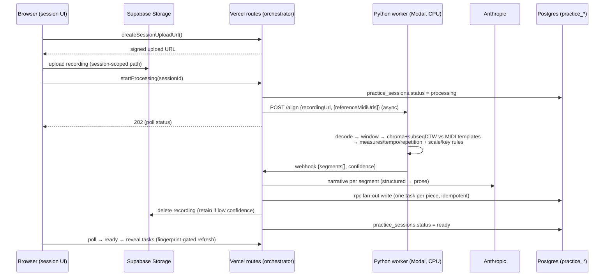

# feat: Listen and auto-log piano practice

## Summary

Add a flag-gated "listen" mode to the practice app: record a session via mic, align the audio against per-piece reference MIDIs in a small external Python worker (chroma + subsequence DTW — no note transcription in v1), then auto-write one editable `practice_task` per recognized piece with a teacher-legible narrative. Built spike-first so the alignment bet is proven on real recordings before any infra or UI lands.

---

## Problem Frame

Logging practice today means manually creating a `practice_task`, linking a piece, running the timer, and optionally recording — friction at exactly the moment you're trying to play, and the richest detail (which measures you drilled, how much was under tempo) never gets captured. The active repertoire is small (~12 pieces) and most have MIDIs available, which is what makes recognition tractable. The motivating pain and product decisions are settled in the origin doc (see Sources & References); this plan is about *how* to build it on a Next.js/Supabase/Vercel stack that has never run audio ML.

---

## Requirements

- R1. Discrete "start/stop listening" capture via mic; no always-on listening. (origin R1)
- R2. Record the session and process server-side after stop (not on-the-fly). (origin R2)
- R3. Delete raw audio after processing; retain only when match confidence was low. (origin R3)
- R4. Match audio against the active reference-MIDI set via MIDI-reference alignment (tolerant of wrong notes, tempo, mid-piece starts); not fingerprinting. (origin R4)
- R5. Segment a session into per-piece stretches; emit exactly one task per recognized piece with its worked duration. (origin R5)
- R6. Recognize scales/arpeggios by pattern (no reference MIDI) and identify key/mode where possible. (origin R6)
- R7. Unmatched, non-scale stretches above a minimum duration → a lightweight "free play" entry; brief noodling absorbed. (origin R7)
- R8. Auto-write entries with no review screen; entries are ordinary `practice_tasks`, editable/deletable afterward. (origin R8)
- R9. Per entry, generate a forgiving free-text narrative — region-level location ("the opening," "the coda"), tempo trend, repetition, hands-separate — written to be useful to a piano teacher. Not specific bar numbers in v1. Piece identity is the only thing held to a high bar. (origin R9; narrowed to region-level after the U1 spike)
- R10. Upload one optional reference MIDI per piece; replace by re-uploading; no in-app MIDI editing. (origin R10, R11)
- R11. Show, per piece, whether it has a reference MIDI yet (a recognizability checklist). (origin R12)
- R12. Ship behind a feature flag with existing manual logging fully intact. (plan-derived; WHOOP/TeamSnap rollout playbook)

**Origin actors:** A1 (Andrew/player), A2 (piano teacher — indirect reader of narratives), A3 (recognition pipeline — system)
**Origin flows:** F1 (capture and auto-log a session), F2 (make a piece recognizable)
**Origin acceptance examples:** AE1 (covers R5, R9), AE2 (covers R6), AE3 (covers R7), AE4 (covers R3), AE5 (covers R8)

---

## Scope Boundaries

- No audio→MIDI transcription of the player's audio in v1 (ByteDance/Klangio). All recognition is chroma + DTW against reference MIDIs.
- No structured section/measure fields; the existing `piece_sections` model is not used. Detail lives in the narrative prose only. (origin)
- No real-time/score-following or live feedback while playing. (origin)
- No per-note error reporting ("you missed the C# in bar 17") — unreliable on practice audio and out of product scope. (origin)
- No numeric practice-quality grading or auto-detected tempo targets. (origin)
- Pieces with no reference MIDI are simply not in the recognition set. (origin)
- No new GPU infrastructure: the v1 worker is CPU-only.

### Deferred to Follow-Up Work

- Note-level transcription (ByteDance on the same worker) as an optional v2 layer for finer detail — added only if v1 narratives prove too coarse or note-level feedback becomes desired. The worker and data model are shaped so this is an incremental add, not a rewrite.
- **Measure-level localization in the narrative** (and the per-piece score-offset to match the printed edition) — deferred after the U1 spike showed measure precision is coarse on practice audio. v1 narratives are region-level. Revisit once windowing + per-hand chroma (U6) are tuned against real sessions.

---

## Context & Research

### Relevant Code and Patterns

- **Audio capture (reuse):** `src/components/practice-table/task-audio-dialog.tsx` (wavesurfer Record plugin; prefers `audio/mp4` then `audio/webm;opus`; stereo, AGC/echo/noise-suppression off — clean for analysis) + `src/app/practice/timer/audio-actions.ts` (`createAudioUploadUrl` → browser `uploadToSignedUrl`; signed playback; explicit orphan deletion). Path today is task-scoped `${user.id}/${taskId}.${ext}` — v1 needs a session-scoped path.
- **Upload → process → status precedent (mirror closely):** `src/app/(reading)/reader/api/convert/route.ts` (`runtime="nodejs"`, `maxDuration=300`, drives a `status` enum to a terminal state) + `supabase/migrations/00083_reading_books_content.sql` (private bucket + `status` table `uploaded/processing/ready/failed` + `error_message`).
- **Async external-call + status-machine precedent:** `src/lib/whoop/push.ts` (admin client, `*_sync_status` state machine, manual-button trigger, verified-against-live-data rollout).
- **Background trigger precedent (if a sweeper is needed):** `src/app/api/cron/calendar-sync/route.ts` + `supabase/migrations/00106_calendar_background_sync.sql` (pg_cron + pg_net + Vault `CRON_SECRET`).
- **LLM call (mirror):** `src/lib/journal/anthropic.ts` (cached `anthropic()` singleton, env-overridable model default `claude-sonnet-4-6`) + `src/lib/workouts/parse.ts` (non-streaming `messages.create` with tool-use for structured output, resilient fallback).
- **Practice model:** `src/lib/types.ts` (`PracticeTask`, `PieceKind`, `SYSTEM_PIECE_IDS`), `src/app/practice/timer/actions.ts` (`getPiecesWithLastPlayed` = the active set), `src/app/practice/timer/task-actions.ts` (`createTask`). Elapsed = `timer_seconds - timer_remaining_seconds`; `text` is the notes field.
- **Feature-flag precedent:** TeamSnap importer gated by `CALENDAR_IMPORTER_ENABLED`.

### Institutional Learnings

- `.or()`/`.and()` on UPDATE/DELETE in supabase-js throws a misleading `42703` — use a SECURITY DEFINER rpc for conditional/atomic writes (relevant to the idempotency lease). (memory: postgrest-or-on-mutation)
- Trigger-on-mount → unconditional `router.refresh()` re-shows `loading.tsx` (skeleton flash); refresh only when a content fingerprint changed (`src/lib/sync/fingerprint.ts`). (memory: sync-on-load-skeleton-flash)
- Practice tables use family-shared RLS (`auth.uid() IS NOT NULL`), but storage buckets are per-user `{uid}/` folders — keep that asymmetry in mind for new tables/buckets.

### External References

- Chroma + subsequence DTW is the standard audio-to-score alignment method; robust to tempo/wrong-notes/mid-piece starts. Hard cases: **heavy single-measure repetition** (breaks whole-session DTW → mitigate with windowed per-segment alignment, which also *detects* repetition) and **hands-separate practice** (mitigate with per-hand reference chroma, which also *detects* hands-separate). Sources: Raffel audio-to-MIDI alignment; librosa `sequence.dtw` (`subseq=True`).
- "Which measures" derives from the DTW path + the reference MIDI's tempo/time-signature map (read with a lenient parser — see the U3 built-note; the Python worker uses its own). Tempo estimate from local DTW-path slope.
- Audio fingerprinting (Shazam/Chromaprint) is the wrong tool — matches a specific recording, not a re-performance.
- Scale/arpeggio detection: rule-based interval-pattern scan + Krumhansl-Schmuckler key profiles.
- Vercel can't host the heavy work: no GPU, `onnxruntime-node`/`tfjs-node` native binaries unreliable, `@spotify/basic-pitch` unmaintained, and decoding webm/m4a server-side needs bundled ffmpeg. Longest function budget in-repo is `maxDuration=300`; Fluid Compute on Pro allows up to 800s. `after()` is bounded by `maxDuration` — not a job queue. → External Python worker (Modal recommended: CPU-only, scale-to-zero, librosa + `@tonejs/midi`-equivalent `mido`/`pretty_midi` in one place) called async with a webhook callback.

---

## Key Technical Decisions

- **Chroma + DTW MIDI-reference alignment only for v1; no transcription of the player's audio.** The narrative's content (piece, measures, tempo, repetition, hands-separate) all derive from the alignment path against the uploaded reference MIDI. Transcription adds per-note detail that is out of scope and least reliable on messy practice audio, costs GPU, and can *degrade* matching (errors compound). Designed-in as a v2 layer.
- **Vercel orchestrates; an external CPU Python worker does the DSP.** No audio/MIDI/ffmpeg/ML runs in a Vercel function. Recommended worker: Modal (per-second billing, scale-to-zero, single Python module holding librosa chroma+DTW, measure-mapping, and scale/key rules). Provider is swappable (Replicate/Fly/Railway) — the contract is a JSON request/response over HTTPS + webhook.
- **Async job lifecycle modeled on reading-books + WHOOP:** browser uploads recording to a private bucket via signed URL → create `practice_sessions` row (`status=uploaded`) → short kickoff route calls the worker async and sets `processing` → worker webhooks back structured JSON → callback route writes tasks + narrative, deletes/retains audio, sets `ready`/`failed` → client polls status. Every Vercel invocation stays short.
- **Confidence = margin between best and second-best DTW alignment cost.** Low margin → flag the session low-confidence (retain audio per R3); per-segment low confidence can downgrade a guess.
- **Reference MIDI gets its own private bucket + table.** `task-audio`'s MIME allowlist excludes MIDI, and MIDI is per-piece not per-task. New `piece-midi` bucket + `practice_reference_midis` table (1-row-per-piece).
- **Scales/arpeggios and free play attach to the existing "Technique" system piece** (`SYSTEM_PIECE_IDS`); no new `pieces.kind` in v1.
- **Idempotent task fan-out via a SECURITY DEFINER rpc lease** keyed on the session, so a retried/duplicate webhook never double-writes tasks (and avoids the `.or()`-on-mutation `42703` trap).
- **Auto-logged duration encoded in the existing timer columns:** set `timer_seconds` and `timer_remaining_seconds` so elapsed (`timer_seconds - timer_remaining_seconds`) equals the measured segment duration; narrative → `text`.
- **Spike-first, flag-gated rollout.** Prove alignment on real recordings before infra/UI; ship behind `PRACTICE_AUTOLOG_ENABLED` with manual logging untouched.

---

## Open Questions

### Resolved During Planning

- Where does heavy processing run? → External CPU Python worker (Modal recommended), not Vercel. (research-grounded)
- Transcription in v1? → No; chroma+DTW against reference MIDI only. (decided with user)
- Is the reference MIDI used without transcription? → Yes; it's the alignment template and the measure ruler. (clarified with user)
- New data model for scales? → No; reuse the Technique system piece. (research: no `scale` kind exists)

### Deferred to Implementation

- Alignment tuning constants: window size/overlap, Sakoe-Chiba band, subsequence gully, and the confidence-margin threshold for "low confidence." Tuned empirically in the U1 spike against real recordings.
- Minimum segment duration to emit a piece task, and minimum free-play duration (R7) vs absorb-as-noodling threshold.
- Whether the worker computes chroma directly from MIDI note events or synthesizes MIDI→audio first — spike decides which is more robust.
- Final worker provider (Modal vs Replicate vs Fly) and webhook auth/signing scheme.
- Server-side decode of webm/m4a in the worker (ffmpeg in the Python image) — confirmed feasible; exact handling deferred.

---

## High-Level Technical Design

> *This illustrates the intended approach and is directional guidance for review, not implementation specification. The implementing agent should treat it as context, not code to reproduce.*

---

## Implementation Units

### Phase 1 — Prove the bet (no infra, no UI) — ✅ DONE (2026-06-18)

> **Outcome: GO.** Built in `experiments/practice-alignment/`. Five real recordings vs the Chopin Ballade 4 + Bach French Suite 5 references (whole-file DTW, MIDI-binned chroma, no windowing/tuning). **Piece ID 4/4 correct, including hands-separate and heavy-repetition takes**; a scale take correctly read as no-match (→ scale/free-play) under a two-factor cost+margin gate. **Measure localization is coarse** — the loop take landed in the right *region* (the coda) but not the exact bars, and hands-separate mislocalized — which is why R9 was narrowed to region-level and U6 carries the windowing + per-hand mitigations. Reproducible harness + results in the experiment README. The two findings that shaped later units: (a) real-world MIDIs need a **lenient parser** (the Bach seed was rejected by strict `mido`), and (b) the **measure map is unreliable for multi-meter MIDIs flattened to one time signature** (the Bach seed) and for MIDIs whose bar count differs from the published score (the Chopin: ~298 MIDI bars vs 239 in the score) — hence the deferred per-piece score-offset.

- U1. **Alignment feasibility spike**

**Goal:** Prove chroma + subsequence DTW against reference MIDIs returns the right piece and plausible location on *real* practice recordings, including the hard cases, before committing to any infrastructure.

**Requirements:** R4, R5, R6 (validation of feasibility)

**Dependencies:** None

**Files:**
- Create: `experiments/practice-alignment/align_spike.py` (throwaway harness; seeds the eventual worker)
- Create: `experiments/practice-alignment/README.md` (how to run; what "pass" looks like)

**Approach:**
- Take 3–4 real recordings of Andrew's actual pieces + their reference MIDIs. Include deliberate **hands-separate** and **one-bar-looping** passages.
- Implement: decode → overlapping windows → chroma per window → subsequence DTW vs each reference's MIDI-derived chroma (incl. per-hand variants) → piece label + reference position per window → stitch into segments → map positions to measures via the MIDI tempo/time-sig map → estimate tempo from path slope.
- Add the rule-based scale/arpeggio + Krumhansl-Schmuckler key pass for unmatched stretches.
- Tune window/band/gully/confidence-margin constants here; record the chosen values for U6.

**Execution note:** Exploratory validation harness — success is a human judgment call on output quality against real recordings, not an automated test suite. This is the go/no-go gate for Phases 2–4.

**Test scenarios:**
- Test expectation: none — throwaway spike. Validation = manual review: correct piece for each clip; measure ranges within ~±1–2 bars; repetition shows as repeated same-region windows; hands-separate is recognized rather than mis-piece'd; a scale clip is detected with plausible key.

**Verification:**
- A short findings note (in the README or alongside) stating whether alignment is trustworthy enough to proceed, the tuned constants, and any reshaping needed (e.g., "measure localization too coarse → revisit"). If it fails, stop and revisit scope with the user before Phase 2.

---

### Phase 2 — Reference MIDI foundations — ✅ DONE (2026-06-18)

> **Built and browser-verified.** Migration `00143` applied to local DB; uploaded the Bach seed MIDI (the one strict parsers reject) through the running app → "Recognizable" badge, `practice_reference_midis` row `status=ready` (263 measures, 3838 notes), storage object at the per-user path; Remove cleaned up both row and object (no orphan); list-wide recognizability badge confirmed on `/practice/repertoire`. Zero console errors. Built note: dropped `@tonejs/midi` for a lenient hand-rolled parser (`src/lib/practice/midi.ts`) after both `@tonejs/midi` and `mido` rejected the Bach file.

- U2. **Reference MIDI storage + data model**

**Goal:** Persist one optional reference MIDI per piece.

**Requirements:** R10

**Dependencies:** None (can run alongside U1)

**Files:**
- Create: `supabase/migrations/NNNNN_practice_reference_midis.sql`
- Modify: `src/lib/types.ts` (add `ReferenceMidi` type)

**Approach:**
- New private storage bucket `piece-midi` with MIDI MIME allowlist (`audio/midi`, `audio/x-midi`, `application/octet-stream`) and per-user `{uid}/` folder RLS, mirroring `reading-books`/`journal-photos` bucket policies.
- New `practice_reference_midis` table: `piece_id` (FK `pieces`, unique — one per piece), `midi_path`, `status` (`uploaded`/`ready`/`failed`), `measure_count` (nullable, cached from parse), `error_message`, timestamps. Family-shared RLS (`auth.uid() IS NOT NULL`), matching the practice convention.

**Patterns to follow:** `supabase/migrations/00083_reading_books_content.sql` (bucket + status table); practice-table RLS policies.

**Test scenarios:**
- Happy path: inserting a row for a piece persists with `status=uploaded`; second insert for the same piece is rejected by the unique constraint.
- Edge case: deleting a piece cascades / cleans the reference row.
- Integration: bucket RLS allows a user to write/read only under their own `{uid}/` folder.

**Verification:** Migration applies locally; a row + object can be created and read back under RLS.

---

- U3. **Reference MIDI upload UI + recognizability indicator**

**Goal:** Let Andrew attach/replace a reference MIDI on a piece and see at a glance which active pieces are recognizable.

**Requirements:** R10, R11 — F2; A1

**Dependencies:** U2

**Files:**
- Create: `src/app/practice/repertoire/midi-actions.ts` (`"use server"`: create signed upload URL, attach/parse, delete)
- Modify: `src/app/practice/repertoire/[id]/page.tsx` (upload control on the piece view)
- Modify: the repertoire list view + `getPiecesWithLastPlayed` consumer to surface a "has reference MIDI" badge
- Test: `src/app/practice/repertoire/midi-actions.test.ts`

**Approach:**
- Reuse the signed-upload pattern from `audio-actions.ts` (browser `uploadToSignedUrl` into `piece-midi`), path `${user.id}/${pieceId}.mid`.
- On attach, parse the MIDI server-side with a **lenient hand-rolled SMF parser** (`src/lib/practice/midi.ts`) to validate it and cache `measure_count`/`ppq`/`note_count`; set `status=ready` or `failed` with `error_message`. Replace = re-upload (orphan-delete prior object, mirroring `attachTaskAudio`). **Built note (2026-06-18):** we tried `@tonejs/midi` first — it (like `mido`) *rejected the Bach seed file* ("no MTrk header"), so it would wrongly mark a usable MIDI unrecognizable. Dropped the dependency in favor of the lenient parser, which reads both seed files. The Python worker (U6) needs the same leniency.
- Indicator: a piece is "recognizable" when it has a `ready` reference MIDI.

**Patterns to follow:** `src/app/practice/timer/audio-actions.ts` (signed upload + orphan cleanup); `src/lib/workouts/parse.ts` (resilient parse → status).

**Test scenarios:**
- Happy path: upload a valid `.mid` → row `ready`, `measure_count` populated, piece shows recognizable.
- Error path: upload a non-MIDI / corrupt file → `status=failed`, `error_message` set, no crash.
- Edge case: re-uploading replaces the object and clears any prior `failed` state; the previous storage object is removed (no orphan).
- Integration: badge reflects `ready` vs absent across the active-pieces list.

**Verification:** Uploading a real MIDI to a piece flips it to recognizable; bad file fails gracefully; replace doesn't orphan.

---

### Phase 3 — Capture and processing pipeline

- U4. **Session + job data model** — ✅ DONE (2026-06-18)

> Migration `00144` applied + verified: `practice_sessions` (status machine), `practice_tasks.session_id`, and the `claim_practice_session` SECURITY DEFINER lease (tested: first claim → true, duplicate → false). TS types added (`PracticeSession`, `PracticeSegment`, `PracticeAlignmentResult`).

**Goal:** Track a recording's processing lifecycle and guarantee idempotent task writes.

**Requirements:** R2, R3, R5

**Dependencies:** None (precedes U5–U8)

**Files:**
- Create: `supabase/migrations/NNNNN_practice_sessions.sql`
- Modify: `src/lib/types.ts` (`PracticeSession`, status union)

**Approach:**
- `practice_sessions` table: `id`, `date`, `recording_path` (nullable after deletion), `status` (`uploaded`/`processing`/`ready`/`failed`), `error_message`, `confidence` (numeric, nullable), `result` (jsonb — worker output, for debugging/retry), `audio_retained` (bool), `session_number`, timestamps. Family-shared RLS.
- A `claim_practice_session(session_id)` SECURITY DEFINER rpc that atomically transitions `uploaded → processing` only if not already claimed (the idempotency lease), returning whether the caller won the claim.
- `practice_tasks` gains a nullable `session_id` FK so auto-logged tasks trace to their session and the fan-out write is idempotent per session.

**Patterns to follow:** `00083` status table; `whoop_sync_status` state machine; rpc pattern from memory `postgrest-or-on-mutation`.

**Test scenarios:**
- Happy path: a new session inserts as `uploaded`; `claim_practice_session` transitions it to `processing` and returns won=true.
- Edge case: a second `claim_practice_session` call returns won=false and does not change state (idempotency).
- Integration: tasks written with a `session_id` are retrievable by session; deleting a session leaves tasks (SET NULL) or cascades per chosen policy.

**Verification:** Concurrent/duplicate claims yield exactly one winner; schema applies locally.

---

- U5. **Session recording & upload UI**

**Goal:** A flag-gated "start/stop listening" surface that records a session and kicks off processing.

**Requirements:** R1, R2, R12 — F1; A1

**Dependencies:** U4

**Files:**
- Create: `src/app/practice/session/page.tsx` (the listen surface)
- Create: `src/components/practice/session-recorder.tsx` (`"use client"`)
- Create: `src/app/practice/session/actions.ts` (`"use server"`: `createSessionUploadUrl`, `startProcessing`)
- Modify: practice `Header`/nav to link to the session page when `PRACTICE_AUTOLOG_ENABLED`
- Modify: `src/lib/pwa/apps.ts` only if a launch entry is wanted (optional)
- Test: `src/app/practice/session/actions.test.ts`

**Approach:**
- Reuse the wavesurfer recorder logic from `task-audio-dialog.tsx` (extract the shared recording mechanics rather than duplicating). Upload to a **session-scoped** path `${user.id}/sessions/${sessionId}.${ext}` in `task-audio` (or a sibling `practice-sessions` bucket if separation is cleaner — decide in U4).
- On stop: create the `practice_sessions` row, upload, then call `startProcessing(sessionId)` which kicks off U7's pipeline.
- Whole surface hidden unless the feature flag is on; manual logging untouched.

**Patterns to follow:** `task-audio-dialog.tsx` recorder; `createAudioUploadUrl` flow.

**Test scenarios:**
- Happy path: stopping a recording creates a session row and triggers processing exactly once.
- Edge case: a zero-length / aborted recording does not create a dangling processing job.
- Error path: upload failure surfaces an error and leaves the session in a non-`processing` recoverable state.
- Integration: with the flag off, the route/nav entry is not reachable.

**Verification:** Recording a short session produces an `uploaded`→`processing` session and a stored object at the session-scoped path.

---

- U6. **Alignment worker service (external, CPU Python)** — ✅ BUILT + validated (2026-06-18); not yet deployed

> `services/practice-alignment/` (midi.py lenient parser, align.py windowed segmenter, server.py FastAPI `/align`). Validated on the 5 real recordings: piece ID 4/4 + scale→free; region accurate (loop→"the coda", chopin→"an early section", bach→"the opening"); hands-separate detected. **Refinements deferred (documented in the service README):** `tempoBpm`/`repetitionCount` are null (naive ratios gave nonsense — need DTW-slope + ref-center clustering); scale segments are generic `free` (no key id yet — needs pyin); endpoint is synchronous (fine for short clips; async+webhook when on Modal). Not yet deployed to Modal / not yet wired to the app (U7).

**Goal:** Given a recording + the active reference MIDIs, return structured segments (piece, region, hands-separate, confidence) plus scale/free-play classification.

**Requirements:** R4, R5, R6, R7

**Dependencies:** U1 (graduates the spike), reads MIDIs produced by U2/U3

**Files:**
- Create: `services/practice-alignment/` (Python: alignment module graduated from U1, web endpoint, container/Modal config)
- Create: `services/practice-alignment/README.md` (deploy + env + contract)

**Approach:**
- Graduate the spike (`experiments/practice-alignment/`) into a deployable module. Input: signed URL(s) for the recording and the candidate reference MIDIs (or the worker fetches reference chroma cached by the app). Output JSON contract: ordered `segments[]` each `{ kind: "piece"|"scale"|"free", pieceId?, region?, tempoBpm?, handsSeparate?, repetitionCount?, startSec, endSec, confidence }` + overall `confidence`. `region` is a coarse location label / proportional position, **not** a bar range (per the narrowed R9).
- Decode (ffmpeg in image) → **window** the audio (the spike was whole-file; windowing is what fixes the repetition smear and lets segments self-localize) → chroma+subseq DTW vs **per-piece and per-hand** reference chroma (per-hand both improves and *detects* hands-separate playing, the spike's weakest case) → stitch windows into segments → tempo/repetition (consecutive same-region windows) → scale/arpeggio + K-S key for unmatched. Post to the app webhook on completion (and on failure).
- Carry forward the spike's hard-won details: a **lenient MIDI parser** (strict parsers reject some real-world files), the **two-factor confidence gate** (low cost AND healthy margin) that cleanly separated the scale take, and tuned window/band/gully constants.
- CPU-only; scale-to-zero. Auth via shared secret header; webhook payload signed.
- **Deferred precision (not v1):** measure-level localization and a per-piece **score-offset** (to reconcile MIDI bar count with the printed edition) — only if the windowed/per-hand pipeline proves tight enough to promise bar numbers. v1 emits `region`, not bars.

**Execution note:** Build against the U1 fixtures first; the worker must reproduce the spike's results before wiring webhooks.

**Patterns to follow:** the U1 harness; research's recommended windowed-alignment pipeline.

**Test scenarios:**
- Happy path: a fixture recording of a known piece → one segment with correct `pieceId` and plausible measure range.
- Edge case: a hands-separate clip → segment flagged `handsSeparate`, still correct piece.
- Edge case: a one-bar loop → elevated `repetitionCount` over a narrow measure range.
- Edge case: a scale clip with no matching MIDI → `kind:"scale"` with a key.
- Error path: unreadable/empty audio → failure callback with a reason, not a hang.
- Edge case: ambiguous short fragment → low `confidence` on the segment.

**Verification:** The worker reproduces U1 results on fixtures and returns the JSON contract; failure paths call back rather than time out.

---

- U7. **Vercel orchestration routes**

**Goal:** Kick off processing, receive the worker's result, and drive the session to a terminal state.

**Requirements:** R2, R3, R5

**Dependencies:** U4, U6

**Files:**
- Create: `src/app/practice/session/api/process/route.ts` (kickoff: claim → call worker async)
- Create: `src/app/practice/session/api/callback/route.ts` (webhook: verify, fan-out write, delete/retain audio, set status)
- Create: `src/app/practice/session/api/status/route.ts` (poll)
- Modify: `next.config.ts` if a native dep needs `serverExternalPackages` (likely none — MIDI parsing is a pure-JS hand-rolled parser, `src/lib/practice/midi.ts`)

**Approach:**
- Kickoff: `runtime="nodejs"`; call `claim_practice_session`; if won, POST the worker with signed recording URL + candidate reference URLs; return 202. If not won, no-op (idempotent).
- Callback: verify the worker signature; idempotently write tasks + narrative via U8's lib (guarded by the session claim); on success delete the recording unless `confidence` is low (then set `audio_retained=true`); set `status=ready`/`failed`, persist `confidence` + `result`.
- Status: return the session's status + a content fingerprint for the reveal UI.

**Patterns to follow:** `reader/api/convert/route.ts` (runtime/maxDuration/status-machine); `audio-actions.ts` deletion; Replicate/Modal webhook docs.

**Test scenarios:**
- Happy path: kickoff claims and calls the worker once; callback writes tasks and sets `ready`.
- Edge case (idempotency): a duplicate callback does not double-write tasks; a duplicate kickoff does not re-call the worker.
- Error path: worker failure callback → `status=failed` with `error_message`; audio retained for inspection.
- Edge case (R3): low overall confidence → audio retained (`audio_retained=true`), not deleted.
- Integration: end-to-end with a stubbed worker payload produces the expected tasks and storage deletion.

**Verification:** A stubbed worker response flows through to written tasks, correct status, and the right delete/retain branch.

---

- U8. **Narrative generation + task fan-out write**

**Goal:** Turn worker segments into a teacher-legible narrative and write one editable task per piece (plus scale/free-play entries).

**Requirements:** R5, R6, R7, R8, R9 — AE1, AE2, AE3, AE5; A1, A2

**Dependencies:** U4, U6

**Files:**
- Create: `src/lib/practice/narrative.ts` (Anthropic call: structured segment → prose)
- Create: `src/lib/practice/anthropic.ts` (`PRACTICE_MODEL` constant, reuses cached client)
- Create: `src/lib/practice/autolog.ts` (segments → `practice_tasks` via the idempotent rpc)
- Test: `src/lib/practice/narrative.test.ts`, `src/lib/practice/autolog.test.ts`

**Approach:**
- Narrative: non-streaming `messages.create` with tool-use, system prompt aimed at *teacher-legible deliberate-practice signals* (time on task, isolating/repeating hard spots, under- vs up-to-tempo, hands-separate). Forgiving prose; resilient fallback to a templated summary if the LLM call fails (never block the log).
- Fan-out: one task per `kind:"piece"` segment → `piece_id`, `text`=narrative, `timer_seconds`/`timer_remaining_seconds` encoding the measured duration, `session_id`, today's `date`/`session_number`. `kind:"scale"` and `kind:"free"` → tasks on the Technique system piece (free-play only if above the min-duration threshold per R7). Writes go through the session-scoped idempotent rpc.

**Patterns to follow:** `src/lib/workouts/parse.ts` (tool-use, resilient); `task-actions.ts` (`createTask`); memory `postgrest-or-on-mutation` (rpc for conditional writes).

**Test scenarios:**
- Covers AE1. Happy path: two piece-segments (Ballade slow-repeated, Invention) → two tasks with durations and narratives mentioning the slow/repeated work.
- Covers AE2. A scale segment → a Technique task naming the key.
- Covers AE3. A 6-min unmatched segment → a free-play Technique task; a 20-sec noodle → no task.
- Covers AE5. Tasks are plain editable `practice_tasks` (no special lock/flag blocking edit).
- Error path: LLM failure → templated fallback narrative, task still written.
- Edge case: duplicate invocation for the same session writes each task once (idempotent rpc).

**Verification:** Given a sample segment set, the right tasks appear with sensible durations and narratives; re-running is a no-op.

---

### Phase 4 — Surface and ship

- U9. **Results reveal UI + rollout gating**

**Goal:** Show processing progress, reveal the auto-logged tasks cleanly when ready, and keep the whole feature behind a flag.

**Requirements:** R8, R12 — F1; A1

**Dependencies:** U5, U7, U8

**Files:**
- Modify: `src/components/practice/session-recorder.tsx` (poll status; processing/ready/failed states)
- Modify: the practice feed/table to surface newly auto-logged tasks
- Create: `src/lib/practice/flags.ts` (or reuse existing flag util) for `PRACTICE_AUTOLOG_ENABLED`
- Test: `src/components/practice/session-recorder.test.tsx`

**Approach:**
- After stop, show a "listening… / analyzing…" state; poll the status route; on `ready`, reveal the new tasks. Gate `router.refresh()` on the content fingerprint to avoid the documented skeleton-flash; only refresh on real state transitions.
- On `failed`, show a friendly message and leave manual logging available; on low-confidence, optionally note "I wasn't sure about part of this — audio kept so you can check."
- Entire surface and nav entry gated by `PRACTICE_AUTOLOG_ENABLED`.

**Patterns to follow:** memory `sync-on-load-skeleton-flash` (fingerprint-gated refresh); TeamSnap `CALENDAR_IMPORTER_ENABLED` gating.

**Test scenarios:**
- Happy path: poll transitions processing→ready reveals tasks without a skeleton flash.
- Error path: `failed` status shows a recoverable message; manual logging still works.
- Edge case: low-confidence session surfaces the "kept the audio" note.
- Integration: flag off → no session UI anywhere; existing practice pages unchanged.

**Verification:** A full recorded session shows progress then the auto-logged tasks; flag off fully hides the feature.

---

## System-Wide Impact

- **Interaction graph:** New writes to `practice_tasks` (family-shared) from a webhook callback path; new buckets/tables; new external HTTP egress to the worker + Anthropic; new env vars/secrets (`PRACTICE_AUTOLOG_ENABLED`, `PRACTICE_MODEL`, worker URL + shared secret, webhook signing secret).
- **Error propagation:** Worker/LLM failures must drive the session to `failed` with a message and never block manual logging; LLM failure degrades to a templated narrative, not a lost task.
- **State lifecycle risks:** Duplicate/retried webhooks (idempotency via the session-claim rpc); orphaned storage objects (reuse orphan-delete pattern); partial fan-out writes (single rpc transaction).
- **API surface parity:** None external; this is additive UI + internal routes.
- **Integration coverage:** End-to-end (record → worker stub → tasks) exercises the seams unit tests can't; the U1 spike covers the algorithmic risk that mocks never will.
- **Unchanged invariants:** Manual practice logging, the timer, recordings, and `piece_sections` are untouched; the feature is purely additive and flag-gated.

---

## Risk Analysis & Mitigation

| Risk | Likelihood | Impact | Mitigation |
|------|-----------|--------|------------|
| Alignment unreliable on hands-separate / heavy repetition | Med | High | U1 spike on real recordings is the gate before any infra; per-hand reference chroma + windowed alignment specifically target these cases |
| Measure localization too coarse for a useful narrative | Med | Med | Quote ranges not exact bars; validate granularity in U1; narrative is forgiving by design |
| External worker ops/cost/cold-starts | Low | Med | CPU-only scale-to-zero (Modal); async webhook absorbs cold starts; cost is pennies/session |
| Duplicate webhook double-writes tasks | Med | Med | SECURITY DEFINER session-claim lease; idempotent fan-out |
| Skeleton-flash on reveal | Med | Low | Fingerprint-gated refresh (known pattern) |
| Wrong-piece auto-write erodes trust | Low | Med | Confidence margin + low-confidence audio retention; entries are trivially editable (R8); flag-gated rollout with manual fallback |

---

## Phased Delivery

### Phase 1 — Prove the bet
- U1 only. Gate: alignment trustworthy on real recordings? If no, reshape scope with the user before spending on infra.

### Phase 2 — Reference MIDI foundations
- U2, U3. Can proceed in parallel with U1 (no algorithmic dependency).

### Phase 3 — Pipeline
- U4 → U5/U6 → U7/U8. The worker (U6) graduates the U1 spike.

### Phase 4 — Surface and ship
- U9. Flip `PRACTICE_AUTOLOG_ENABLED` on for Andrew only first, verify against live sessions (WHOOP/TeamSnap playbook).

---

## Documentation / Operational Notes

- New secrets/env in Vercel + the worker host: `PRACTICE_AUTOLOG_ENABLED`, `PRACTICE_MODEL`, worker base URL, worker shared secret, webhook signing secret. Document worker deploy in `services/practice-alignment/README.md`.
- Verify via `tsc`/build/targeted scripts and the U1 harness, not the browser, per standing preference. The alignment bet is validated with real recordings, not synthetic fixtures alone.
- Capture the eventual engine/hosting decision and any new audio-pipeline gotchas as a memory entry / `docs/solutions` once it lands — no audio-ML precedent exists in this repo yet.

---

## Sources & References

- **Origin document:** [docs/brainstorms/listen-and-auto-log-practice-requirements.md](docs/brainstorms/listen-and-auto-log-practice-requirements.md)
- Reuse: `src/components/practice-table/task-audio-dialog.tsx`, `src/app/practice/timer/audio-actions.ts`
- Precedent: `src/app/(reading)/reader/api/convert/route.ts`, `supabase/migrations/00083_reading_books_content.sql`, `src/lib/whoop/push.ts`, `src/app/api/cron/calendar-sync/route.ts`
- LLM: `src/lib/journal/anthropic.ts`, `src/lib/workouts/parse.ts`
- Model: `src/lib/types.ts`, `src/app/practice/timer/actions.ts`
- External: librosa `sequence.dtw` (subseq); Raffel audio-to-MIDI alignment; Krumhansl-Schmuckler key profiles; Vercel Fluid Compute duration limits; Modal/Replicate webhook patterns; `@tonejs/midi`
