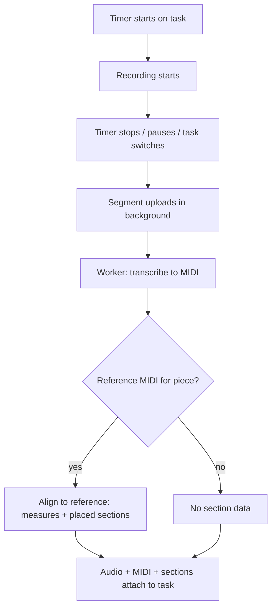
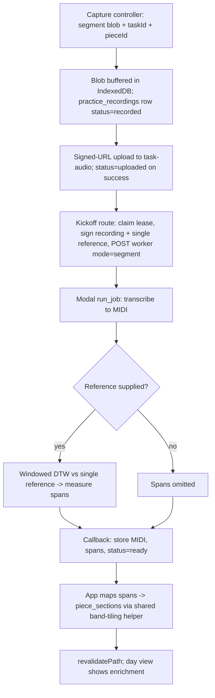

# Practice Capture Merge - Plan

## Goal Capsule

- **Objective:** One recording system riding the practice timer — automatic, invisible capture and enrichment of every timed task-run — replacing the three overlapping capture features (timer, task-audio recorder, Listen).
- **Product authority:** Andrew (sole user of the practice app). This plan's Product Contract carries his confirmed decisions; implementation follows this plan, then repo conventions, surfacing genuine scope conflicts instead of guessing.
- **Product Contract preservation:** changed: Success Criteria — "zero lost audio" narrowed to "zero audio lost after capture completes" (crash mid-segment loses that segment in v1; confirmed by Andrew at plan time). All R/F/AE IDs otherwise unchanged.
- **Stop conditions:** Surface (don't guess) anything that would change product behavior — log semantics, what appears in the Recordings tab, deletion of any audio. Never delete existing audio objects or rows during migration.
- **Execution profile:** No test runner in this repo — verify via `npx tsc --noEmit`, eslint, `npm run build`, ad-hoc `tsx` scripts for pure logic, and local worker runs (see Verification Contract). Browser verification only on explicit request. Migrations must be idempotent/re-apply-safe (shared local Supabase across workspaces). Dev servers never bind port 3000 (`npm run dev:agent`).
- **Open blockers:** None. Enrichment coverage depends on reference-MIDI and placed-section backfill (4 of 9 active pieces as of 2026-07-02) — content work owned by Andrew, not this build.

---

## Product Contract

### Summary

With a per-device toggle on, every timed task-run records automatically, uploads and processes silently in the background, and attaches audio, transcribed MIDI, and section-level location to the task that was already planned. Manual takes and explicit performance recordings join the same per-task recording list. The standalone Listen page retires, replaced by capture-only open sessions with on-demand piece linking.

### Problem Frame

The practice app grew three separate capture features that now overlap. The timer is the daily driver: plan tasks, run the countdown per task. The task-audio recorder manually attaches one trimmed, titled recording to a task. Listen records a whole session, recognizes pieces by audio matching, transcribes to MIDI, and auto-writes completed tasks to the log.

The overlaps cost real things. Listen's auto-logger appends new completed tasks without reconciling against the planned tasks the timer already tracks, so using both on the same day double-logs the same practicing. Listen blocks the UI with an analyzing spinner and a poll loop, while the rest of the app is instant. Listen deletes the audio after transcription — even when transcription fails, leaving no artifact at all. And piece recognition solves a problem the timer has already solved: during a timed task, the piece is known in advance, yet the pipeline still guesses it from audio at region-level precision.

Meanwhile the pieces of something better already exist separately: reliable transcription to performance MIDI, per-piece section markers placed on the reference MIDI, and a permanent laptop-plus-external-mic setup at the piano.

### Key Decisions

- **The recorder follows the timer exactly.** Recording starts when a task's timer starts and stops when it stops, pauses, or switches — one audio segment per task-run, multiple segments per task allowed. Between-task playing is not captured; open sessions exist for that. The mic is hot only during a deliberate "I'm practicing now," which keeps the privacy story clean now that audio is kept.
- **Processing enriches; it never touches the log.** The timer remains the sole source of truth for what was practiced and for how long. Background processing attaches evidence (audio, MIDI, section location) to the existing task and creates nothing. This keeps misfires cosmetic rather than data-integrity problems and lets pieces without reference MIDIs degrade to "less enrichment" instead of "different log treatment."
- **Alignment replaces recognition in the primary flow.** Each segment arrives knowing its claimed piece, so the pipeline aligns the performance MIDI against that one reference MIDI — no library-wide guessing. Low-confidence alignment degrades to "no section data," never to a "you didn't practice what you said" signal.
- **Recognition is demoted to an on-demand tool.** Piece identification is currently too rough to automate against. It survives only as the explicit "link to pieces" action on open sessions, and nothing in the merged flow makes automatic decisions based on it.
- **One recording model with kinds.** A task has a list of recordings; kind distinguishes auto-captured practice, manual takes, and performances. Performances are the only kind surfacing in the Recordings tab. Trim and title stay on the manual/performance path. The single-slot task-audio model retires.
- **Audio is kept, always.** Storage is trivially cheap relative to the archive's value (ground truth for future re-transcription, listening back). This also fixes today's delete-on-failed-transcription behavior. No pruning story in v1.
- **Everything is background; the app's feel doesn't change.** No upload or processing screens, no blocking states. Capture and enrichment results appear when ready; the user uses the app exactly as today.
- **Section location reuses the existing section layer.** Alignment output maps into `piece_sections` markers already placed on the reference MIDI, with measures as the substrate. No new sectioning concept.
- **Staged convergence (chosen over big-bang session remodel).** Capture core ships first; open-session linking UX waits for recognition quality work. A near-live day-view surfacing of enrichment is folded in only if it proves cheap during planning, and is severable.

### Requirements

**Capture**

- R1. A per-device auto-record toggle (default off) controls whether timed task-runs record; it lives alongside the existing mic-device preference.
- R2. With the toggle on, starting a task's timer starts recording from the selected mic; stopping, pausing, or switching tasks ends the segment.
- R3. Each segment is born associated with its task and the task's piece; a task accumulates multiple segments across timer runs.
- R4. The timer UI shows a subtle recording indicator plus the existing input-level meter and silent-input warning while recording.
- R5. Segment upload and processing kickoff happen automatically when the segment ends, without user action.

**Processing and enrichment**

- R6. Each uploaded segment is transcribed to performance MIDI in the background and both artifacts (audio, MIDI) attach to the task.
- R7. For pieces with a reference MIDI, the performance is aligned against it to produce measure-level location, expressed through that piece's placed sections where they exist.
- R8. When alignment confidence is low or no reference MIDI exists, section data is simply absent; no negative or accusatory signal is shown.
- R9. Processing failures never lose the audio; a failed segment retains its recording and can be reprocessed.

**Recording model**

- R10. A task has a list of recordings with a kind: auto (timer-captured), manual (user-initiated take), or performance.
- R11. The explicit "record a performance" action remains a deliberate entry point; performance recordings appear in the Recordings tab. Auto and manual practice recordings do not.
- R12. Trim and title affordances remain available on manual and performance recordings.
- R13. Existing single-slot task audio remains playable after the merge.

**Open sessions (secondary flow)**

- R14. An untimed open session can be recorded without any task or piece association; it is captured, transcribed, and kept as a browsable session artifact.
- R15. Open sessions write nothing to the practice log and run no piece recognition automatically.
- R16. An explicit "link to pieces" action runs recognition on an open session and proposes piece segments for user acceptance; only accepted segments enter the log.

**UX constraints**

- R17. No flow in the merged system blocks the user on upload or processing; the app remains fully usable while segments capture and process.
- R18. The standalone Listen page retires; its remaining useful surfaces (session browsing, the "process an existing audio file" escape hatch) relocate rather than disappear.

### Key Flows

- F1. Timed task-run capture (primary)
  - **Trigger:** Toggle on; user starts a planned task's timer on the piano laptop.
  - **Steps:** Recording starts with the timer; user practices; user stops/pauses/switches; segment ends and uploads silently; background worker transcribes and aligns to the task's piece; results attach to the task.
  - **Outcome:** Shortly after (typically 2–4 minutes for a 10-minute segment), the task shows its recordings, MIDI, and section location. Zero taps beyond normal timer use.
  - **Covers R1–R8, R17.**



- F2. Performance recording
  - **Trigger:** User explicitly chooses to record a performance.
  - **Steps:** User records deliberately; optionally trims and titles; recording saves with kind performance.
  - **Outcome:** The take appears in the Recordings tab as a first-class artifact, and on its task if attached to one.
  - **Covers R10–R12.**

- F3. Open session
  - **Trigger:** User starts an open (untimed, unassociated) recorded session.
  - **Steps:** Session records; on stop it uploads and transcribes in the background; the artifact is browsable with playback.
  - **Outcome:** A kept session with audio and MIDI; the practice log is untouched.
  - **Covers R14, R15, R17.**

- F4. On-demand piece linking
  - **Trigger:** User invokes "link to pieces" on an open session.
  - **Steps:** Recognition proposes piece segments with locations; user reviews and accepts or rejects each.
  - **Outcome:** Accepted segments become log entries; rejected proposals cost nothing.
  - **Covers R16.**

### Acceptance Examples

- AE1. **Covers R2, R3.** Given the toggle is on, when the user runs the Ballade task for 10 minutes, switches to scales, then returns to the Ballade for 5 minutes, then the Ballade task has two audio segments and the scales task has one, each with its own transcription.
- AE2. **Covers R7.** Given Ballade 4 has a reference MIDI with placed sections, when a segment aligns to mm. 140–162, then the task shows that measure range labeled with the placed section covering it.
- AE3. **Covers R8.** Given a piece has no reference MIDI, when its segment finishes processing, then the task shows audio and MIDI with no section data and no warning.
- AE4. **Covers R9.** Given transcription fails on a segment, when processing completes, then the audio remains stored and attached, and the failure is visible only as absent enrichment.
- AE5. **Covers R11.** Given a timed task-run was auto-recorded, when the user opens the Recordings tab, then that practice segment is not listed there; a performance recorded the same day is.
- AE6. **Covers R15.** Given the user records a 90-minute open session and never invokes linking, then the practice log for that day is unchanged.
- AE7. **Covers R1.** Given the toggle is off on a device, when the user runs timers on it, then no audio is captured and the timer behaves exactly as today.
- AE8. **Covers R17.** Given a segment is uploading or processing, when the user navigates anywhere in the app or starts the next task, then nothing blocks, spins, or prompts.

### Success Criteria

- Over two weeks of normal practice with the toggle on, every timed task ends up with its recordings and transcribed MIDI attached, with zero extra interactions and zero audio lost after capture completes (including failed transcriptions). A browser crash or lid-close mid-segment may lose that in-flight segment in v1; that is the accepted boundary.
- The user never sees an upload or processing state; the app feels identical to today.
- Section alignment ships visibly best-effort: shown when confident, absent when not. Its accuracy is judged by Andrew against his own sense of where he worked, on pieces with placed sections, before the practice-notes follow-up builds on it.

### Scope Boundaries

**Deferred to Follow-Up Work**

- Crash-proof capture (timesliced chunked upload so an in-flight segment survives a browser crash) — v1 accepts the loss.
- Dropping the legacy `practice_tasks.audio_path`/trim/title columns — they stay frozen and readable until the new model has soaked.
- Near-live enrichment is in this plan only as severable unit U9; if it slips, nothing else depends on it.
- Warm Modal container to cut the ~2-minute processing floor.

**Deferred for later**

- Practice-notes generation (starting with time-per-section aggregated from aligned segments) — the named follow-up; this build stores the aligned data it needs.
- Recognition-quality improvements — prerequisite for any automation of open-session linking.
- Multi-device capture (timer started on a phone recording via the laptop) — v1 records only on the device running the timer with the tab open.
- Any audio retention/pruning policy — v1 keeps everything.

**Outside this product's identity**

- Ambient always-on listening that detects piano and proposes tasks — contradicts the privacy posture and "use the app as I do now."
- Processing authority over the log (adjusting logged time from audio, splitting tasks, verified-practice badges).

### Dependencies / Assumptions

- A laptop with an external mic sits permanently at the piano and runs the timer; the auto-record toggle is set once there.
- Recording requires the practice tab open on that device; the tab-lifetime constraint is acceptable for v1.
- Enrichment quality tracks reference-MIDI and placed-section coverage (4 of 9 active pieces have reference MIDIs, prod snapshot 2026-07-02; some sections unplaced). The build degrades gracefully; backfill is content work outside this plan.
- Keep-audio-forever at ~2h/day is an accepted storage cost (order of $2/month after a year at current rates).
- There is no user-preferences table; per-device preferences follow the existing localStorage pattern (nearest schema analogs are app-config tables like `journal_settings`, `reading_settings`).

---

## Planning Contract

### Key Technical Decisions

- **KTD1 — New `practice_recordings` table; legacy columns frozen.** Recordings move to their own table (`kind` in `auto|manual|performance`, nullable `task_id`/`session_id`, per-segment status machine) rather than widening `practice_tasks`. The existing `audio_path`/`audio_trim_*`/`audio_title` columns and their `practice_tasks_audio_consistency` CHECK (migration `00027`) stay untouched and readable (R13); existing rows are backfilled into the new table as kind=`performance` (they were deliberate takes — this keeps the Recordings tab's contents identical on day one). Readers switch to the new table; the legacy columns are dropped in follow-up work, not here.
- **KTD2 — One capture controller riding `TaskTimerProvider`, owned by the start gesture.** A client capture module mounts beside the timer provider in `src/app/practice/layout.tsx` and holds one persistent `MediaStream` while the toggle is on and a timer is active; each task-run gets its own `MediaRecorder` over that stream. Recording starts only from an explicit user gesture in that tab. A restored timer (reload, second tab) shows a "not recording" state and never auto-resumes — this is what prevents multi-tab double capture. The run-authorization flag lives in module scope: it survives same-tab layout remounts (navigating to `/todos` and back mid-run ends the segment on exit and automatically starts a fresh one on return — the original gesture authorized this run) but dies with the tab. Navigating out of the practice layout unmounts the controller and ends the segment normally (upload proceeds); the timer itself keeps running. Auto-capture reads the shared mic-device preference (`task-audio-input-device-id`); the transport bar exposes the toggle.
- **KTD3 — Segment-end taxonomy matches the timer's real lifecycle.** The timer has no stop distinct from pause, and switching is not pause-then-start (`task-timer-context.tsx:320-331`). Segment enders: `pauseTaskTimer` (all call sites), the previous-task branch inside `startTaskTimer` (switch), complete-with-auto-advance (segment N ends and segment N+1 starts with no gesture, serialized over the shared stream), `resetTaskTimer` (ends the segment; the reset run starts a new one), toggle-off mid-run, and practice-layout unmount. Soft-goal expiry and `setTaskGoal` do not end a segment.
- **KTD4 — Worker gains a `mode: "segment"` job: known-piece alignment to measure ranges.** The kickoff payload carries `mode` plus a single reference (the task's piece) instead of the full library. The worker transcribes as today, then aligns the segment against that one reference using the existing windowed chroma+DTW machinery, emitting per-window reference measure positions coalesced into `{startSec, endSec, measureStart, measureEnd, confidence}` spans (repetition of a passage shows as repeated spans — exactly the signal the practice-notes follow-up wants). Windows below a confidence floor emit no span (R8). Measure math already exists in `services/practice-alignment/midi.py` (`total_measures`, time-signature maps). Region-word labels are not produced for segments. Callback envelope (`sessionId`/`ok`/`secret`) is unchanged; the local dev server (`server.py`) gets the same mode for parity. The segment result also carries the reference's total measure count (`total_measures` already computes it) so app-side section mapping needs no reference-MIDI parse. Modal's 1800s job timeout is the hard processing ceiling (~2h40m of audio at current throughput); U8's file escape hatch warns on audio that cannot finish in time. If U2's long-transcription measurement shows base64 MIDI approaching Vercel's ~4.5MB callback cap, the contingency is a pre-signed storage upload URL in the kickoff payload, with the callback carrying only the MIDI's path.
- **KTD5 — Measures→sections mapping is app-side via one shared helper.** The band-tiling rule in `measure-view-panel.tsx:145-180` (placed parents sorted by `start_measure`, band ends at the next placed marker, subsections tile within parents) is extracted into a pure function in `src/lib/practice/` used by both the Measure view and enrichment display, so the two can't drift. The helper takes `totalMeasures` as a parameter — the Measure view passes its parsed roll's count; enrichment passes the count stored from the worker callback. Unplaced sections produce no bands — a span over them shows measure numbers only.
- **KTD6 — Upload/kickoff resilience without blocking UI.** On segment end the finalized blob is buffered in IndexedDB and the row is created at status `recorded`; a successful signed-URL upload (bounded retry) flips it to `uploaded`, kickoff POSTs with `keepalive`, and the buffered blob is deleted only after both confirm — a lid-close right after stopping the timer cannot lose the day's last segment. A `claim_practice_recording` SECURITY DEFINER lease (cloned from `claim_practice_session`, `00144`, with the same REVOKE-from-PUBLIC convention) makes kickoff idempotent. An opportunistic sweep on practice-page load recovers every stuck state: `recorded` rows re-upload from the IndexedDB buffer (no surviving blob → `failed` "upload never completed" after ~10 minutes); `uploaded` rows older than ~2 minutes re-kick; `processing` rows whose `claimed_at` is older than ~45 minutes → `failed` "worker never called back". Failed rows are reprocessable. Segments shorter than ~20 seconds of heard audio upload but skip processing (worker cost floor is ~2 minutes); blobs under ~2 seconds are dropped. All new recording routes and server actions stay behind the middleware auth gate and the owner-only practice check; the worker result path branches inside the existing `/practice/session/api/callback` carve-out, and no new middleware exemption is added.
- **KTD7 — Auto segments record transcription-grade; deliberate takes keep full quality.** Auto captures use mono at 128 kbps (the transcription model downmixes to mono anyway); manual/performance keep the existing 256 kbps stereo. The `task-audio` bucket limit rises from 150MB to 500MB so 90-minute segments and 2-hour open sessions fit; the bucket-level limit only takes effect up to the Supabase project's global upload limit (a dashboard setting), so U1's verification includes a one-time check that the global limit is ≥500MB.
- **KTD8 — Audio is never deleted by the pipeline.** The recording-job apply path stores the MIDI and enrichment and leaves the audio object and path in place — including on transcription failure (status `failed`, reprocess re-runs the same job). The open-session apply path drops both the audio deletion and the `writeSessionTasks` fan-out.
- **KTD9 — Linking writes ordinary tasks and never deletes accepted ones.** F4 acceptance creates normal completed task rows (same shape autolog writes today) tagged with the session; re-linking replaces only unaccepted proposals. Autolog's delete-and-rewrite idempotency (`autolog.ts:56-57`) does not survive into the linking flow.
- **KTD10 — Enrichment lands via the existing refresh model.** The callback `revalidatePath("/practice")`; the day view merges refreshed data as it already does (`practice-table.tsx:1119-1136`). Immediate updates use the `emitOptimisticTaskUpdate` window-event pattern where a client action is involved. The near-live layer (U9) adds a small visibility-gated poll for pending segments that triggers `router.refresh()` — severable.

### High-Level Technical Design

Segment lifecycle against timer events (the state machine U4 implements and its test matrix):

```mermaid
stateDiagram-v2
  [*] --> Idle
  Idle --> Recording: timer start gesture + toggle on
  Idle --> Recording: same-tab return to practice layout, run still authorized
  Idle --> MicUnavailable: gUM fails / mic unplugged
  MicUnavailable --> Recording: mic recovered + next start gesture
  Recording --> Finalizing: pause / switch / complete / reset / toggle off / layout unmount
  Recording --> Recording: soft-goal expiry, setTaskGoal (no-op)
  Recording --> Finalizing_next: auto-advance (serialized handoff, same stream)
  Finalizing_next --> Recording: next task's segment starts
  Finalizing --> Buffered: blob >= 2s to IndexedDB, row status=recorded (else discard)
  Buffered --> Uploading: signed-URL upload
  Buffered --> Buffered: tab died pre-upload; sweep re-uploads from buffer on next load
  Uploading --> Kicked: upload ok (status=uploaded) + kickoff claimed
  Uploading --> Skipped: heard audio < ~20s (uploaded, no kickoff)
  Uploading --> Stuck_uploaded: kickoff lost (tab closed)
  Stuck_uploaded --> Kicked: sweep re-kick on next page load
  Kicked --> Ready: worker callback ok
  Kicked --> Failed: worker callback error (audio kept)
  Kicked --> Failed: no callback after ~45min (watchdog)
  Skipped --> Kicked: reprocess action
  Failed --> Kicked: reprocess action
```

Processing pipeline (per segment; open sessions identical minus alignment mode):



### Assumptions

- The timer context's `ActiveTaskMeta` supplies `pieceId` at start time but can be null on legacy restores — the capture controller falls back to a server lookup rather than trusting meta presence (`task-timer-context.tsx:180-210`).
- MediaRecorder keeps recording in a backgrounded tab on desktop Chrome/Safari; the plan does not depend on recording while the practice tab is closed.
- Vercel's ~4.5MB callback body cap comfortably fits per-segment MIDIs; multi-hour open-session MIDIs stay under it (a 2-hour session's MIDI is single-digit MB at most — verify during U2 with a real long transcription and note the result).

### Sequencing

U1 (schema) → U2 (worker mode, independent of UI) → U3 (shared capture lib) → U4 (capture controller, needs U1+U3) → U5 (kickoff/apply path, needs U1+U2) → U6 (task/day-view UI, needs U5) → U7 (Recordings tab switch, needs U1) → U8 (open sessions + linking + Listen retirement, needs U5+U2) → U9 (near-live poll, needs U6, severable). U2 can proceed in parallel with U3/U4.

---

## Implementation Units

### U1. Schema: practice_recordings, claim lease, bucket limit, backfill

- **Goal:** The unified recording model exists and existing recordings appear in it unchanged.
- **Requirements:** R3, R10, R11, R13.
- **Dependencies:** None.
- **Files:** new `supabase/migrations/00160_practice_recordings.sql` (number = next free); `src/lib/types.ts`.
- **Approach:** New table `practice_recordings`: id, `kind` CHECK (`auto|manual|performance`), `task_id → practice_tasks ON DELETE SET NULL`, `session_id → practice_sessions ON DELETE SET NULL`, `piece_id → pieces ON DELETE SET NULL`, `date`, `audio_path`, `duration_seconds`, `trim_start/trim_end`, `title`, `status` CHECK (`recorded|uploaded|processing|ready|failed|skipped`), `error_message`, `transcription_path`, `alignment jsonb` (measure spans), `claimed_at`, timestamps. Follow `00144` conventions exactly: `gen_random_uuid()` PK, `update_updated_at_column` trigger, RLS "Authenticated access", `claim_practice_recording` SECURITY DEFINER RPC with `REVOKE ALL FROM PUBLIC; GRANT TO authenticated, service_role`. Idempotent DDL (`IF NOT EXISTS` / `ON CONFLICT DO NOTHING`) — shared local stack. Backfill: `INSERT … SELECT` one row per `practice_tasks.audio_path IS NOT NULL` as kind=`performance`, copying trim/title/date, status `ready`, guarded by `WHERE NOT EXISTS` on (task_id, kind, audio_path) so re-apply inserts nothing; leave legacy columns untouched (KTD1). Bump `task-audio` bucket `file_size_limit` to 500MB (KTD7). Segment path convention: `{uid}/recordings/{recordingId}.{ext}`.
- **Patterns to follow:** `supabase/migrations/00144_practice_sessions.sql` (status machine + lease), `00151` (header-comment rationale), `00147` (idempotency), `00027`/`00028` (bucket config).
- **Test scenarios:**
  - Migration applies cleanly to the shared local DB, then re-applies with unchanged row counts (idempotency — re-apply must not duplicate backfilled rows).
  - Covers AE5 seam: after backfill, a prod-shape task with `audio_path` yields exactly one `practice_recordings` row, kind=`performance`, same trim/title.
  - `claim_practice_recording` returns true once, false on the second call for the same id (SQL check via local psql).
  - Legacy check: `practice_tasks_audio_consistency` CHECK still holds; no legacy column dropped or modified.
- **Verification:** `supabase db` local apply + re-apply; `SELECT` spot-checks; `npx tsc --noEmit` after types update; one-time dashboard check that the project-global upload limit is ≥500MB (manual — Andrew; agents cannot mutate project settings).

### U2. Worker: known-piece segment alignment mode

- **Goal:** The worker can process a `mode: "segment"` job — transcribe, align against one supplied reference, and return coalesced measure spans.
- **Requirements:** R6, R7, R8.
- **Dependencies:** None (contract-level parallel with U1).
- **Files:** `services/practice-alignment/job.py`, `align.py` (new `align_to_reference` path), `server.py`, `modal_app.py` (only if payload plumbing needs it); `src/lib/types.ts` (span type).
- **Approach:** Payload gains `mode` (`"session"` default = today's behavior; `"segment"` = single reference, no scale classification, no library recognition). Segment mode: transcribe first, compute audio chroma as today, subsequence-DTW windows against the single reference template, convert each accepted window's reference-frame span to measures via the reference's time-signature map (`midi.py`), coalesce adjacent/overlapping windows into spans `{startSec, endSec, measureStart, measureEnd, confidence}`, drop windows under a confidence floor (start with the existing `CONF_FLOOR`; tune during verification). Return `{ok, sessionId?, recordingId, spans, transcriptionMidiB64}` through the unchanged callback envelope. Mirror in `server.py` for local dev.
- **Technical design (directional):** windowed alignment (not one global DTW) is deliberate — practice loops a passage, and repeated windows mapping to the same measures are the repetition signal the follow-up wants.
- **Execution note:** Verify against a real recording before wiring the app: run the local worker on one of the existing prod session recordings' pieces (Andrew can supply a short clip) or a synthesized rendering of a reference MIDI, and eyeball that spans land on the right measures.
- **Test scenarios:**
  - Covers AE2: a recording of a known passage of a reference-MIDI piece returns spans whose measure range covers that passage.
  - Covers AE3/R8: `mode: "segment"` with no reference supplied returns transcription only, `spans: []`, `ok: true`.
  - Low-confidence audio (noise/speech) returns empty spans, not spans with garbage measures.
  - `mode` absent → byte-identical behavior to today's session pipeline (regression guard for open sessions until U8).
  - Long-transcription size check: a ~1-hour audio's base64 MIDI stays well under the ~4.5MB callback cap; record the observed size. If it approaches the cap, switch to the KTD4 contingency (worker uploads the MIDI via a pre-signed URL; callback carries only the path).
  - Segment-mode result includes the reference's total measure count.
- **Verification:** local worker run via `services/practice-alignment/run.sh` against fixture audio; Python sanity script printing spans; no app changes required to test.

### U3. Shared capture library

- **Goal:** The mic/device/meter/mime logic both existing recorders duplicate becomes one shared module the new capture controller can use.
- **Requirements:** R1, R4 (foundations).
- **Dependencies:** None.
- **Files:** new `src/lib/practice/capture.ts` (pure helpers) and `src/components/practice/use-capture.ts` (hook) — extracted from `src/components/practice/session-recorder.tsx:11-43,71-77,104-172,176-211`; `session-recorder.tsx` and `src/components/practice-table/task-audio-dialog.tsx` switch to it.
- **Approach:** Extract verbatim: mime pick (m4a-first), content-type remap for the bucket allowlist, `INPUT_DEVICE_STORAGE_KEY` device resolution (incl. the anti-Continuity logic), level meter (AnalyserNode RMS + silent-after-4s). Add the auto-record toggle preference: `practice-auto-record` localStorage key beside the mic key, lazy-`useState` + try/catch, SSR-guarded (the existing pattern at `session-recorder.tsx:104-111`). No behavior change to either existing recorder.
- **Patterns to follow:** the two recorders' shared-key precedent; house localStorage idiom (inline try/catch, no helper today — this module becomes the helper).
- **Test scenarios:** Test expectation: none beyond regression — pure extraction. Verify both existing recorders still record/upload in a manual smoke when requested; `tsc`/eslint/build gate.
- **Verification:** `npx tsc --noEmit`, `npm run build`; grep confirms both old components import the shared module and the duplicated blocks are gone.

### U4. Capture controller riding the timer

- **Goal:** With the toggle on, timed task-runs record and finalize segments across every real timer transition, invisibly.
- **Requirements:** R1, R2, R3, R4, R17. Covers F1 capture half.
- **Dependencies:** U1, U3.
- **Files:** new `src/components/practice/capture-controller.tsx`; new `src/app/practice/recordings/segment-actions.ts` (create row + signed upload URL — lives here so this unit's smoke matrix is self-sufficient); `src/app/practice/layout.tsx` (mount beside `TaskTimerProvider`); `src/components/timer/task-timer-context.tsx` (emit segment-boundary events or expose start/end callbacks); `src/components/layout/transport-bar.tsx` (indicator, toggle, mic-state UI).
- **Approach:** Controller subscribes to timer transitions and implements the KTD3 taxonomy and KTD2 ownership rules: persistent `MediaStream` while toggle on + timer active; one `MediaRecorder` per task-run at mono/128kbps (KTD7); serialized handoff on auto-advance (end N, start N+1 on the same stream — no re-acquisition; the pause→start pair is synchronous, so stream teardown is deferred across it); explicit-gesture-only start for reloads and second tabs, with the module-scope run-authorization flag auto-resuming a fresh segment when the same tab returns to the practice layout mid-run (KTD2); a screen wake lock (`navigator.wakeLock`) held while recording, released on finalize; layout unmount finalizes. On finalize: blob < 2s discarded; otherwise buffer to IndexedDB, create the `practice_recordings` row at `recorded` (`segment-actions.ts`), and hand to U5's upload/kickoff path (KTD6). Transport bar: renders on every route under the practice layout whenever a timer is active or loaded (today it returns null off exactly `/practice` — that guard changes); recording dot + level meter + the shared lib's silent-input warning while recording; distinct "mic unavailable" state when toggle on, timer running, but gUM failed or track ended (timer never blocked — R17); the auto-record toggle lives here, and capture reads the shared mic-device preference.
- **Execution note:** The state machine in HTD is the test matrix — walk every transition manually with a real mic before calling this done.
- **Test scenarios (manual smoke matrix + scripted where pure):**
  - Covers AE1: start task A → switch to task B → return to A: three rows, correct task/piece ids, three separate audio objects.
  - Covers AE7: toggle off → timer runs, zero `practice_recordings` rows, zero gUM calls.
  - Auto-advance (complete active task with a next task queued): segment N finalizes, segment N+1 records, no gap-crash, both rows correct.
  - Pause vs switch vs reset vs toggle-off mid-run each end the segment exactly once (no double-finalize).
  - Reload mid-run: timer restores running, controller shows not-recording, no phantom row; next explicit start records normally.
  - Second tab open: no double recording; second tab shows not-recording.
  - Unplug external mic mid-segment: partial blob finalizes and uploads; bar shows mic-unavailable; timer unaffected.
  - gUM denied at start: timer starts normally; mic-unavailable state; no row.
  - Navigate to `/todos` mid-segment: segment finalizes and uploads; timer continues.
  - Navigate to `/todos` and back mid-run: exit finalizes segment N; return starts a fresh segment automatically (same-tab authorization); a reload instead shows not-recording.
  - Start a 10-minute task and don't touch the laptop: wake lock holds and the full segment records (run on the piano laptop's real power settings).
  - With a segment recording, visit `/practice/recordings`: the recording indicator remains visible.
- **Verification:** `tsc`/eslint/`npm run build`; the smoke matrix above run once by Andrew (or on request via browser tooling) — this unit is the one place manual verification is genuinely required.

### U5. Segment kickoff and apply path

- **Goal:** A finalized segment uploads, processes via the segment worker mode, and lands enrichment on its row — audio never deleted, failures reprocessable.
- **Requirements:** R5, R6, R7, R8, R9. Covers F1 processing half.
- **Dependencies:** U1, U2.
- **Files:** upload/kickoff client path in `src/components/practice/capture-controller.tsx` (consumes U4's `segment-actions.ts`), new `src/app/practice/session/api/process` extension or sibling route for recordings (kickoff: claim lease, sign audio + the piece's single reference, POST `mode: "segment"`); `src/app/practice/session/api/callback/route.ts` (branch on recordingId); new `src/lib/practice/apply-segment.ts`; new shared `src/lib/practice/section-bands.ts` (band-tiling helper extracted from `src/components/repertoire/measure-view-panel.tsx:145-180`, panel switched to it); `services` untouched (done in U2).
- **Approach:** Upload with bounded retry flips `recorded`→`uploaded`, then kickoff with `keepalive`; the IndexedDB buffer clears only after both confirm (KTD6). Kickoff signs only the task's piece's reference (skip when none — transcription-only job). Apply: store MIDI to `practice-session-midi` at `{uid}/recordings/{id}.mid`, write `alignment` spans + the reference's total measure count, status `ready`; on worker error status `failed` + `error_message`, audio untouched (KTD8); segments under ~20s heard audio get status `skipped` without kickoff. Sweep on practice page load: `recorded` rows re-upload from the buffer (no surviving blob → `failed` "upload never completed" after ~10 minutes); `uploaded` rows older than ~2 minutes re-enter kickoff (lease makes this safe); `processing` rows with `claimed_at` older than ~45 minutes → `failed` "worker never called back". Reprocess = same kickoff for a `failed`/`skipped` row. Map spans→sections at read time via `section-bands.ts` with the stored measure count (KTD5).
- **Test scenarios:**
  - Covers AE4: force a worker failure (bad audio bytes): status `failed`, audio object still present, reprocess flips it to `ready` on a good retry.
  - Covers AE3: piece without reference MIDI: `ready` with MIDI, `alignment` empty, UI-level absence (checked in U6).
  - Kickoff idempotency: two concurrent kickoffs for one row → one worker job (lease).
  - Stuck-row re-kick: row left `uploaded` (kill the tab post-upload) is picked up on next page load.
  - Kill the tab between row creation and upload: next practice-page load re-uploads from the IndexedDB buffer and the segment completes; with the buffer cleared, the row lands `failed` ("upload never completed").
  - A `processing` row older than the watchdog ceiling flips to `failed` and reprocesses successfully.
  - `section-bands.ts` scripted test (tsx): band tiling matches the Measure-view panel's current output for a piece with placed parents + tiled children + unplaced sections (fixture from Ballade 4's real section rows).
  - Sub-20s segment: uploaded, status `skipped`, no worker job.
- **Verification:** `tsx` script for `section-bands`; local end-to-end with the local worker (`PRACTICE_WORKER_URL` at `server.py`); `tsc`/build.

### U6. Task-row and day-view enrichment

- **Goal:** A task shows its recordings with per-segment state (pending/ready/failed + reprocess), playback, and section location; nothing blocks.
- **Requirements:** R4 (surfaced results), R7, R8, R9 (reprocess affordance), R17. Covers AE2/AE3/AE4/AE8 display halves.
- **Dependencies:** U1, U5.
- **Files:** `src/app/practice/feed/actions.ts` (join `practice_recordings` into the task select at `:201`); `src/components/practice-table/task-row.tsx` (recordings list replaces the single-slot `hasAudio` affordance at `:144-156`, `:862-899`); new `src/components/practice-table/task-recordings.tsx`; `src/lib/optimistic-task.ts` if the event payload needs the recordings shape.
- **Approach:** Compact per-task list: kind icon, duration, status dot (uploading/processing shown quietly, never blocking), play via `createSignedPlaybackUrl`, section label + measure range from `alignment` spans through `section-bands.ts`; `skipped` rows render playable with a muted "too short to analyze" label; reprocess action on `failed` and `skipped` rows; each row carries a small overflow menu with Download and Delete (row + object — explicit user deletion mirrors U7's semantics; only the pipeline never deletes). `revalidatePath` + `emitOptimisticTaskUpdate` deliver updates (KTD10). Legacy tasks whose only audio is the backfilled performance row render it in the same list (R13).
- **Test scenarios:**
  - Covers AE2: ready segment with spans on a placed-section piece shows "mm. X–Y · <section label>".
  - Covers AE3: ready segment with empty spans shows audio + MIDI affordances, no section text, no warning.
  - Covers AE4: failed segment shows quiet failed state + reprocess; clicking reprocess returns it to processing.
  - Covers AE8: with a segment mid-processing, task interactions (complete, edit, start another timer) all work; no spinner overlays.
  - A task with legacy single-slot audio (backfilled row) plays back exactly as before.
  - A sub-20s segment shows "too short to analyze", plays back, and can be reprocessed.
  - Delete a garbage auto segment from the task row: row and object gone, log untouched.
- **Verification:** `tsc`/eslint/build; visual pass deferred to Andrew per house rule.

### U7. Recordings tab and piece page on the new model

- **Goal:** The Recordings tab lists kind=`performance` rows from `practice_recordings`; manual/performance recording writes rows there; trim/title keep working.
- **Requirements:** R10, R11, R12, R13. Covers F2.
- **Dependencies:** U1.
- **Files:** `src/app/practice/recordings/actions.ts` (`getRecordings` requeries `practice_recordings` kind=`performance`), `src/components/recordings/recordings-list.tsx`, `src/app/practice/repertoire/[id]/page.tsx:40-50` (second call site); `src/components/practice-table/task-audio-dialog.tsx` + `src/app/practice/timer/audio-actions.ts` (save path writes a `practice_recordings` row; kind chosen by entry point — task row = `manual`, Recordings/performance entry = `performance`).
- **Approach:** Keep the dialog UI (wavesurfer, trim, title) as-is; only its persistence changes: new rows go to `practice_recordings` with per-recording paths (no more upsert-over-`{taskId}.ext`), trim/title update the row. Legacy rows (backfilled) edit in place on the new table; legacy `practice_tasks` columns are not written anymore (frozen). Recordings tab query and player bar switch tables; the `performances` repertoire table is untouched and unrelated (naming caution from research). The tab gains a "Record performance" button opening the dialog in record mode preceded by a piece picker (task optional — `task_id` null unless launched from a task); the tab's empty-state copy updates to point at it.
- **Test scenarios:**
  - Covers AE5: an auto segment never appears in the tab; a new performance recording does; pre-merge recordings all still listed (backfill as performance).
  - Trim + retitle a backfilled recording: persists on `practice_recordings`, playback honors trim.
  - Record manual audio from a task row: kind=`manual`, appears on the task (U6), absent from the tab.
  - Delete from the tab removes row + object (explicit user deletion remains allowed — only the pipeline never deletes).
  - Record a brand-new performance from the tab (no task): saves kind=`performance` with null task_id and appears in the tab.
- **Verification:** `tsc`/eslint/build; SQL spot-checks locally.

### U8. Open sessions capture-only, linking, Listen retirement

- **Goal:** Open sessions keep their audio, write nothing to the log, and gain the explicit "link to pieces" flow; the Listen page retires with its useful surfaces relocated.
- **Requirements:** R14, R15, R16, R18. Covers F3, F4, AE6.
- **Dependencies:** U5 (apply-path conventions), U2 (worker untouched-mode regression guard).
- **Files:** `src/lib/practice/apply-result.ts` (drop `writeSessionTasks` call and audio deletion; keep MIDI store; keep `recording_path`), `src/lib/practice/autolog.ts` (repurposed: task-row writer becomes the linking flow's accept action — without the delete-rewrite), `src/app/practice/session/page.tsx` + `[id]/page.tsx` (session browsing + linking UI home), `src/app/practice/session/api/process/route.ts` (open sessions keep `mode: "session"` recognition only when linking is invoked — initial processing becomes transcription-only), new link actions; `src/components/practice/practice-nav.tsx` (retire Listen entry; open-session recorder + file escape hatch move under Recordings), `src/components/practice/session-recorder.tsx` (drop the blocking poll — stop returns immediately; status appears on the session list).
- **Approach:** Open-session stop = upload + transcription-only job (no recognition, no log writes — AE6); session page lists sessions with status and playback (audio now kept). "Link to pieces" sets a visible "linking…" status on the session (same mechanism as transcription status) and disables the button while pending; proposals (piece, time range, region) render on the session detail page with accept/reject, and a failed link job shows quietly with retry. Accept writes ordinary completed tasks tagged `session_id` (KTD9); re-link replaces unaccepted proposals only. The file escape hatch warns when audio length would exceed the worker's 1800s ceiling (KTD4). The recorder component loses its `working/done` phases — stop lands you back at the list with the new session row in `processing`. The Recordings page gains a "Sessions" section housing the open-session recorder, the file escape hatch, and the session list — the navigation home replacing the Listen tab.
- **Test scenarios:**
  - Covers AE6: record an open session, wait for `ready`: log unchanged, audio playable, MIDI browsable.
  - Link flow: invoke link on a session of known pieces → proposals appear; accept one, reject one → exactly one new task, tagged with the session; re-link → accepted task untouched, rejected slot re-proposed.
  - Failed transcription on an open session: audio kept, status failed, reprocess available (regression of today's delete-on-failure).
  - File escape hatch: uploading an existing audio file still produces a session end-to-end from its new home.
  - Listen nav entry gone; `/practice/session/[id]` debug view still reachable from the session list.
- **Verification:** local worker end-to-end; `tsc`/eslint/build; prod-shape SQL spot-checks.

### U9. Near-live enrichment refresh (severable)

- **Goal:** While the practice tab is open, finished segments appear on their tasks within ~30 seconds without user action.
- **Requirements:** F1 outcome polish; no R depends on it.
- **Dependencies:** U6.
- **Files:** `src/components/practice-table/practice-table.tsx` (or a small hook beside it); a lightweight pending-status endpoint or server action.
- **Approach:** When the rendered day has rows in `uploaded|processing`, poll a tiny status action every ~20–30s while `document.visibilityState === "visible"`; on any transition call `router.refresh()`. Stop polling when nothing is pending. This is the entire unit; if it threatens the core it ships later (Scope Boundaries).
- **Test scenarios:** with a segment processing, leave the tab open: task updates to ready without interaction inside ~30s; with nothing pending, zero polls (network tab); hidden tab does not poll.
- **Verification:** `tsc`/build; manual observation alongside U4's smoke.

---

## Verification Contract

| Gate | Command / method | Applies to |
|---|---|---|
| Types | `npx tsc --noEmit` | every unit |
| Lint | `npx eslint <touched files>` | every unit |
| Build | `npm run build` | U3–U9, and before any PR |
| Migration idempotency | apply + re-apply `00160` on the shared local Supabase (`npm run db:heal` conventions) | U1 |
| Pure-logic scripts | ad-hoc `tsx` scripts (repo precedent: synthetic-MIDI parser test) for `section-bands.ts` tiling and span→section mapping | U5 |
| Worker | local run via `services/practice-alignment/run.sh` + fixture audio; assert span measures, empty-span low-confidence behavior, `mode` absent regression | U2, U5, U8 |
| Capture smoke matrix | the U4 manual matrix (real mic, real timer) — run by Andrew or on request via browser tooling; house rule: no unprompted browser automation | U4, U9 |
| Prod read-only checks | Supabase MCP `SELECT`s to validate backfill shape against real rows before merge | U1 |

Definition-of-done gates below assume all applicable rows pass.

---

## Definition of Done

- All nine units land (U9 may ship separately if severed — note it in the PR if so), each passing its Verification rows.
- AE1–AE8 each demonstrably hold (AE1/AE7 via the U4 smoke matrix; AE2–AE6 and AE8 via unit verifications above).
- Existing data intact: every pre-merge recording playable (R13), zero audio objects deleted by any migration or pipeline path, `practice_sessions` history still renders.
- The Listen nav entry is gone and both relocated surfaces (open-session recorder + file escape hatch, session browsing) are reachable.
- No blocking upload/processing UI anywhere in the merged flows (AE8).
- Worker deployed to Modal with the new mode and the local `server.py` parity path verified.
- Abandoned experiments and dead code from the build are removed from the diff; legacy single-slot columns remain (their removal is named follow-up work, not leftover).

---

## Sources / Research

- Prior plan: `docs/plans/2026-06-18-001-feat-listen-auto-log-practice-plan.md` — original Listen decisions this plan supersedes in part (auto-write without review, delete-audio requirement, "purely additive" stance).
- Timer lifecycle (switch ≠ pause+start; restore-on-mount; auto-advance): `src/components/timer/task-timer-context.tsx:142-211,256-282,320-392`; auto-advance wiring `src/components/practice-table/practice-table.tsx:1341-1352`; provider mount `src/app/practice/layout.tsx:52-61`.
- Recorder/upload patterns to extract: `src/components/practice/session-recorder.tsx:11-43,104-172,176-211,272-310`; single-slot save path `src/app/practice/timer/audio-actions.ts:8-61`.
- Auto-log appends completed tasks without reconciling planned ones: `src/lib/practice/autolog.ts:56-137`.
- Audio deleted unconditionally after processing, even on failed transcription: `src/lib/practice/apply-result.ts:34-60`.
- Worker contract and job flow: `src/app/practice/session/api/process/route.ts`, `services/practice-alignment/job.py`, `modal_app.py:53-74`; measure math `services/practice-alignment/midi.py:33-43`.
- Section placement model: `piece_sections.start_measure` (`supabase/migrations/00147_piece_section_start_measure.sql`); band tiling to extract: `src/components/repertoire/measure-view-panel.tsx:145-180`.
- Bucket limits and mime allowlist: `supabase/migrations/00027_task_audio.sql`, `00028_task_audio_bucket_limit.sql` (150MB — raised by U1).
- Recordings tab query keyed on `audio_path`: `src/app/practice/recordings/actions.ts:21-64`; second call site `src/app/practice/repertoire/[id]/page.tsx:40-50`.
- Refresh model (revalidatePath + optimistic events; no push channel): `src/lib/optimistic-task.ts:128-137`, `src/components/practice-table/practice-table.tsx:1119-1136`.
- Worker timing (prod, 2026-07-02): ~110–120s fixed floor per job (cold start) plus ~10.5s per audio-minute; upload is seconds even for an hour of audio.
- Naming caution: an unrelated repertoire `performances` table exists (`src/components/repertoire/performances-panel.tsx`) — recording kind=`performance` must not be conflated with it.
