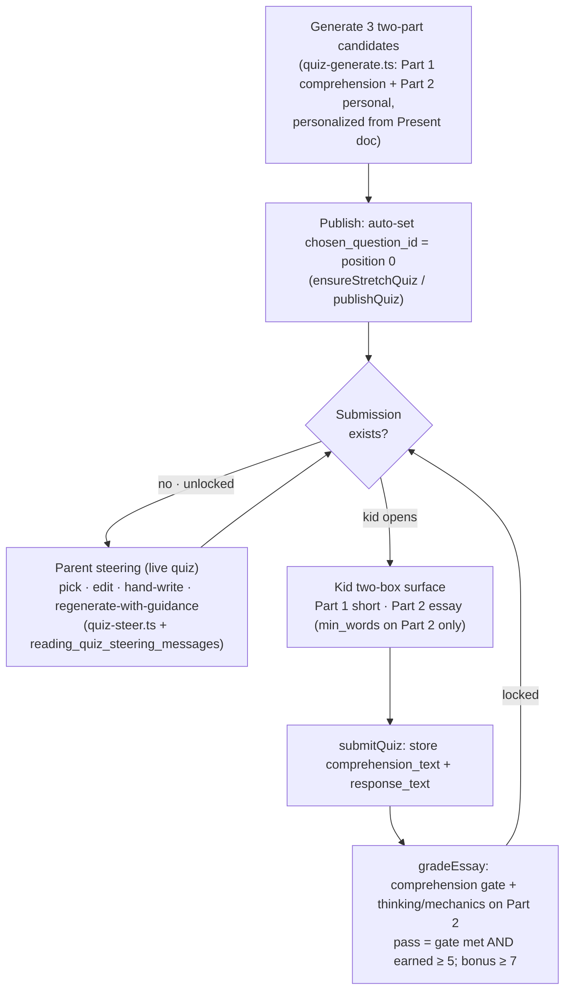
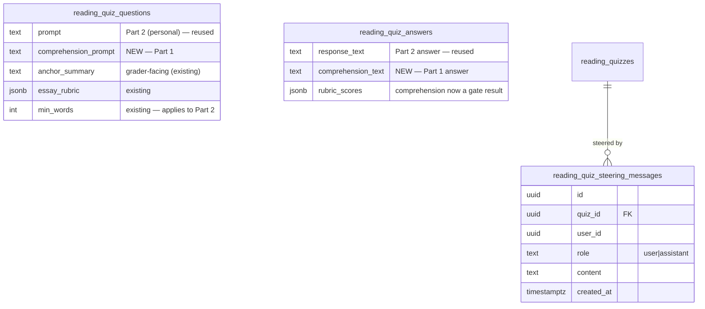

# Reader Essay Two-Part Questions & Parent Steering - Plan

## Goal Capsule

- **Objective:** Reshape reader essay quizzes into a two-part writing exercise — a short proof-of-reading, then a personal question that uses a book theme as a launching point for thinking about something the kid actually cares about — and give parents a steering surface to curate the question before it reaches the kid.
- **Product authority:** Andrew (parent/owner). Product decisions confirmed in brainstorm dialogue 2026-07-07; the scoring formula and technical approach confirmed in planning dialogue the same day.
- **Execution profile:** Deep, `execution: code`. Touches a schema migration, generation, grading/scoring, the kid writing surface, and a new parent steering conversation. No unit-test harness exists in this repo — verification is `tsc` + `lint` + `build` + targeted manual reader-app checks.
- **Open blockers:** None. OQ1 (scoring formula) resolved in KTD1; OQ4 (parent steering) resolved — any adult role may steer (see U7).
- **Product Contract preservation:** Product Contract unchanged — R-IDs and product scope carried forward verbatim; OQ1–OQ4 resolved by planning (OQ4: parents may steer — see U7).

---

## Product Contract

### Summary

Reader essay quizzes become a two-part prompt: Part 1 is a short comprehension check that proves the kid read the pages; Part 2 connects a theme from those pages to something the kid genuinely cares about — sourced from their journal `Present` doc — as a launching point for real thinking. Grading demotes comprehension to a light gate and puts the earned score on the thinking and writing in Part 2. Parents replace the kid's old "pick one of three" step with a steering surface on the draft: accept a candidate, edit it, hand-write their own, or run a back-and-forth with the AI to regenerate candidates. Whatever the parent lands on becomes the single question the kid writes; a sensible default auto-publishes so no kid is ever blocked waiting on a parent.

### Problem Frame

Today's essay quiz generates three fused prompts (each opens with a reading detail, then widens to a theme), the kid picks one, and the essay is graded on comprehension, mechanics, and thinking as three equal thirds. The prompt deliberately keeps the personal angle faint — "use interests sparingly, do NOT center on the reader's main hobby." The result skews toward "book stuff": the bulk of what the kid writes is about the book, and the personal, thinking-for-its-own-sake dimension the parent most wants is suppressed by design.

The goal is to make these essays practice for why writing is valuable at all — a way to work through your own thoughts. The kid should still prove they read the pages, but the center of gravity should move to a question that matters to *them* (baseball, a personal goal, what's fair about screen time), tied loosely back to a theme in the reading. The parent, who knows the specific kid, should be able to steer toward that.

### Key Decisions

- **Parent curation replaces the kid's pick.** The kid no longer chooses among three; the parent (owner/parent role) curates down to one question, and the kid receives that single question. The AI's three candidates become a parent-facing selection tool, not a kid-facing chooser.
- **Comprehension is a gate, not a graded third.** Part 1 is a low bar that's easy to clear if the kid actually read; the earned score that drives pass/bonus comes from the thinking and writing in Part 2. A kid is only penalized on the book part when they clearly did not read.
- **Interests come from the existing journal `Present` doc.** No new interest profile and no embeddings/auto-summaries — reuse the human-curated `Present` doc already surfaced by `loadReaderContext()`. The change is to flip today's "use sparingly / don't center on their hobby" guardrail so Part 2 *intentionally* bridges the book theme to the kid's real life.
- **The book theme is a launching point, not the subject.** Part 2 may tie only loosely to the reading; a genuine, useful question for the kid beats a forced, tight connection to the book.
- **Auto-default + override, never parent-gated.** A sensible default question auto-publishes so the kid can start immediately. Parents steer when they want, not as a required step on every quiz.

### Requirements

**Question shape and generation**

- R1. Each essay quiz presents the kid with two parts: Part 1, a short comprehension prompt answerable in a sentence or two that proves they read the assigned pages; Part 2, a longer prompt that connects a theme from those pages to something the specific kid cares about.
- R2. Part 2 is personalized from the kid's journal `Present` doc (interests, projects, goals). The generator is instructed to intentionally bridge a book theme to the kid's real life, replacing the current instruction to use interests sparingly and avoid centering on their main hobby.
- R3. Part 2's tie to the book may be loose. A relevant, genuinely useful question for the kid is preferred over a forced connection to the reading.
- R4. The generator produces three distinct two-part candidates, each with a different reading anchor and a different personal angle. (The count and distinctness expectation carry over from today's behavior; the shape changes from one fused prompt to an explicit two-parter.)

**Kid writing experience**

- R5. The kid writes into two separate inputs: a short answer box for Part 1 and a larger essay box for Part 2. The relative size signals expected effort — Part 1 short, Part 2 the bulk.
- R6. The per-reader word-count floor applies only to Part 2. Part 1 stays genuinely short and is not held to the essay minimum.

**Grading**

- R7. Comprehension is evaluated as a light pass/fail gate: did the kid show, in Part 1, that they read and understood what happened? The gate is easy to clear for a kid who read.
- R8. The earned score that determines pass and bonus is driven by the quality of thinking and the writing mechanics in Part 2, not by comprehension weight.
- R9. If the comprehension gate fails (the kid clearly did not read), the quiz does not pass regardless of Part 2 quality. A strong Part 2 is not dragged down by a terse-but-adequate Part 1.
- R10. The revision loop continues to work across attempts for both parts — the grader still sees the prior draft, prior scores, and prior feedback and credits genuine progress.

**Parent steering**

- R11. On a quiz, a parent (owner or parent role) can steer the question via any of: (a) accept one of the three candidates as-is, (b) edit a candidate's text, (c) hand-write their own two-part question from scratch, or (d) send guidance to the AI to regenerate candidates.
- R12. Regenerate-with-guidance is a running back-and-forth: the parent's notes accumulate across rounds, and each new set of candidates reflects the full steering conversation, not only the latest note. The parent can see the thread of what they asked for.
- R13. Regenerated and hand-written questions preserve the two-part structure and the Part 2 personalization intent.
- R14. Whatever the parent lands on becomes the single question published to the kid.
- R15. A sensible default question auto-publishes without parent action so the kid is never blocked. Parents may steer any quiz; nothing waits on a parent.
- R16. Parent steering is allowed freely until the kid begins writing (defined as: no submission exists yet). Once the kid has started, the question locks and can no longer be swapped. A parent who wants a different question after that applies it to the next quiz; the existing parent close/override tools cover genuine exceptions.

### Acceptance Examples

- AE1. **Covers R7, R8, R9.** A kid writes a thoughtful, well-argued Part 2 but a one-line Part 1 that correctly names what happened in the pages. **Then:** the comprehension gate passes (they proved they read), and the quiz passes or earns bonus based on the Part 2 thinking and mechanics — the short Part 1 does not cost them.
- AE2. **Covers R9.** A kid writes a strong Part 2 but a Part 1 that shows they did not read the pages (wrong or empty). **Then:** the comprehension gate fails and the quiz does not pass, regardless of Part 2 quality.
- AE3. **Covers R11, R12, R14.** A parent dislikes all three candidates and sends "make this about his baseball goals," gets three new ones, then sends "tie it to teamwork, not stats." **Then:** the next candidates reflect both notes, and the parent picks one, which becomes the kid's single question.
- AE4. **Covers R15, R16.** No parent touches a freshly generated quiz; the default question auto-publishes and the kid starts writing. A parent then opens it to steer. **Then:** because the kid has already submitted, the question is locked and cannot be swapped out from under them.

### Scope Boundaries

- Legacy multiple-choice and free-text quiz paths are unchanged; this work is essay-only.
- No new per-kid interest profile, embeddings, or AI-generated kid summaries — the existing journal `Present` doc is the interest source.
- A per-kid "always require my approval before this kid can write" setting is deferred, not built now.

#### Deferred to Follow-Up Work

- Persist an in-progress "started"/autosave signal for essays so the lock boundary protects unsaved local text (see KTD4). Today the lock keys on submission existence; this is a hardening follow-up, not part of this plan.
- Introducing a unit-test runner (e.g. `vitest`) to cover the pure scoring logic in `src/lib/reading/essay-scoring.ts`. Valuable but out of scope; see Verification Contract.

### Outstanding Questions

Brainstorm-deferred questions resolved by planning:

- OQ1 (scoring formula) → resolved in KTD1.
- OQ2 (steering thread machinery) → resolved in KTD3.
- OQ3 (two-part data model) → resolved in KTD2.

**Resolved during planning**

- OQ4 → **Parents can steer.** Any adult role (owner or parent) may steer; steering is not owner-only. U7 resolves the kid scope for steering through an adult gate (`getIsAdult`) rather than loosening the shared `getIsOwner` check that guards all member-mode reading actions — so parents get steering access without inheriting owner-level reading admin elsewhere. Consistent with R11 ("owner or parent").

---

## Planning Contract

### Key Technical Decisions

- KTD1. **Scoring: comprehension gate + earned score from Part 2.** The grader emits comprehension as a pass/fail gate (`comprehension_met`) rather than a scored third. The *earned* score is `thinking + mechanics` on Part 2, each 1–4, out of 8. **Pass = gate met AND earned ≥ 5; bonus = gate met AND earned ≥ 7.** A failed gate fails the quiz regardless of Part 2. This preserves the current pass/bonus feel (old 9/12 ≈ 75% → 5/8; old 11/12 ≈ 92% → 7/8) while making comprehension unable to either drag down or carry the grade. Thresholds live as named constants in `src/lib/reading/essay-scoring.ts` so they stay tunable. Advances R7–R9.

- KTD2. **Extend the existing question/answer rows; keep the `chosen_question_id` model; remove the kid chooser.** Add a `comprehension_prompt` column to `reading_quiz_questions` (Part 1) and a `comprehension_text` column to `reading_quiz_answers` (Part 1 answer). Reuse the existing `prompt`/`response_text` as Part 2. The three-candidate rows and `reading_quizzes.chosen_question_id` selection stay exactly as today; only the kid-facing `EssayChooser` is removed, because the quiz always has a chosen question by the time the kid sees it. Minimal migration, preserves grading and publish plumbing. Resolves OQ3.

- KTD3. **Steering thread = a new quiz-scoped message table + the journal chat pattern, copied not shared.** Add `reading_quiz_steering_messages(quiz_id, user_id, role, content, created_at)` mirroring `journal_messages`. A new `src/lib/reading/quiz-steer.ts` regenerates the three candidates from the accumulated thread using a tool-forced call, reusing `anthropic()`/`JOURNAL_MODEL` (`src/lib/journal/anthropic.ts`) and `messagesAsAnthropicTurns()` (`src/lib/journal/context.ts:319`). No shared-lib refactor — each surface keeps its own tool schema, matching the existing convention between `quiz-generate.ts` and `opening-candidates.ts`. The table's `user_id` follows the reading convention (the kid who owns the reading, matching `user_id = auth.uid()` RLS and the `.eq("user_id", scope.userId)` filter used throughout the reading app); the parent who authored a turn is tracked separately in `created_by_email`. Steering reads/writes run through the member-mode admin client under owner scope, like other cross-kid admin actions. Resolves OQ2.

- KTD4. **Steering acts on the live quiz; lock = a submission exists.** Because quizzes auto-publish (`ensureStretchQuiz`), steering must work on published quizzes, not just drafts — this relaxes today's `status === "draft"` edit guard for essay steering specifically. The lock boundary is server-checked: steering/pick/edit/hand-write is allowed only while no `reading_quiz_submissions` row exists for the quiz — the existence query must be scoped by both `quiz_id` and the resolved kid `userId` (mandatory on the RLS-bypassing member-mode admin client). The lock read and the mutation are not atomic against a concurrent first submit; each mutating action re-reads the lock immediately before writing and accepts the residual race as low-impact (worst case: a swap lands as the kid submits). Known limitation: in-progress essay text is not persisted server-side until submit, so a pre-first-submit swap cannot destroy *saved* work but can drop unsaved local text; hardening is deferred (see Scope Boundaries). Advances R11, R16.

- KTD5. **Auto-default chosen question = the first candidate (position 0) at publish.** Both publish paths (`ensureStretchQuiz` checkin path and manual `publishQuiz`) set `chosen_question_id` to the position-0 candidate when none is chosen, so the kid always receives one question without a chooser. Parent picks override this before lock. Advances R14, R15.

### High-Level Technical Design

Quiz lifecycle from generation through grading:

Schema deltas (new migration `00161`):

### Assumptions

- The `Present` doc may be empty for a kid; generation must degrade to a general, age-appropriate thoughtful Part 2 rather than failing or inventing interests. `loadReaderContext()` already returns `""` when nothing is on file.
- Exactly one live quiz per book holds today (`archiveOtherOpenQuizzes`); steering replaces candidate rows in place on that live quiz rather than creating a new quiz.
- Reusing `JOURNAL_MODEL` for reading generation/steering is already the established pattern (`quiz-generate.ts` imports it); no separate model config is introduced.

### Sequencing

Foundations first (schema, types/scoring), then generation, then the read/grade path, then steering, then the kid-facing scoring UI. Dependency-honoring order: U1 → U2 → U3 → U4 → U5 → U6 → U9, with U7 in parallel after U3 and U8 after U4 and U7. U5 follows U4 because it relies on the auto-default chosen question; U6 follows U5; U9 (scoring UI) follows U6.

---

## Implementation Units

### U1. Schema migration: two-part columns + steering thread table

- **Goal:** Add the columns and table the rest of the plan depends on.
- **Requirements:** R1, R5, R11, R12.
- **Dependencies:** none.
- **Files:** `supabase/migrations/00161_reading_two_part_essays.sql`
- **Approach:** `ALTER TABLE reading_quiz_questions ADD COLUMN comprehension_prompt text;` and `ALTER TABLE reading_quiz_answers ADD COLUMN comprehension_text text;`. Create `reading_quiz_steering_messages` mirroring `journal_messages` (00034): `id uuid pk`, `quiz_id uuid NOT NULL REFERENCES reading_quizzes(id) ON DELETE CASCADE`, `user_id uuid NOT NULL` (the kid who owns the reading — matches the reading RLS/scope convention, **not** the turn author), `created_by_email text` (the parent who authored the turn), `role text CHECK (role IN ('user','assistant'))`, `content text NOT NULL`, `created_at timestamptz DEFAULT now()`, plus `INDEX (quiz_id, created_at)`. Apply the same `user_id = auth.uid()` RLS/grants as `00086` so the kid-owned scoping holds; parent writes go through the service-role member-mode admin client (per KTD3), so do not add a parent-scoped policy.
- **Patterns to follow:** `supabase/migrations/00139_reading_essay_quizzes.sql` (essay column adds), `supabase/migrations/00034_journal.sql:50` (message table shape + index).
- **Execution note:** Local apply via `npm run db:reset` picks up the new migration; heed the shared-local-supabase caveat (re-apply + `pgrst` reload) if the DB is shared across workspaces.
- **Verification scenarios:** Migration applies cleanly on a fresh `db:reset`; new columns are nullable and existing essay quizzes still load; `reading_quiz_steering_messages` rejects a role outside `user|assistant`.
- **Test expectation:** none (schema) — verified via migration apply + downstream typecheck.

### U2. Types + scoring redefinition

- **Goal:** Encode the two-part shape in TypeScript and rewrite scoring to gate + earned.
- **Requirements:** R7, R8, R9.
- **Dependencies:** U1.
- **Files:** `src/lib/types.ts`, `src/lib/reading/essay-scoring.ts`
- **Approach:** Add `comprehension_prompt: string | null` to `ReadingQuizQuestion` and `comprehension_text: string | null` to `ReadingQuizAnswer`. Redefine comprehension as a gate: keep `EssayRubricScores` but treat `comprehension` as a gate result (a `met: boolean` plus note) — reshape `EssayRubricScore` for comprehension or add a `comprehension_met` boolean carried in `rubric_scores`. In `essay-scoring.ts` replace the sum-of-three model: `ESSAY_EARNED_MAX = 8`, `ESSAY_PASS_MIN = 5`, `ESSAY_BONUS_MIN = 7`; `earnedScore = thinking + mechanics`; `meetsStandard = comprehensionMet && earned >= ESSAY_PASS_MIN`; bonus = `comprehensionMet && earned >= ESSAY_BONUS_MIN`. Keep `ESSAY_BONUS_BUCKS = 30`.
- **Patterns to follow:** existing `essayTotalScore` / constants in `src/lib/reading/essay-scoring.ts`; `EssayRubricScores` shape in `src/lib/types.ts:1104`.
- **Verification scenarios:** gate met + earned 5 → pass, not bonus; gate met + earned 7 → bonus; gate met + earned 4 → fail; gate failed + earned 8 → fail (no pass, no bonus); a fully-null (ungraded) score returns `graded=false`.
- **Test expectation:** none (no runner) — verify by `tsc` and by exercising the pure functions in a throwaway `tsx` snippet during implementation.

### U3. Generation: two-part candidates + interest-forward prompt

- **Goal:** Produce three two-part candidates that bridge a book theme to the kid's real interests.
- **Requirements:** R1, R2, R3, R4.
- **Dependencies:** U1, U2.
- **Files:** `src/lib/reading/quiz-generate.ts`, `src/lib/reading/quiz-build.ts`
- **Approach:** Extend `REPORT_ESSAY_TOOL` so each assignment carries `comprehension_prompt` (Part 1: short, answerable in a sentence or two, proves reading) alongside `prompt` (Part 2: the personal question). Rewrite the system + user prompt: Part 1 is a brief comprehension check; Part 2 intentionally connects a theme from the assigned pages to the reader's real interests/goals from the `Present` context — **removing** the current "use sparingly / do NOT center on the reader's main hobby" guardrail and replacing it with the bridge intent, while allowing a loose tie to the book (R3). Keep three distinct anchors/angles. Add `comprehensionPrompt` to the generated option type and persist it in `essayQuestionRows`.
- **Patterns to follow:** existing tool-forced call + `sanitizeOption`/`sanitizeRubric` in `src/lib/reading/quiz-generate.ts:213`; `essayQuestionRows` in `src/lib/reading/quiz-build.ts:19`.
- **Verification scenarios:** a mocked tool response with `comprehension_prompt` + `prompt` per assignment parses into three options and persists both fields; an empty `Present` context still yields a valid, general Part 2 (no crash, no invented facts); malformed/<3 output still falls back to the existing empty-set + `generation_error` path.
- **Test expectation:** none (no runner) — verify via `tsc`, a `tsx` parse snippet, and a manual draft generation in the reader app.

### U4. Auto-default chosen question at publish

- **Goal:** Guarantee the kid receives one question without a chooser.
- **Requirements:** R14, R15.
- **Dependencies:** U1, U3.
- **Files:** `src/lib/reading/ensure-stretch-quiz.ts`, `src/app/(reading)/reader/quizzes/actions.ts`
- **Approach:** In `ensureStretchQuiz`, capture the inserted question ids (the current batch `essayQuestionRows(...)` insert returns only the quiz id, so add `.select("id, position")` or a follow-up select) and set `reading_quizzes.chosen_question_id` to the position-0 question. In `publishQuiz`, default `chosen_question_id` to position 0 when it is still null at publish. Leave the atomic/race-safe pattern from `chooseEssayQuestion` intact for the parent-pick path (U7).
- **Patterns to follow:** insert + `archiveOtherOpenQuizzes` in `src/lib/reading/ensure-stretch-quiz.ts:28`; `publishQuiz` in `src/app/(reading)/reader/quizzes/actions.ts:305`.
- **Verification scenarios:** an auto-published checkin quiz has a non-null `chosen_question_id`; a manually published quiz with no parent pick defaults to position 0; a quiz where the parent already picked keeps the parent's choice.
- **Test expectation:** none (no runner) — verify via reader-app flow and a prod-read `SELECT` shape check locally.

### U5. Kid two-box writing surface + remove chooser

- **Goal:** Show Part 1 and Part 2 as two inputs; drop the kid chooser; capture both answers.
- **Requirements:** R5, R6, R1.
- **Dependencies:** U1, U2, U4.
- **Files:** `src/components/reading/quiz-runner.tsx`, `src/app/(reading)/reader/quizzes/actions.ts`
- **Approach:** In `EssayRunner`, render a short single-line/short-textarea input for Part 1 (`comprehension_prompt`) above the existing essay editor (Part 2). Keep the `min_words` gate on the Part 2 box only. Remove the `EssayChooser` branch from the runner (the quiz always has `chosen_question_id`). Extend the `submitQuiz` payload to carry `comprehensionText` alongside `responseText`; store it in `comprehension_text`. Expose `comprehension_prompt` (not `anchor_summary`) through `getQuizForTaking` so the client can render Part 1. When Part 1 is empty at submit, show a soft, non-blocking nudge ("You haven't answered Part 1 — this is where you show you read the pages") so the kid doesn't unknowingly burn an attempt on the comprehension gate; submit stays allowed per R6/R16.
- **Patterns to follow:** `EssayRunner` + word-count gate in `src/components/reading/quiz-runner.tsx:208`; the submit payload shape at `quiz-runner.tsx:268` and the answer insert at `actions.ts:835`.
- **Verification scenarios:** kid sees two labeled inputs; submit is blocked until Part 2 meets `min_words` regardless of Part 1 length; an empty Part 1 with a valid Part 2 shows the soft nudge but does not block submit; submit persists both `comprehension_text` and `response_text`; the chooser no longer appears; `anchor_summary` is never sent to the client.
- **Test expectation:** none (no runner) — verify via reader-app manual flow; guard the `anchor_summary` non-exposure by inspecting the selected columns.

### U6. Grading rewrite: gate + Part 2 scoring

- **Goal:** Grade Part 1 as a gate and Part 2 for thinking/mechanics; keep the revision loop.
- **Requirements:** R7, R8, R9, R10.
- **Dependencies:** U2, U5.
- **Files:** `src/lib/reading/quiz-grade.ts`, `src/app/(reading)/reader/quizzes/actions.ts`
- **Approach:** Change `GRADE_ESSAY_TOOL` so comprehension is a gate: emit `comprehension_met` (boolean) + `comprehension_note` instead of a 1–4 score; keep `mechanics_score`/`mechanics_fixes` and `thinking_score`/`thinking_note` scoped to Part 2. Feed the grader the `comprehension_prompt` + Part 1 answer (for the gate) and the Part 2 prompt + `response_text` (for scoring). Compute `meetsStandard`/bonus via the U2 scoring functions, and redefine `EssayGrade.total` to the earned (out-of-8) score so every reader of `grade.total`/`ESSAY_BONUS_MIN` — the submit-time standout-bonus award in `actions.ts` and the results-page recomputation — uses one consistent scale (see U9). Preserve the revision-context path (prior draft, prior scores, prior feedback) for both parts.
- **Patterns to follow:** tool schema + `rubric_scores` assembly in `src/lib/reading/quiz-grade.ts:139` and `:458`; revision context at `quiz-grade.ts:319`; submit-time grade wiring at `actions.ts:829`.
- **Verification scenarios:** **Covers AE1** — gate met + strong Part 2 (thinking 4 / mechanics 3) → pass or bonus, unaffected by a one-line Part 1; **Covers AE2** — gate failed (empty/wrong Part 1) → fail regardless of Part 2; mechanics fixes still surface exact-quote corrections; a revision that improves Part 2 is credited against prior feedback; the Mason Bucks standout bonus fires once at earned ≥ 7.
- **Test expectation:** none (no runner) — verify by driving submissions through the reader app across the AE cases and confirming stored `rubric_scores` + pass/bonus.

### U7. Parent steering engine: thread + regenerate/pick/edit/hand-write actions

- **Goal:** Server-side steering that accumulates guidance and reshapes the live quiz's question.
- **Requirements:** R11, R12, R13, R14, R16.
- **Dependencies:** U1, U3.
- **Files:** `src/lib/reading/quiz-steer.ts` (new), `src/app/(reading)/reader/quizzes/actions.ts`
- **Approach:** New `quiz-steer.ts` builds a tool-forced regeneration (three two-part candidates) from: the accumulated `reading_quiz_steering_messages` turns (`messagesAsAnthropicTurns`), the current candidates, the book excerpt, and the `Present` context — reusing `anthropic()`/`JOURNAL_MODEL` and copying the sanitize pattern from `quiz-generate.ts`. Add server actions: `steerQuizQuestions(quizId, guidance, memberEmail)` (persist the parent's user turn, regenerate, replace the quiz's candidate rows, reset `chosen_question_id` to the new position 0, persist the assistant turn); a parent `setChosenQuestion` (generalize `chooseEssayQuestion` to allow re-pick pre-lock); extend `updateQuizQuestion` to accept `comprehensionPrompt`; and a hand-write path that writes both Part 1 and Part 2. Every action enforces the KTD4 lock (re-read `reading_quiz_submissions` scoped by `quiz_id` + resolved kid `userId` immediately before mutating) and requires an adult role. Role gate (OQ4 — parents may steer): steering a *kid's* quiz runs in member mode, where `resolveReadingScope` currently requires `getIsOwner` (`src/lib/members/auth.ts`). Resolve the kid scope for steering through an adult gate (`getIsAdult`) — e.g. a steering-specific scope resolver or an explicit adult check before the admin-client mutation — **without** loosening the shared `getIsOwner` guard that other member-mode reading actions rely on, so parents gain steering access without owner-level reading admin elsewhere. The `setChosenQuestion` re-pick branch (a question already chosen) must be adult-gated even though the kid's historical first-pick action had no role check. On a failed or under-count regeneration, preserve the existing candidate rows (do not blank them), return a retryable error, and record no assistant turn. Relax the `status === "draft"` guard so these apply to the live published quiz, and never accept or expose `anchor_summary` on any steering read path a kid could reach.
- **Patterns to follow:** journal chat loop `src/app/(journal)/journal/api/chat/route.ts:46` (load thread → turns → persist); `messagesAsAnthropicTurns` `src/lib/journal/context.ts:319`; `updateQuizQuestion`/`chooseEssayQuestion` in `src/app/(reading)/reader/quizzes/actions.ts:256`/`:669`; role checks via `getIsAdult`/`requireOwner` in `src/lib/members/auth.ts`.
- **Verification scenarios:** **Covers AE3** — two successive guidance turns both influence the third candidate set (the thread, not just the last note, is sent); regenerate replaces candidate rows and resets the default chosen; a failed regenerate preserves the prior candidates and returns a retryable error without recording an assistant turn; edit updates Part 1 and Part 2; hand-write persists both parts; the re-pick branch is rejected for a kid; every action is rejected once a submission exists and rejected for non-adult roles; no steering read path exposes `anchor_summary`.
- **Test expectation:** none (no runner) — verify via the parent flow in the reader app and by inspecting `reading_quiz_steering_messages` + question rows.

### U8. Parent steering UI on the live quiz + lock affordance

- **Goal:** Give parents the four steering capabilities and reflect the lock state.
- **Requirements:** R11, R16.
- **Dependencies:** U4, U7.
- **Files:** `src/components/reading/quiz-draft-editor.tsx`, `src/components/reading/parent-admin-controls.tsx`, `src/app/(reading)/reader/quizzes/[id]/edit/page.tsx`, `src/app/(reading)/reader/quizzes/page.tsx`
- **Approach:** Extend the editor into a steering panel usable on a published (not just draft) quiz: candidate cards with Pick, inline Edit (Part 1 + Part 2 + rubric), Hand-write, and a guidance chat box that calls `steerQuizQuestions` and renders the accumulated thread. Enumerate the regeneration interaction states: **in-flight** (disable the guidance input and candidate actions, show a "regenerating candidates…" indicator on the thread), **success** (new cards replace old, thread appends the assistant turn), and **error** (surface a retryable message, leave prior candidates intact). Add an entry point from the parent admin list to steer the live quiz. When a submission exists, render the panel read-only with a "locked — the reader has started" note. Keep owner/parent gating on the route.
- **Patterns to follow:** `QuizDraftEditor` controls in `src/components/reading/quiz-draft-editor.tsx:22`; owner gating in `src/app/(reading)/reader/quizzes/[id]/edit/page.tsx`; admin entry points in `src/components/reading/parent-admin-controls.tsx`.
- **Execution note:** UI-heavy; prefer runtime/smoke verification in the reader app over any unit coverage.
- **Verification scenarios:** **Covers AE4** — steering controls are interactive before first submit and read-only (locked note shown) after a submission exists; the guidance thread renders prior turns; regeneration shows an in-flight indicator and a retryable error state on failure; a non-adult role cannot reach the panel.
- **Test expectation:** none (no runner) — manual reader-app verification.

### U9. Kid-facing scoring UI: migrate the out-of-12 consumers

- **Goal:** Update every surface that renders the old three-dimension/12 scoring so it reflects the gate + out-of-8 model.
- **Requirements:** R7, R8, R9.
- **Dependencies:** U2, U6.
- **Files:** `src/components/reading/quiz-essay-feedback.tsx`, `src/app/(reading)/reader/quizzes/[id]/results/page.tsx`, `src/components/reading/quiz-grading-criteria.tsx`, `src/components/reading/quiz-success-modal.tsx`, `src/components/reading/quiz-runner.tsx`
- **Approach:** These consumers read `ESSAY_MAX_SCORE`/`ESSAY_PASS_MIN`/`essayTotalScore` and render "total / 12", a three-dimension breakdown, pass/bonus copy, and (on the results page) an independent bonus recomputation. Under U2/U6 comprehension has no numeric score and `essayTotalScore` returns null, so the feedback card's total/bonus silently disappears and the grading-criteria dialog states the wrong rule. Update each: present comprehension as a met/not-met gate, show the earned score out of 8 (thinking + mechanics), rewrite the kid-facing "how this is graded" copy, and migrate the results-page bonus recomputation to the same earned-score basis so it agrees with the stored bonus.
- **Patterns to follow:** existing feedback rendering in `src/components/reading/quiz-essay-feedback.tsx`; bonus recomputation in `src/app/(reading)/reader/quizzes/[id]/results/page.tsx`.
- **Verification scenarios:** the feedback card shows a gate result + earned/8 (never a null total); the grading-criteria dialog states the gate + Part-2 rule; the results-page bonus badge matches the stored standout bonus; success-modal copy reflects the new bars.
- **Test expectation:** none (no runner) — manual reader-app verification across pass, bonus, and gate-fail cases.

---

## Verification Contract

This repo has no unit-test runner (0 test files; deps include `typescript`, `tsx`, `playwright` only). Verification leans on static checks plus targeted manual reader-app flows, consistent with the project norm of verifying via tsc/build.

| Gate | Command | Applies to | Done signal |
|---|---|---|---|
| Typecheck | `npx tsc --noEmit` | U1–U9 | No type errors |
| Lint | `npm run lint` | U1–U9 | Clean |
| Build | `npm run build` | U1–U9 | Builds |
| Migration apply | `npm run db:reset` | U1 | Applies; existing essay quizzes still load |
| Reader-app flow | `npm run dev:agent` (never port 3000) | U3–U9 | Generate → steer → publish → kid two-box → grade walks the AE cases |

Pure scoring functions (`essay-scoring.ts`) should be exercised with a throwaway `tsx` snippet during U2 implementation since there is no test harness to hold assertions.

---

## Definition of Done

- Essay quizzes generate three two-part candidates; Part 2 bridges a book theme to the kid's `Present`-doc interests, with the old "use sparingly" guardrail removed (R1–R4).
- The kid writes into two boxes; the word-count floor applies only to Part 2; the kid chooser is gone (R5, R6).
- Grading gates on comprehension and scores pass/bonus from Part 2 thinking + mechanics per KTD1; AE1 and AE2 hold (R7–R10).
- Every kid-facing scoring surface (feedback card, results page, grading-criteria dialog, success modal) reflects the gate + out-of-8 model with no null-total regressions (R7–R9).
- Parents can pick / edit / hand-write / regenerate-with-guidance on the live quiz, guidance accumulates across rounds, and the choice locks once a submission exists; AE3 and AE4 hold (R11–R16).
- A default question auto-publishes so no kid is blocked (R15).
- `tsc`, `lint`, `build`, and migration apply all pass; the reader-app flow walks the acceptance examples.
