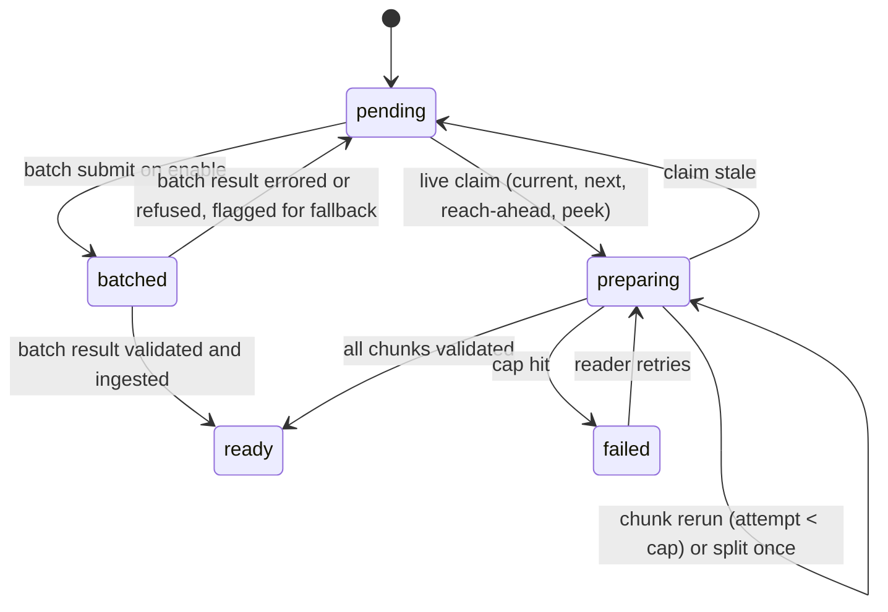
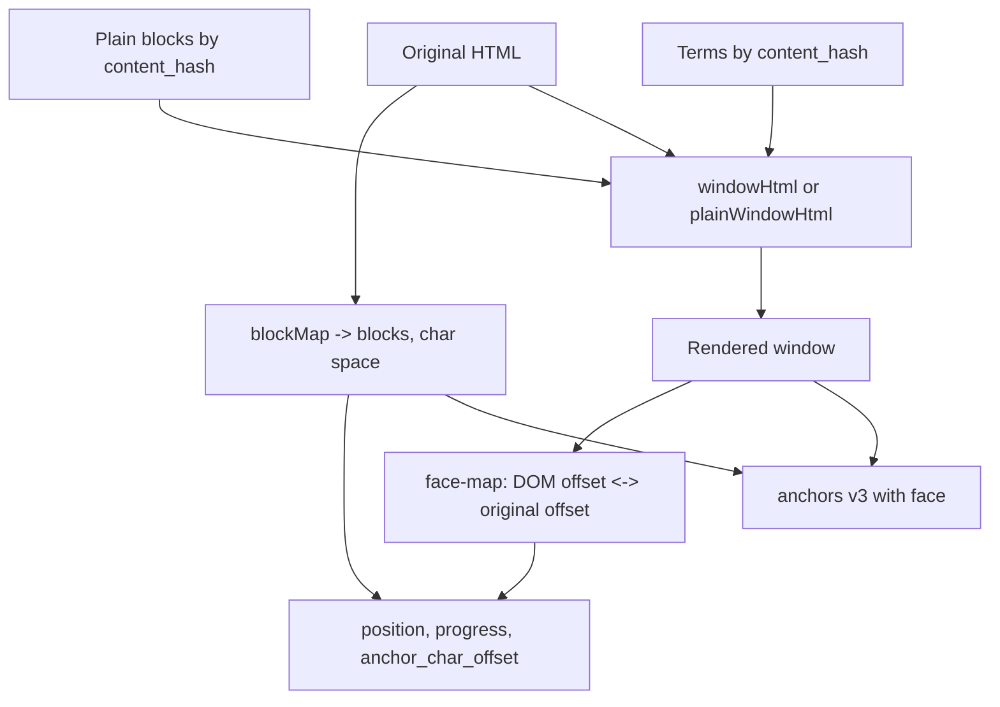

# Reader Plain English Mode - Plan

## Goal Capsule

- **Objective:** Let a reader switch a book to a paragraph-for-paragraph plain-prose translation, generated once per book and shared by the family, without breaking position, highlights, Ask, sharing, or Listen.
- **Authority:** This plan. Product behavior is owned by the R-IDs; implementation mechanism by the KTDs. Repo conventions in `CLAUDE.md` override sequencing details here.
- **Execution profile:** Four phases, dependency-ordered. Phase A (data and generation) must land before Phase B (reading). Phases C and D can interleave after B. Side by side is a follow-up, not in this plan's units.
- **Stop conditions:** Stop and surface if the Anthropic org cannot use `claude-fable-5-1` (data-retention 400), if `reading_book_content.content_hash` turns out not to identify byte-identical copies, or if the paged reader cannot keep the top-of-page character stable across a face swap. After U3, Andrew reads one full translated chapter (the Satprem fixture) against the original; Phase B does not start until that read passes, and a failure revisits the prompt or default model before any UI work.
- **Tail ownership:** The executor opens the PR. Migration `00188` must be applied to prod before the code deploys (see [[migration-collision-blocks-prod]] in memory: check prod `max(version)` first).

---

## Product Contract

### Summary

Add a per-book, per-reader "Plain English" reading mode to the reader. The book's text is translated paragraph by paragraph into plain prose, stored against the book's content hash so identical family copies share it, and rendered in place of the original with a selection-toolbar peek at the counterpart paragraphs. Highlights, Ask, and shares keep working across both faces. Listen, summaries, quizzes, progress, and the spoiler boundary stay on the original.

### Problem Frame

Some nonfiction is written in a style so ornate that the reader spends their effort decoding sentences rather than weighing ideas. Today the only relief is leaving "what does this mean" Ask threads on passage after passage, which is slow and pulls attention out of the book. Chapter summaries don't help: they compress, and the reader wants the ideas at the author's granularity, just without the ornamentation. A translation, not a summary, removes exactly the layer being objected to.

### Requirements

**Entry and eligibility**

- R1. A "Plain English" item appears in the reading view's title overflow menu beside "Layout" and "Listen", for books only (not articles).
- R2. Any signed-in reader, including kids, can turn Plain English on or off for their own copy.
- R3. Turning it on when no translation exists for the book's content hash starts generation and shows a confirmation with an estimated cost first.
- R4. When `reading_books.fiction` is `true`, the confirmation carries a one-line warning that the style may be the point. `null` does not warn.
- R5. Turning it on when a translation already exists for the content hash, or when generation for that hash is already in progress, switches the face immediately with no cost dialog and no new generation.
- R6. Turning it off returns to the original face immediately and keeps the stored translation.

**Translation**

- R7. The translation is one output paragraph per input paragraph, keyed by the book's block index. Headings pass through unchanged.
- R8. Each translated paragraph keeps the author's person and tense and every idea, example, name, date, citation, and footnote marker, at roughly the original length.
- R9. Quotations of other writers and verse are kept as the original text, decided per paragraph by the translation pass.
- R10. The translation pass also returns the terms it deliberately left untranslated, each with a definition grounded in this book's usage and the chapter it first appears in.
- R11. A chapter whose output fails validation (block count, kept-entry shape, length floor) is rerun; after the attempt cap it is marked failed and the original is shown for that chapter with a tappable retry that re-enters the live translation path.

**Generation and progress**

- R12. On enable, the reader's current chapter and the next chapter are translated live; all remaining chapters are submitted as one batch.
- R13. Chapters flip to plain as they become ready. A chapter the reader is currently viewing flips on the next navigation, not under them.
- R14. An untranslated chapter in plain mode shows the original with a quiet marker at its heading. Reaching one before the batch lands translates it live.
- R15. The overflow item shows progress while chapters are pending ("Plain English · 4 of 21 chapters"), a check when every chapter is ready, and a failure count ("Plain English · 2 chapters failed") when any chapter ended failed.
- R16. Two readers enabling the same content hash at once produce one translation. Turning it off does not cancel a running batch.

**Reading in plain**

- R17. Both faces render in the book's serif face. While the plain face is shown, an icon beside the book's name in the header says so; the menu check and the toolbar's "Original" label say the same. (Revised 2026-09-04: a book set in a sans face read as an app, not a book.)
- R18. Reading position, progress percentage, time left, chapter navigation, page numbers, and the spoiler boundary remain measured on the original text, and a position saved in one face resumes at the same place in the other.
- R19. Terms from R10 are marked with a faint underline on their first occurrence in each chapter, only in chapters at or after the term's first chapter. Tapping one shows the definition in a small popover.
- R20. While Listen is playing, the original face is shown regardless of the reader's setting.

**Marks, Ask, and sharing across faces**

- R21. Highlights, Asks, and Notes can be made in plain mode. Such a mark anchors to the paragraph, renders exactly in the plain face, and renders as a whole-paragraph mark in the original face and in other family members' copies.
- R22. A mark made in either face stores the original paragraph text as its quote for relocation and read-back, and a plain-face mark also stores the plain sentence the reader selected.
- R23. Ask threads opened from a passage receive both faces of the anchored paragraphs as context, so the model answers against the author's words.
- R24. A shared passage shows the author's words with the reader's plain sentence beneath, never the paraphrase alone. The starred read-back and the marks list do the same.
- R25. The selection toolbar offers "Show original" in plain mode and "Plain English" in original mode, for every book regardless of translation state. It opens the whole paragraphs the selection touches, in the other face, in the side panel where Ask threads open, with a pending indicator while a live request is outstanding and an inline error with retry if it fails.
- R26. In a book with no translation, R25's "Plain English" translates just the selected paragraphs on demand and stores them.

**Untouched**

- R27. Listen, chapter summaries, quizzes, reading time, and progress are generated from and measured on the original text and are not changed by this plan.

### Key Decisions

- **Entry is a per-book menu item, not a reader-wide toggle.** Governs R1, R2. (session-settled: user-approved — chosen over a reader-wide display toggle: this is a decision about how to read one book, made once, and a global toggle invites flipping mid-page.)
- **Counterpart paragraphs open in the side panel from the selection toolbar.** Governs R25, R26. (session-settled: user-directed — chosen over tap-to-expand inline: inline expansion reflows the page, fights existing gestures, and breaks paged columns.)
- **Quotations and verse stay original.** Governs R9. (session-settled: user-directed — chosen over translating them set off as quotations: a paraphrase inside quotation marks is a stronger claim than a paraphrase of the author.)
- **Highlights are allowed in plain mode, paragraph-precise across faces.** Governs R21, R22. (session-settled: user-approved — chosen over original-only highlighting: the face you read in is the one you must be able to mark up.)
- **Term definitions come from the translation pass.** Governs R10, R19. (session-settled: user-directed — chosen over a later separate glossary pass: the translator is the one reader that already decided which words to keep.)
- **Progressive per-chapter delivery, current chapter first.** Governs R12, R13, R14, R15. (session-settled: user-approved — chosen over a wait screen: a failed chapter degrades to "you see the original here", not "the feature is broken".)
- **Per-reader setting, family-shared translation.** Governs R2, R5, R16. (session-settled: user-approved — chosen over one setting for everyone: a kid mid-book should not see their text change because a parent flipped it.)
- **Kids can use it.** Governs R2. (session-settled: user-directed — chosen over adults-only like Listen: the point of the feature is comprehension, which is the kids' programme's goal.)
- **Listen stays on the original and out of scope.** Governs R20, R27. (session-settled: user-directed — chosen over voicing the plain face: scope control for v1.)
- **Side by side is a follow-up phase.** See Scope Boundaries. (session-settled: user-directed — chosen over including it in v1: the paged-layout work is the riskiest part and v1's value does not depend on it.)

### Acceptance Examples

- AE1. Covers R7, R9, R11. **Given** a chapter of 40 paragraphs where paragraph 12 is a block quotation, **when** the chapter is translated, **then** 40 output entries come back, entry 12 is marked kept with no text and renders byte-identical to the input, and any translated paragraph shorter than 60% of its original triggers a rerun of that chunk.
- AE2. Covers R12, R14, R16. **Given** Andrew and Jenny hold byte-identical copies and both enable Plain English within a minute, **when** the second enable arrives, **then** it finds the existing claims and batch for that content hash and submits nothing new. Both see progress from the same rows.
- AE3. Covers R18. **Given** a reader saves position mid-paragraph on the plain face on a laptop, **when** they open the book on a Palma in the original face, **then** the reader resumes inside the same paragraph and within one sentence of the sentence they left, measured on the fixture chapter, and no "you were elsewhere" prompt fires.
- AE4. Covers R21, R22, R24. **Given** a reader highlights a plain sentence in paragraph 200 and shares it to Jenny, **when** Jenny opens her copy in the original face, **then** paragraph 200 is marked whole, and the share shows the author's paragraph with Andrew's plain sentence beneath.
- AE5. Covers R25, R26. **Given** an untranslated book in the original face, **when** the reader selects two words spanning paragraphs 8 and 9 and taps "Plain English", **then** the side panel shows plain versions of paragraphs 8 and 9 after a live request, and those two paragraphs are stored so a later peek is instant.
- AE6. Covers R13, R15. **Given** the reader is on chapter 3 when chapter 3's translation lands, **when** nothing else happens, **then** the page does not reflow; the heading marker changes to "Plain English ready", and the face flips when the reader navigates or taps the marker.
- AE7. Covers R19. **Given** the term "samadhi" is first kept in chapter 2, **when** the reader is in chapter 1, **then** no underline appears; in chapter 2 and later the first occurrence per chapter is underlined and tap shows the definition.
- AE8. Covers R8, R9. **Given** the Satprem fixture chapter is translated after U3, **when** Andrew reads it against the original, **then** every paragraph keeps the author's claims, names, and citations with no added or dropped ideas, and the sign-off is recorded before Phase B begins.

### Scope Boundaries

**In scope:** everything under Requirements, for EPUB/PDF books converted by the reader.

**Not in scope**

- Voicing the plain face for Listen (R20, R27).
- Changing chapter summaries, quizzes, reading time, or the spoiler boundary.
- Saved web articles. Their block structure is nested and they have no page map; the selection peek is the right tool there and is not built for articles in this plan.
- Word-level alignment between faces. Mapping is per paragraph by design.

#### Deferred to Follow-Up Work

- **Side by side.** Shipped 2026-09-04 as a parallel-text spread: a "Side by side" toggle (per device) in the overflow menu, offered when Plain English is on, the reader is paged, and two columns fit. A second paging engine (`use-parallel-pagination.ts`) lays the window out as a two-column grid, each paragraph beside its translation in one row, headings and marks spanning both, and cuts it into pages by height at row boundaries (a row taller than the page splits at the same pixel on both sides). The left cells are the book's own blocks, so anchors and position are untouched; the translation cells are asides the block selector never sees, and a selection in one becomes a plain-face mark. Margin markers and read-along are not shown in this mode.
- **Monthly spend cap** across Plain English and Listen. V1 ships the per-enable confirmation only (R3).
- **Relocating translations across different-file copies** of the same title by quote search, so a copy from a different upload could reuse a sibling's translation.
- **Chapter re-translate** from the reader when a paragraph reads wrong.

---

## Planning Contract

### Key Technical Decisions

- KTD1. **Translations key on `reading_book_content.content_hash` + block index, not on `book_id`.** Every family member holds their own `reading_books` row and converted file; the share flow copies the converted HTML verbatim and records the sha256 in `content_hash` (`supabase/migrations/00182_reading_book_copies.sql`, `src/lib/reading/book-copy.ts`). That hash is the only identity that guarantees identical block indices. A copy with a different hash is treated as untranslated. Implements the family-shared Key Decision for R5, R16.
- KTD2. **Model: `claude-fable-5-1` live for the current and next chapter, Batch API for the rest, `claude-opus-5` as the fallback; both env-overridable.** (session-settled: user-approved — chosen over all-live: batch halves the price and generating ahead tolerates its latency; chosen over Opus or Sonnet throughout: fidelity is the product and the cost is one-time per book.) Batches take up to 24 hours, so the live path and the reach-ahead path (R14) are what make progressive delivery feel immediate. The Batch API rejects the server-side `fallbacks` parameter, so refusals and errors in batch results are resubmitted live to the fallback model by our code. Fable's thinking is always on: control spend with `output_config.effort` ("medium"), never `thinking: {type: "disabled"}` (400). Fable requires 30-day data retention on the org; see Risks & Dependencies.
- KTD3. **Requests are block-range chunks of about 10k characters, not whole chapters.** Fable turns can run minutes and route handlers cap at 300s (`maxDuration` in `src/app/(reading)/reader/api/audio/[bookId]/[index]/prepare/route.ts`). Chunks keep each live request well inside that, make reruns cheap, and make the per-paragraph length floor checkable. Chunk boundaries fall on block boundaries; a chunk carries the previous chunk's last original paragraph as read-only context for continuity, which is available at batch-submit time and removes any dependency between chunks. A chapter's chunks therefore run concurrently (audio's `Promise.all` pattern in `synthesize.ts`); each chunk's blocks are stored as soon as they validate, and a stale-claim reclaim skips chunks whose blocks are already stored so it resumes rather than restarts.
- KTD4. **Output is structured JSON per chunk: one entry per input block with `action: translate | keep` and text, plus a `terms` array.** Forced `tool_choice` is a 400 on Fable, so use `output_config.format` (structured outputs). Headings are not sent. Kept entries carry `action: "keep"` and no text; the server copies the original block, so the model never has to echo a long passage byte-for-byte. Validation is a pure function: entry count equals input count, indices match and are unique, kept entries carry no text, translated length is at least 60% of the original, no translated entry empty. Failure reruns the chunk; attempt cap is 2 on Fable then 1 on the fallback, then the chunk is split in half once (audio's `splitLong` pattern in `src/lib/reading/audio/chapters.ts`), then the chapter is `failed`.
- KTD5. **Chapter units come from `chapterBounds` with audio's post-processing.** `src/lib/reading/reading-progress.ts` `chapterBounds(toc, title, blocks)` gives TOC spans; reuse the audio plan's merge-short and split-long rules (`src/lib/reading/audio/chapters.ts`) so front matter folds into chapter one and unchaptered books cut into ~20k-char parts. The chapter row stores `anchor_id`, `block_start`, `block_end`, `char_start`, `char_end` so "the chapter you are in" is `chapterIndexAt(position)` and the menu count is stable.
- KTD6. **Job model mirrors audio: a claim row per (content hash, chapter) with a stale-claim timeout.** `src/lib/reading/audio/synthesize.ts` `claim()` (conditional UPDATE to `preparing`, reclaim after `CLAIM_STALE_MS`, `null` means someone else holds it) is copied, not shared, because the key differs. Statuses: `pending | preparing | batched | ready | failed`. A `batched` chapter carries `batch_id`. Batch submission is single-writer too: one conditional UPDATE moves `pending` chapters to `batched` with a sentinel `batch_id` and returns the rows it won; only those chunks go into the batch; the real `batch_id` overwrites the sentinel after submission, and the rows revert to `pending` if the API call fails. A caller that wins zero rows submits nothing. First writer wins on ingest: chapters already `ready` are never overwritten.
- KTD7. **Batch reconciliation runs from the reader's polling while plain mode is on, with a pg_cron sweep as backstop.** The plan route checks any open `batch_id` on read (cheap `batches.retrieve`), ingests results when `processing_status === "ended"`, and the client polls it every few seconds while chapters are pending (audiobook provider pattern, `src/components/audiobook/audiobook-provider.tsx`). Reconcile never calls the model: an `errored`, `expired`, or refused chunk sets its chapter back to `pending` flagged for the fallback model, and the next reader-triggered prepare (R14 reach-ahead or the Retry marker) translates it live. A pg_cron + pg_net job every 10 minutes hits `src/app/api/cron/reading-plain-reconcile/route.ts` with `CRON_SECRET` (pattern `00184_reading_annotation_notifications.sql`), so a batch finishing overnight is ingested before anyone opens the book. Memory: a migration-scheduled cron once silently skipped; verify registration in prod after deploy.
- KTD8. **The original block map stays the coordinate system; the plain face is a rendered-string substitution.** `book-reader.tsx` computes `blocks = blockMap(html)` once from the original HTML. For the plain face, a new `plainWindowHtml(html, blocks, win, plainBlocks)` beside `windowHtml` in `src/lib/reading/paged-window.ts` emits one element per original block with the same tag, `id`, and classes, using the translated text only for blocks whose chapter row is `ready` and the original slice otherwise, and preserves the zero-width `page-anchor` spans. Blocks stored by a peek (R26) or left behind by a failed chapter are served through the counterpart panel only, so a chapter is never a patchwork of faces. Every translated text value and every `data-term` attribute is HTML-escaped with the `escapeHtml` helper from `src/lib/reading/inline-chat-blocks.ts` (exported to a shared helper); stored plain text is untrusted text, never markup. Inline chat and summary marks keep splicing at block boundaries (`src/lib/reading/inline-chat-blocks.ts`). Anchors, positions, TOC ids, and the spoiler boundary never see the plain text.
- KTD9. **In-block character offsets map proportionally between faces.** Offsets measured on the plain DOM are converted with `plainOffset × originalLength ÷ plainLength` before they enter the original char space (position save, `anchor_char_offset`), and the inverse when restoring on the plain face. A new pure module `src/lib/reading/face-map.ts` owns this. Snapping to block start was rejected because multi-page paragraphs would jump. Cross-device drift is a few characters, under the 400-char "elsewhere" thresholds in `src/lib/reading/position-sync.ts`.
- KTD10. **Anchor scheme v3 adds `face`; plain-face anchors are block-only.** `src/lib/reading/annotation-anchors.ts` gains `face: "original" | "plain"` and `ANCHOR_VERSION = 3`. A plain-face anchor stores `blockIndex`/`endBlockIndex` with null offsets. `rangeForAnchor` resolves a face mismatch (anchor face differs from rendered face) to the whole block range instead of falling back to index-based offsets, which today silently paint an arbitrary span. v1 and v2 anchors read as `face: "original"`. On the plain face, `rangeForAnchor` for a plain-face anchor locates `plain_quoted_text` inside the block's plain text and returns that range, so the mark renders exactly (R21); if the search misses it returns the whole block. `quoted_text` always holds the original block text; a new `plain_quoted_text` column holds the plain selection. `src/lib/reading/share-placement.ts` copies an explicit column list, so the new column must be named there or it will not travel.
- KTD11. **Per-reader face lives on `reading_book_state`.** Add `reading_face text not null default 'original'` (`'original' | 'plain'`, text so a future `'side_by_side'` is a data change). `getBookReaderData` in `src/app/(reading)/reader/actions.ts` already reads this row for resume; the face rides along. Reader settings in `src/lib/reading/reader-settings.ts` are localStorage per device and are the wrong home.
- KTD12. **Kept paragraphs are the model's call, marked in data, not detected from markup.** `src/lib/reading/convert.ts` emits every non-heading block as `<p>`; blockquotes and verse are indistinguishable in converted HTML, and re-converting would move every anchor. The `keep` action in KTD4 is the only workable route for R9. Kept entries carry no text; the server copies the original.
- KTD13. **Chapters outside the rendered window flip immediately; the current window flips on navigation or on tapping the heading marker.** Replacing the window's HTML repaginates, and on the Palma that is a full repaint with ghosting. The marker text changes from "Translating" to "Plain English ready" when the chapter lands (R13, AE6). In scroll mode the whole document is the window: no chapter flips while the reader is on the page; a marker tap or a chapter navigation rebuilds the scroll HTML and then restores scroll to the current original char offset through the existing resume scroll-to path. A failed chapter's marker reads "Couldn't translate · Retry"; tapping it resets the chapter to `pending` and fires prepare.
- KTD14. **The face-swap forces a repagination through the existing `layoutNonce` path and toggles `font-sans` on the content wrapper.** Font changes already repaginate keeping the top character fixed; the plain face is treated as a font change plus a content substitution so no new pagination path is introduced in v1.
- KTD15. **Term underlines are inline spans inside blocks with container click delegation.** `<span class="reader-term" data-term="…">` around the first occurrence per chapter; `blockMap` strips inline tags so block text is unchanged, and `textPositionAt` already walks multiple text nodes. Click delegation mirrors `CHAPTER_TAP_CLASS` (defined in `src/components/reading/reader-prose.ts`, applied in `src/components/reading/annotations/reader-annotation-layer.tsx`); the popover uses `src/components/ui/popover.tsx`. Typographic underline only (dotted, no color) so it survives e-ink.
- KTD16. **The selection toolbar gains a fourth intent for books.** `src/components/reading/annotations/selection-toolbar.tsx` is "deliberately three": the touch bar reserves its height and lays actions out `flex-1`. The face action renders for every book regardless of translation state (R26 depends on it in an untranslated book), never for articles, and the touch layout is re-budgeted (icon plus short label). The action does not create an annotation row; it opens the panel in a new `counterpart` mode alongside `list | thread` in `src/components/reading/annotations/reader-annotation-layer.tsx`, following the `book-document-thread.tsx` precedent for a second panel content type.
- KTD17. **Cost confirmation reuses audio's format helper with a measured rate.** The Plain English rate is dollars per 1k original characters measured from the fixture chapter's actual usage (input + output + thinking tokens at the chosen effort, reruns included), not list price times characters, because Fable's always-on thinking is billed as output. The dialog labels the figure "about". Per-chapter actual usage is stored on `reading_plain_chapters` so the rate can be recalibrated. `formatCost` in `src/lib/reading/audio/constants.ts` renders it; the fiction warning rides along (R3, R4).
- KTD18. **Plain blocks are fetched from one route and stored in the reader's offline content cache keyed by hash.** `src/lib/reading/offline/content-cache.ts` caches the book HTML; the service worker never caches `/api/*`. Without this, an offline plain-mode book silently shows the original. The route returns all ready blocks with an ETag derived from the latest ready chapter.

### High-Level Technical Design

Generation lifecycle per chapter. Prose in the KTDs is authoritative where they disagree.



Data flow for the plain face. The original block map is the only coordinate system.



Storage sketch, directional:

```text
reading_plain_chapters   (content_hash, chapter_index) PK
  anchor_id, block_start, block_end, char_start, char_end,
  status, attempts, batch_id, model_used, claimed_at, error_message,
  input_tokens, output_tokens, fallback_next bool
reading_plain_blocks     (content_hash, block_index) PK
  text (null when kept), kept bool, chapter_index, model
reading_plain_terms      (content_hash, term_key) PK
  term, definition, first_chapter_index
reading_book_state       + reading_face text default 'original'
reading_annotations      + plain_quoted_text text null
```

### Assumptions

- `reading_book_content.content_hash` is populated lazily by `hashOf` today; the plan route computes and stores it on first use for books that predate `00182`.
- The Anthropic SDK pinned in `package.json` (`^0.96`) exposes `messages.batches` and `output_config`; bump the minor if a call shape is missing.
- Sharing applies to copies with equal hashes, which today means share-flow copies. Separately uploaded copies share only if conversion is byte-deterministic; U1/U3 verify that converting the same EPUB twice yields the same `content_hash`.
- No family member reads a book in member mode; the reader is self-scoped (`memberEmail={null}` in `src/app/(reading)/reader/[id]/read/page.tsx`), so "per reader" is the signed-in user's row.

### System-Wide Impact

- **Data lifecycle.** Translations are keyed by hash and never deleted with a book; a re-conversion changes the hash and orphans them (the book regenerates on next enable). The convert flow warns when translations exist for the current hash (U13).
- **RLS boundary.** The three new tables are read by any authenticated user who owns a copy with that hash and written only by server code with the admin client. The SELECT policy joins through `reading_books`/`reading_book_content`; the precedent for cross-user read is `00183_reading_shared_thread_access.sql` (SECURITY DEFINER helper with `REVOKE ALL FROM PUBLIC, anon; GRANT EXECUTE TO authenticated`).
- **Prompt context parity.** Ask threads receive both faces (R23), and the prompt inspector must show what was sent. The agent-facing reader API is unaffected in v1.
- **E-ink.** Face flips repaint; KTD13 confines them to navigation. Underlines and markers are typographic.
- **Cost.** First feature that commits a whole book in one tap. R3's confirmation and KTD1's one-translation-per-hash are the guards; a monthly cap is deferred.

### Risks & Dependencies

- **Fable 5.1 org eligibility.** Requires 30-day data retention; a 400 means falling back to Opus for everything. Verify with one live call before U3 is considered done.
- **Batch latency.** Up to 24 hours. Mitigated by live current+next, reach-ahead (R14), and the cron backstop (KTD7).
- **Structured-output shape drift.** Fable's tool/JSON escaping differs from Opus; always `JSON.parse`, never string-match, and validate before ingest.
- **Paged top-character stability across face swap.** If repagination cannot hold the top character on the substituted HTML, fall back to snapping to the block start on swap only (position save still uses KTD9).
- **Kept-paragraph misses.** Quotations embedded mid-paragraph will be translated; accept for v1 and rely on the peek.
- **Cron registration.** Prod once skipped a migration-scheduled cron; confirm `cron.job` in prod after deploy.

### Open Questions

- **Deferred to implementation:** exact chunk size and effort level, tuned on one real chapter for latency and cost before U3 is finalized.
- **Deferred to implementation:** whether the length floor should be 60% or lower for list-like paragraphs; measure on the Satprem chapter.
- **Deferred to follow-up:** side-by-side pagination approach (rows vs. two synchronized columns).

### Sources

- `src/lib/reading/block-stream.ts`, `src/lib/reading/annotation-anchors.ts`, `src/lib/reading/paged-window.ts`, `src/lib/reading/paged-position.ts`, `src/lib/reading/position-sync.ts` — char space, anchors, windowing, position.
- `src/lib/reading/audio/{plan,synthesize,chapters,constants}.ts`, `src/app/(reading)/reader/api/audio/**` — per-chapter claim/prepare/poll precedent.
- `src/lib/reading/book-copy.ts`, `src/lib/reading/share-placement.ts`, `supabase/migrations/00182_reading_book_copies.sql`, `00183_reading_shared_thread_access.sql` — copies, hash, cross-user read.
- `src/lib/reading/chat-prompt.ts`, `src/lib/reading/chat-context.ts`, `src/app/(reading)/reader/api/chapter-summary/route.ts`, `src/lib/journal/anthropic.ts` — Anthropic client and prompt conventions.
- `src/components/reading/book-reader.tsx` (title menu ~1244–1260, `blocks` ~230), `src/components/reading/annotations/{selection-toolbar,reader-annotation-layer,annotation-panel}.tsx`, `src/components/reading/annotations/chapter-menu.tsx`, `src/components/reading/reader-prose.ts`.
- Anthropic API reference (bundled `claude-api` skill, cached 2026-06-24): Fable 5.1 constraints, Batch API shape and limits, pricing.

---

## Implementation Units

### Unit Index

| U-ID | Title | Key files | Depends on |
|---|---|---|---|
| U1 | Schema, types, RLS | `supabase/migrations/00188_reading_plain_english.sql`, `src/lib/types.ts` | — |
| U2 | Translation prompt, structured output, validator | `src/lib/reading/plain/{prompt,validate,chunk}.ts`, `scripts/verify-plain-translate.mts` | — |
| U3 | Chapter plan, claim, live prepare, ingest | `src/lib/reading/plain/{plan,translate}.ts`, `src/app/(reading)/reader/api/plain/[bookId]/[index]/prepare/route.ts` | U1, U2 |
| U4 | Batch submit, reconcile, cron backstop, fallback | `src/lib/reading/plain/batch.ts`, `src/app/(reading)/reader/api/plain/[bookId]/batch/route.ts`, `src/app/api/cron/reading-plain-reconcile/route.ts` | U3 |
| U5 | Plan/blocks read route, client hook, offline cache | `src/app/(reading)/reader/api/plain/[bookId]/route.ts`, `src/components/reading/use-plain-english.ts`, `src/lib/reading/offline/content-cache.ts` | U3, U4 |
| U6 | Per-reader face, menu item, confirm dialog, progress | `src/components/reading/book-reader.tsx`, `src/components/reading/plain-english-dialog.tsx`, `src/app/(reading)/reader/actions.ts` | U4, U5 |
| U7 | Plain face rendering, flip-on-navigation, Listen guard | `src/lib/reading/paged-window.ts`, `src/components/reading/{book-reader,paged-view}.tsx`, `src/components/reading/reader-prose.ts`, `scripts/verify-plain-face.mts` | U6 |
| U8 | Face mapping for position and progress | `src/lib/reading/face-map.ts`, `src/lib/reading/paged-position.ts`, `scripts/verify-face-map.mts` | U7 |
| U9 | Anchors v3, cross-face marks, quotes, shares, read-back | `src/lib/reading/annotation-anchors.ts`, `src/app/(reading)/reader/annotation-actions.ts`, `src/lib/reading/share-placement.ts`, `scripts/verify-plain-anchors.mts` | U8 |
| U10 | Ask context carries both faces | `src/lib/reading/chat-context.ts`, `src/lib/reading/chat-prompt.ts` | U9 |
| U11 | Selection peek and on-demand translation | `src/components/reading/annotations/{selection-toolbar,reader-annotation-layer}.tsx`, `src/components/reading/annotations/counterpart-panel.tsx`, `src/app/(reading)/reader/api/plain/[bookId]/blocks/route.ts` | U9 |
| U12 | Term underlines and definition popover | `src/lib/reading/plain/terms.ts`, `src/components/reading/term-popover.tsx`, `src/components/reading/reader-prose.ts` | U7 |
| U13 | Re-conversion guard | `src/app/(reading)/reader/api/convert/route.ts`, `src/lib/reading/use-book-file-actions.ts` | U1 |

### Phase A: Data and generation (U1–U5)

### U1. Schema, types, RLS

- **Goal:** Create the storage for translations, chapter jobs, terms, the per-reader face, and the plain quote column.
- **Requirements:** R5, R7, R10, R16, R21, R22. KTD1, KTD6, KTD10, KTD11.
- **Dependencies:** none.
- **Files:** `supabase/migrations/00188_reading_plain_english.sql` (new), `src/lib/types.ts` (modify).
- **Approach:**
  1. Tables per the storage sketch in High-Level Technical Design, idempotent (`IF NOT EXISTS`), `update_updated_at_column()` trigger on chapters, `COMMENT ON` for `kept` and `reading_face`.
  2. RLS: SELECT on the three plain tables for authenticated users who own a `reading_books` row whose `reading_book_content.content_hash` matches; no INSERT/UPDATE/DELETE policies (server writes with the admin client). Follow `00183` for the helper function's `REVOKE`/`GRANT`.
  3. `reading_book_state.reading_face` and `reading_annotations.plain_quoted_text` as nullable-safe additions covered by existing "Own rows" policies.
  4. Hand-written types in `src/lib/types.ts`.
- **Patterns to follow:** `00170_reading_audiobooks.sql`, `00182_reading_book_copies.sql`, `00183_reading_shared_thread_access.sql`.
- **Test scenarios:**
  - Applying the migration twice on the shared local DB succeeds.
  - A user who owns a copy with hash H can SELECT rows for H; a user with no copy of H gets zero rows.
  - An authenticated client INSERT into `reading_plain_blocks` is rejected.
  - `reading_face` defaults to `original` on existing state rows.
- **Verification:** `supabase db reset` locally passes; prod `max(version)` checked before merge.

### U2. Translation prompt, structured output, validator

- **Goal:** A pure library that turns a block range into a request and validates the response.
- **Requirements:** R7, R8, R9, R10, R11. KTD2, KTD3, KTD4, KTD12.
- **Dependencies:** none.
- **Files:** `src/lib/reading/plain/prompt.ts`, `src/lib/reading/plain/chunk.ts`, `src/lib/reading/plain/validate.ts` (new), `scripts/verify-plain-translate.mts` (new).
- **Approach:**
  1. `chunkBlocks(blocks, start, end)`: block-range chunks of ~10k chars, boundaries on blocks, headings excluded from the payload.
  2. `buildPlainSystem(book, chapterTitle)`: translator-not-editor rules (author's person and tense; keep every idea, name, date, citation, footnote marker; same length; plain meaning for obscuring figures, keep vivid clear ones; `keep` for quotations of other writers, verse, epigraphs; pick one reading where ambiguous; return kept terms with book-grounded, spoiler-free definitions). XML block layout like `buildChapterSummarySystem` in `src/lib/reading/chat-prompt.ts`.
  3. Request params: `claude-fable-5-1`, `output_config: { effort: "medium", format: <JSON schema> }`, no `thinking` param, previous chunk's last original paragraph as read-only context.
  4. `validateChunk(input, output)`: count, unique indices, kept entries carry no text, 60% length floor, non-empty; returns a typed result with the failing index.
- **Execution note:** Build the validator against a fixture first (the Satprem chapter from this conversation), then the prompt.
- **Patterns to follow:** `src/lib/reading/chat-prompt.ts` (prompt constants, env-overridable models), `src/lib/reading/quiz-generate.ts` (structured generation, if applicable).
- **Test scenarios:**
  - Covers AE1. A 40-block input with a kept block returns valid when count, indices, and kept identity match.
  - Output with 39 entries fails with the missing index named.
  - A kept entry carrying a text field is rejected.
  - A translated entry at 50% of original length fails; at 70% passes.
  - Chunking a 25k-char range produces chunks under the cap that cover every block exactly once, with no heading blocks inside.
- **Verification:** `npx tsx scripts/verify-plain-translate.mts` passes; added to `verify:reader`.

### U3. Chapter plan, claim, live prepare, ingest

- **Goal:** Derive chapter units for a hash, claim one, translate it live chunk by chunk, and store blocks and terms.
- **Requirements:** R11, R12, R14, R16. KTD2, KTD5, KTD6.
- **Dependencies:** U1, U2.
- **Files:** `src/lib/reading/plain/plan.ts`, `src/lib/reading/plain/translate.ts` (new), `src/app/(reading)/reader/api/plain/[bookId]/[index]/prepare/route.ts` (new), `src/lib/reading/book-copy.ts` (export `hashOf` or an `ensureContentHash` wrapper).
- **Approach:**
  1. `getPlainPlan(hash, blocks, toc, title)`: create chapter rows once per hash from `planChapters` in `src/lib/reading/audio/chapters.ts` (already composes `chapterBounds` with merge-short and split-long); idempotent on conflict. The route obtains the hash through the exported `hashOf`/`ensureContentHash`.
  2. `claim(hash, chapterIndex)` copied from audio with the new key; stale reclaim.
  3. `translateChapter`: run the chapter's chunks concurrently; per chunk call the model, validate, rerun per KTD4, fall back to Opus after the Fable cap, split once, else `fail()`. Skip any chunk whose blocks are already stored for that (hash, chapter). Handle `stop_reason === "refusal"` as a fallback trigger. Store each chunk's blocks as soon as it validates, with the `kept` flag; store terms with `first_chapter_index = min(existing, this)`, replacing the definition when the new chapter index is lower. Record input/output token usage on the chapter row.
  4. Prepare route: `maxDuration = 300`, `resolveReadingScope(null)`, book must be a non-article with content; returns `{status: "preparing"}` when claimed elsewhere or already ready.
- **Patterns to follow:** `src/lib/reading/audio/synthesize.ts`, `src/lib/reading/audio/plan.ts`, audio prepare route.
- **Test scenarios:**
  - Covers AE2. Two concurrent prepare calls for the same (hash, chapter) result in one model call; the second returns `preparing`.
  - A chunk failing validation twice on Fable is retried once on Opus, and the chapter's `model_used` records the fallback.
  - A chunk failing after the split marks the chapter `failed` with an error message and leaves earlier chunks' blocks stored.
  - A refusal stop reason routes to the fallback without counting as a validation failure.
  - Re-running prepare on a `ready` chapter makes no model call.
  - A reclaimed chapter with chunk 1 already stored makes model calls only for chunk 2.
  - Integration: after a successful chapter, `reading_plain_blocks` holds one row per non-heading block in the chapter and kept blocks have null text.
- **Verification:** One real chapter translates end to end locally against the API; Fable eligibility confirmed or fallback recorded.

### U4. Batch submit, reconcile, cron backstop, fallback

- **Goal:** Submit all pending chapters as one batch, ingest results when it ends, and resubmit failures live.
- **Requirements:** R12, R14, R16. KTD2, KTD6, KTD7.
- **Dependencies:** U3.
- **Files:** `src/lib/reading/plain/batch.ts` (new), `src/app/(reading)/reader/api/plain/[bookId]/batch/route.ts` (new), `src/app/api/cron/reading-plain-reconcile/route.ts` (new), migration addition in `00188` for the pg_cron schedule.
- **Approach:**
  1. `submitBatch(hash)`: single-writer per KTD6. Conditional UPDATE `pending` → `batched` with a sentinel `batch_id`, RETURNING rows; build requests only for those chapters' chunks with `custom_id = c{chapterIndex}-k{chunkIndex}` (the Batch API caps `custom_id` at 64 alphanumeric/hyphen/underscore characters, and a 64-hex hash already fills it); write the real `batch_id` after submission; revert to `pending` on API failure. Chapters already `preparing` are skipped.
  2. `reconcile(hash)`: for each open `batch_id`, `batches.retrieve`; when `ended`, iterate results, resolve the chapter through the rows carrying that `batch_id`, validate per chunk, ingest complete chapters as `ready`; any `errored`, `expired`, or `refusal` chunk sets the chapter back to `pending` with `fallback_next = true`. Reconcile never calls the model.
  3. First writer wins: ingest skips chapters already `ready` (live may have finished first).
  4. Cron route with `CRON_SECRET` reconciles all hashes with open batches; pg_cron every 10 minutes.
- **Patterns to follow:** `00184_reading_annotation_notifications.sql` + `src/app/api/cron/reading-annotation-emails/route.ts`; Batch API shape from the `claude-api` skill's batches reference.
- **Test scenarios:**
  - Submitting when chapters 3 and 4 are already `preparing` batches only the others.
  - A batch result set where one chunk `errored` leaves that chapter `pending` and the rest `ready`.
  - A chapter that went `ready` via live before the batch ended is not overwritten by the batch result.
  - The cron route rejects a request without the secret.
  - Two concurrent `submitBatch` calls for one hash create exactly one batch.
  - Turning the reader's face off does not cancel the batch (no cancel call).
- **Verification:** A real small batch (two chapters) round-trips locally; `cron.job` row exists after migration.

### U5. Plan/blocks read route, client hook, offline cache

- **Goal:** Give the reader the chapter statuses and ready blocks for its hash, with polling while pending and offline availability.
- **Requirements:** R13, R14, R15. KTD7, KTD18.
- **Dependencies:** U3, U4.
- **Files:** `src/app/(reading)/reader/api/plain/[bookId]/route.ts` (new), `src/components/reading/use-plain-english.ts` (new), `src/lib/reading/offline/content-cache.ts` (modify).
- **Approach:**
  1. GET calls `resolveReadingScope(null)`, resolves the hash from the caller's own `reading_books`/`reading_book_content` row (never from the request), returns 401 unauthenticated and 404 when the book is not the caller's or is an article without content, and returns `{hash, chapters: [{index, anchorId, status}], blocks: [{index, text, kept}], terms}` for ready chapters, ETag from the newest `ready` timestamp, `no-store` semantics like the audio plan route. Triggers `reconcile(hash)` if any `batched`. The same access rule applies to the batch and blocks routes in U4 and U11.
  2. Hook polls every few seconds while any chapter is `pending | preparing | batched` and the face is plain; stops when complete. Fires prepare for the current chapter and the next when entering an untranslated chapter in plain mode (R14).
  3. Content cache stores the blocks payload keyed by hash alongside the book HTML; offline reads serve from it.
- **Patterns to follow:** `src/components/audiobook/audiobook-provider.tsx` polling and pre-fire, `src/lib/reading/use-book-file-actions.ts`.
- **Test scenarios:**
  - Entering chapter 7 in plain mode when chapter 7 is `batched` triggers a live prepare for 7 and 8.
  - Polling stops when every chapter is `ready` or `failed`.
  - Offline, a book with cached plain blocks renders plain; a book without shows original with the marker.
  - The route returns 304 on matching ETag.
  - A request for a bookId the caller does not own returns 404 and performs no model call.
- **Verification:** Network panel shows polling only while pending; offline test with the service worker.

### Phase B: Reading in plain (U6–U8)

### U6. Per-reader face, menu item, confirm dialog, progress

- **Goal:** Turn Plain English on and off from the reading view, with cost and fiction confirmation and progress.
- **Requirements:** R1, R2, R3, R4, R5, R6, R15. KTD11, KTD17.
- **Dependencies:** U4, U5.
- **Files:** `src/components/reading/book-reader.tsx` (title menu), `src/components/reading/plain-english-dialog.tsx` (new), `src/app/(reading)/reader/actions.ts` (`getBookReaderData`, new `setReadingFace` action), `src/lib/reading/audio/constants.ts` (rate table).
- **Approach:**
  1. Third `DropdownMenuItem` beside Listen, gated `!isArticle && loaded`; no adults-only gate (R2). Label states: "Plain English", "Plain English · 4 of 21 chapters", "Plain English ✓", "Plain English · 2 chapters failed", plus "Turn off" when on.
  2. Enable with no chapter rows for the hash: dialog with the measured estimate (KTD17, labelled "about") and the fiction warning when `fiction === true`; on confirm, one server action sets the face, creates the plan, claims the current and next chapter, submits the batch for the rest, and returns; the client then fires the two live prepares and starts polling.
  3. Enable when chapter rows exist (ready or in progress): set face only, no dialog; progress display takes over. Disable: set face only. `setReadingFace` upserts, since the state row may not exist yet, and `getBookReaderData` defaults to `original` when absent.
  4. `setReadingFace` server action writes `reading_book_state.reading_face`; `getBookReaderData` returns `readingFace` and `fiction`.
- **Patterns to follow:** Listen wiring in `book-reader.tsx`, `formatCost` readout, position-sync server action style.
- **Test scenarios:**
  - Covers R4. A book with `fiction = true` shows the warning; `null` and `false` do not.
  - Covers R5. Enabling on a hash with all chapters `ready` makes no prepare or batch call.
  - Enabling on a hash with chapters in progress shows no dialog and submits nothing.
  - Covers R6. Disabling switches the face and leaves chapter rows untouched.
  - Articles do not show the item.
  - A kid account sees and can use the item.
- **Verification:** `npx tsc --noEmit`, `npm run lint`; manual enable/disable on a local book.

### U7. Plain face rendering, flip-on-navigation, Listen guard

- **Goal:** Render translated text in place of the original in both paged and scroll modes without touching the block map.
- **Requirements:** R7, R13, R14, R17, R20, R27. KTD8, KTD13, KTD14.
- **Dependencies:** U6.
- **Files:** `src/lib/reading/paged-window.ts` (`plainWindowHtml`), `src/components/reading/book-reader.tsx`, `src/components/reading/paged-view.tsx`, `src/components/reading/use-pagination.ts`, `src/components/reading/reader-prose.ts`, `src/lib/reading/inline-chat-blocks.ts` (marker), `scripts/verify-plain-face.mts` (new).
- **Approach:**
  1. `plainWindowHtml`: per-block emission per KTD8; kept and untranslated blocks use the original slice; `page-anchor` spans preserved; headings unchanged.
  2. Scroll mode uses the same function over the full range.
  3. Face swap toggles `font-sans` and bumps `layoutNonce`.
  4. Chapter heading marker as an inline mark (`aside`/`span`, never a `BLOCK_SELECTOR` tag) reading "Translating" or "Plain English ready" or "Couldn't translate · Retry"; tap on ready flips the window; tap on retry resets the chapter to `pending` and fires prepare; chapters outside the paged window use plain immediately on next window build. In scroll mode the whole document is the window (KTD13): nothing flips until a marker tap or chapter navigation, and scroll is restored from the original char offset afterwards.
  6. All translated text and `data-term` values pass through `escapeHtml` before insertion.
  5. `follow.listening` forces the original face for rendering only (the setting is unchanged).
- **Patterns to follow:** `windowHtml`, `inline-chat-blocks.ts` splice rules, `SUMMARY_MARK_PROSE` typography.
- **Test scenarios:**
  - Covers AE6. With the reader in chapter 3 and chapter 3 landing, the DOM is unchanged until navigation; the marker text changes.
  - `plainWindowHtml` output has the same block count, tags, and `id`s as `windowHtml` for the same window, and adds no `BLOCK_SELECTOR` elements.
  - A kept block renders the original text; a translated block renders the plain text.
  - Starting Listen in plain mode renders the original face; stopping restores plain.
  - Scroll mode renders the full plain book with page anchors intact.
  - Scroll mode, chapter 1 lands while reading chapter 3: DOM unchanged; after the marker tap the viewport still opens on the same block.
  - A translated block containing `<`, `&`, and `"` renders them as literal characters and adds no elements to the DOM.
  - A chapter with peeked blocks but status `pending` renders fully original.
- **Verification:** `npx tsx scripts/verify-plain-face.mts`; paged and scroll manual check; Palma check if available.

### U8. Face mapping for position and progress

- **Goal:** Keep position, progress, and offsets in the original char space when the DOM shows plain text.
- **Requirements:** R18. KTD9.
- **Dependencies:** U7.
- **Files:** `src/lib/reading/face-map.ts` (new), `src/lib/reading/paged-position.ts`, `src/components/reading/use-pagination.ts`, `src/lib/reading/reading-progress.ts` (callers), `scripts/verify-face-map.mts` (new).
- **Approach:**
  1. `toOriginalOffset(block, plainText, plainOffset)` and `toPlainOffset(block, plainText, originalOffset)` with clamping.
  2. Apply at the DOM measurement seams: `charOffsetAtTopOfPage`, position save, resume scroll-to, and any `anchor_char_offset` computation.
  3. Dev-mode invariant checks stay on and must not fire.
- **Test scenarios:**
  - Covers AE3. Save mid-paragraph on plain, restore on original: same block, offset within 2% of block length.
  - Offset 0 and offset = length round-trip exactly.
  - A block with no translation maps identity.
  - Progress percentage is identical in both faces at the same block boundary.
- **Verification:** `npx tsx scripts/verify-face-map.mts`; `verify-position-sync.mts` still passes.

### Phase C: Marks, Ask, peeks, terms (U9–U12)

### U9. Anchors v3, cross-face marks, quotes, shares, read-back

- **Goal:** Make highlights, Asks, Notes, shares, and the starred read-back correct across faces.
- **Requirements:** R21, R22, R24. KTD10.
- **Dependencies:** U8.
- **Files:** `src/lib/reading/annotation-anchors.ts`, `src/components/reading/annotations/use-annotation-highlights.ts`, `src/app/(reading)/reader/annotation-actions.ts`, `src/lib/reading/share-placement.ts`, `src/lib/reading/annotation-types.ts`, `src/components/reading/annotations/annotation-list.tsx`, `src/lib/reading/annotation-notifications.ts`, `scripts/verify-plain-anchors.mts` (new), `scripts/verify-anchor-quotes.mts` (extend).
- **Approach:**
  1. `ANCHOR_VERSION = 3`, `face` field; v1/v2 read as original.
  2. `anchorFromRange` on the plain face produces a block-only anchor, `quote` = original block text, `plainQuote` = selection.
  3. `rangeForAnchor`: face mismatch → whole-block range; never the index-offset fallback across faces. Face match on plain: locate `plain_quoted_text` in the block's plain text for an exact range; miss → whole block.
  4. `createAnnotation` writes `quoted_text` (original) and `plain_quoted_text`; `anchor_char_offset` = block start for plain-face anchors.
  5. `share-placement.ts` column list gains `plain_quoted_text`; relocation continues to search the original quote.
  6. List, starred read-back, and share email render original with plain beneath when present.
- **Patterns to follow:** existing v1→v2 compatibility note in `annotation-anchors.ts`; explicit column copy in `share-placement.ts`.
- **Test scenarios:**
  - Covers AE4. Plain-face highlight on block 200 renders exact on plain, whole block on original, and whole block in a recipient's identical copy.
  - A v2 anchor resolves identically under v3.
  - Relocation into a different-file copy finds the paragraph by the original quote.
  - `anchor_char_offset` for a plain-face mark equals the block's `charStart`.
  - Share email body shows both texts in the right order.
- **Verification:** `npx tsx scripts/verify-plain-anchors.mts`, `verify-anchor-quotes.mts`, `verify-starred-marks.mts` pass.

### U10. Ask context carries both faces

- **Goal:** Ask threads see the author's paragraph and the plain paragraph.
- **Requirements:** R23.
- **Dependencies:** U9.
- **Files:** `src/lib/reading/chat-context.ts`, `src/lib/reading/chat-prompt.ts`, `src/app/(reading)/reader/api/chat/prompt/route.ts` (inspector).
- **Approach:** Add `plainFace` to `promptInput` when the anchor is plain-face or the reader is in plain mode: translated text for `blockIndex..endBlockIndex` by hash. The system sections name it as "the plain-English rendering the reader saw" and instruct answering against the original. Inspector shows it.
- **Test scenarios:**
  - An Ask from plain mode includes both texts; from original mode with no translation includes only the original.
  - Spoiler cut still uses the original char space.
  - `verify-chapter-context.mts` and `verify-chat-stream.mts` still pass.
- **Verification:** Prompt inspector shows the section.

### U11. Selection peek and on-demand translation

- **Goal:** "Show original" / "Plain English" in the selection toolbar, opening counterpart paragraphs in the panel, translating on demand when needed.
- **Requirements:** R25, R26. KTD16, KTD3.
- **Dependencies:** U9.
- **Files:** `src/components/reading/annotations/selection-toolbar.tsx`, `src/components/reading/annotations/reader-annotation-layer.tsx`, `src/components/reading/annotations/annotation-panel.tsx`, `src/components/reading/annotations/counterpart-panel.tsx` (new), `src/app/(reading)/reader/api/plain/[bookId]/blocks/route.ts` (new POST).
- **Approach:**
  1. New `SelectionIntent` `"face"`, rendered for every book (never articles); touch bar layout re-budgeted.
  2. Resolve the anchor's block range; open panel mode `counterpart` showing the other face's paragraphs, selected span lightly marked, in the matching typeface. Pending indicator while a request is outstanding; inline error with retry after the attempt cap. No annotation row.
  3. POST blocks route: same access rule as U5; validates `from`/`to` are integers within the block count and caps the range at one KTD3 chunk (400 otherwise); skips blocks already stored; takes a short-lived claim keyed on (hash, from, to) so a concurrent identical request returns `preparing`; translates via U2/U3 chunk logic with the same validator; stores blocks with the chapter index from the plan; does not alter chapter status.
- **Patterns to follow:** `book-document-thread.tsx` as a second panel content type; `openDraft` flow.
- **Test scenarios:**
  - Covers AE5. Two-word selection across blocks 8–9 in an untranslated book shows both plain paragraphs and stores them.
  - In plain mode, "Show original" shows the original paragraphs from the block map with no network call.
  - The toolbar shows four actions on an untranslated book in original mode; three on an article.
  - An out-of-range or oversized range is rejected with no model call; two concurrent peeks for blocks 8–9 make one model call.
  - The touch bar fits four actions without overflow at the narrowest supported width.
- **Verification:** `verify-paged-selection.mts` passes; manual on phone width.

### U12. Term underlines and definition popover

- **Goal:** Underline kept terms and show their definitions.
- **Requirements:** R19. KTD15.
- **Dependencies:** U7.
- **Files:** `src/lib/reading/plain/terms.ts` (new; first-occurrence marking per chapter), `src/lib/reading/paged-window.ts` (span emission inside `plainWindowHtml`), `src/components/reading/term-popover.tsx` (new), `src/components/reading/book-reader.tsx` (click delegation), `src/components/reading/reader-prose.ts` (`[&_.reader-term]` dotted underline).
- **Approach:** Case-insensitive whole-word match of each term whose `first_chapter_index <= chapter`, first occurrence per chapter, wrapped in a span with `data-term`. Delegated click opens the popover anchored to the span.
- **Test scenarios:**
  - Covers AE7. A term first kept in chapter 2 is not underlined in chapter 1 and is underlined once in chapter 2.
  - `blockMap` over the emitted HTML yields identical block text to the unmarked version.
  - Selecting across a term span still produces a valid anchor.
- **Verification:** `verify-plain-face.mts` extended for term spans; manual tap.

### Phase D: Guards (U13)

### U13. Re-conversion guard

- **Goal:** Warn before re-converting a book that has a translation for its current hash.
- **Requirements:** System-Wide Impact (data lifecycle).
- **Dependencies:** U1.
- **Files:** `src/app/(reading)/reader/api/convert/route.ts`, `src/lib/reading/use-book-file-actions.ts`.
- **Approach:** Before re-conversion, check `reading_plain_chapters` for the current hash; if any exist, the client shows a one-line warning that the translation will need regenerating. No deletion.
- **Test scenarios:**
  - Re-converting a translated book shows the warning; an untranslated book does not.
  - After re-conversion, old rows remain and the new hash has none.
- **Verification:** Manual.

---

## Verification Contract

| Gate | Command | Applies to |
|---|---|---|
| Types | `npx tsc --noEmit` | all units |
| Lint | `npm run lint` | all units |
| Reader invariants | `npm run verify:reader` (with `verify-plain-translate`, `verify-plain-face`, `verify-face-map`, `verify-plain-anchors` added) | U2, U7, U8, U9, U12 |
| Migration | `supabase db reset` locally; prod `max(version)` = 00187 before merge | U1 |
| Build | `npm run build` | before PR |
| Live smoke | one real chapter through prepare; one two-chapter batch round-trip | U3, U4 |
| Fidelity read | Andrew reads the translated fixture chapter against the original and signs off (AE8) | gate before U6 |

No browser testing by default (memory: verify via scripts and build; browser only when asked).

---

## Definition of Done

- All R1–R27 traceable to a landed unit; AE1–AE8 pass by script or recorded manual check. AE8 sign-off recorded before Phase B units begin.
- `verify:reader` green with the four new scripts; `tsc`, lint, and build green.
- Migration `00188` applied to prod before the code deploys; `cron.job` row confirmed in prod.
- Fable eligibility confirmed with one live call, or the fallback model recorded as the default in env.
- No abandoned-attempt code in the diff.
- Follow-up items (side by side, monthly cap, cross-file relocation, re-translate) recorded in Scope Boundaries only, not stubbed in code.
